# db-engine

A from-scratch relational database engine written in TypeScript on NestJS, storing rows as
binary tuples inside 4 KB slotted pages on the local filesystem.

> **About this document.** This README was generated by reading every file in `src/` plus every
> root-level config file. Everything below is derived from the code as it exists on the
> `backup` branch. Where the code disagrees with the project's own design docs
> ([BINARY_STORAGE.md](BINARY_STORAGE.md), [PLAN.md](PLAN.md)), the **code** is treated as the
> source of truth and the divergence is called out explicitly. Anything I could not determine
> from the code is labelled **UNCERTAIN**.
>
> This file replaces the NestJS starter boilerplate that previously occupied `README.md`.

---

## Table of Contents

| § | Section |
| --- | --- |
| 1 | [Project Overview](#1-project-overview) |
| 2 | [Folder Structure](#2-folder-structure) |
| 3 | [File Documentation](#3-file-documentation) |
| 4 | [Classes](#4-classes) |
| 5 | [Functions](#5-functions) |
| 6 | [Types and Interfaces](#6-types-and-interfaces) |
| 7 | [Data Flow](#7-data-flow) |
| 8 | [Execution Flow](#8-execution-flow) |
| 9 | [Architecture Decisions](#9-architecture-decisions) |
| 10 | [Storage Format](#10-storage-format) |
| 11 | [Algorithms](#11-algorithms) |
| 12 | [Dependencies](#12-dependencies) |
| 13 | [Coding Conventions](#13-coding-conventions) |
| 14 | [Current Features](#14-current-features) |
| 15 | [Missing Features](#15-missing-features) |
| 16 | [Technical Debt](#16-technical-debt) |
| 17 | [Suggestions](#17-suggestions) |
| 18 | [Sequence Diagrams](#18-sequence-diagrams) |
| 19 | [Class Diagrams](#19-class-diagrams) |
| 20 | [Folder Tree](#20-folder-tree) |
| 21 | [API Documentation](#21-api-documentation) |
| 22 | [Internal Glossary](#22-internal-glossary) |
| 23 | [Learning Guide](#23-learning-guide) |
| 24 | [Project Status](#24-project-status) |
| 25 | [AI_CONTEXT.md](#25-ai_contextmd) |

---

# 1. Project Overview

## What this project is

`db-engine` is a **relational database engine implemented from first principles**. It is not a
wrapper around an existing database. There is no PostgreSQL, no SQLite, no MongoDB, no ORM
anywhere in the dependency tree — [package.json](package.json) lists exactly seven runtime
dependencies, and all seven are NestJS framework packages or their peer requirements.

The engine currently provides:

- **Databases** — named directories under `databases/`, each with a `metadata.json`.
- **Tables** — a JSON schema file plus a binary heap file per table.
- **Rows** — encoded as packed binary **tuples** with a **null bitmap**, stored inside
  **4096-byte slotted pages**.
- **CRUD** — insert, scan/select, update (in place when it fits, otherwise delete-and-reinsert),
  and soft delete.
- **Constraints** — primary key, uniqueness, defaults, required columns, and per-type value
  validation.
- **An HTTP surface** — a small REST API over NestJS that exposes those operations.

It is exposed as a NestJS HTTP service. The database itself lives on disk in a `databases/`
folder created next to `process.cwd()`.

## Why it exists

Read together, [PLAN.md](PLAN.md) and [BINARY_STORAGE.md](BINARY_STORAGE.md) make the intent
clear: this is a **learning-driven engineering project** whose goal is to understand how a real
database works by building one. [PLAN.md:64-76](PLAN.md#L64-L76) states the hard project rules
verbatim:

- No external packages for query compilation — the lexer and parser are to be written by hand.
- No external packages for file I/O — Node's built-in `fs/promises` only.
- No real database — PostgreSQL is imitated only in *syntax* and *error message wording*.
- No LLM-generated implementation code.
- The backend is NestJS on Node.js, returning JSON.

The long-term target described in [PLAN.md](PLAN.md) is a **version-controlled SQL database**:
a hand-written lexer → parser → validator → executor pipeline sitting on top of the storage
engine, with a commit log and snapshot/restore. The SQL front end is **not built yet**. What
exists today is everything *below* the SQL layer — the storage engine, the catalog, the
constraint checkers, and a REST API that lets you drive them directly.

## What problems it solves

The current codebase solves four concrete problems, and [BINARY_STORAGE.md:33-66](BINARY_STORAGE.md#L33-L66)
records why each mattered enough to justify the binary rewrite:

| Problem | Previous approach | Current solution |
| --- | --- | --- |
| **A row's text representation can break the file** | One JSON object per line (`.ndjson`). A newline inside a value corrupts every subsequent row. | Binary tuples with explicit lengths. No delimiter to escape, no delimiter to break. |
| **Changing one row rewrote the whole file** | Read the whole `.ndjson`, edit in memory, write it all back. O(file) per update. | Read one 4 KB page, edit it, write that one page back. O(1) pages per update. |
| **A row had no stable address** | A row's identity was its line number, which shifted whenever any earlier row changed. | `RowId = { pageId, slotId }`. The slot directory is a layer of indirection, so a row can physically move inside its page without its address changing. |
| **Type fidelity** | JSON numbers/strings only. | A real type system — `INTEGER`, `BOOLEAN`, `VARCHAR(n)`, `TEXT`, `TIMESTAMP` — each with a defined on-disk encoding. |

## Overall architecture

The system is a **four-layer stack**. Each layer only knows about the layer directly beneath it.

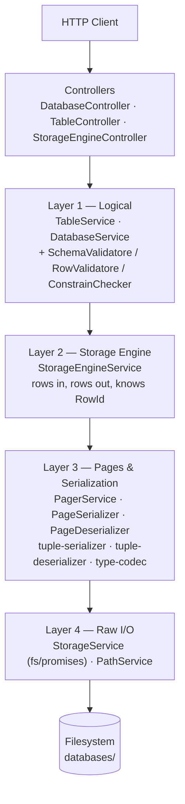

| Layer | Owns | Must not know about |
| --- | --- | --- |
| **Controllers** | HTTP verbs, params, response shape | Pages, buffers, byte offsets |
| **Logical** | Schemas, constraints, defaults, types, "what is a valid row" | Page layout, slots, offsets |
| **Storage engine** | Rows ↔ `RowId`, which page to write to, scanning | HTTP, constraints, `fs` |
| **Pages & serialization** | Page header, slot directory, tuple bytes | HTTP, schemas semantics, file paths |
| **Raw I/O** | `fs/promises` calls, path construction | Everything above it |

There is one important **inversion** in the current wiring, worth understanding early:
[TableService](src/table/table.service.ts) — a *logical* layer service — calls
`storageEngineService.readSchema()` to load the catalog. The catalog read therefore lives in
the storage engine, not in a dedicated catalog service. See §16 for why this is debt.

## Technologies used

| Technology | Version | Role |
| --- | --- | --- |
| **TypeScript** | `^5.7.3` | The entire implementation language. Compiled to ES2023, NodeNext modules. |
| **Node.js** | `@types/node ^22.10.7` (implies Node 22 target) | Runtime. Supplies `Buffer` and `fs/promises`, both load-bearing. |
| **NestJS** | `^11.0.1` | HTTP framework and — more importantly — the dependency-injection container that wires the layers together. |
| **Express** | via `@nestjs/platform-express ^11` | The actual HTTP server under Nest. |
| **class-validator** | `^0.15.1` | Declarative DTO validation. Currently used by exactly one endpoint (see §16). |
| **class-transformer** | `^0.5.1` | Plain-object → DTO-class transformation for the global `ValidationPipe`. |
| **reflect-metadata** | `^0.2.2` | Required by Nest's decorator-based DI and by class-validator. |
| **rxjs** | `^7.8.1` | A NestJS peer dependency. **Not used directly anywhere in `src/`.** |
| **Jest + ts-jest** | `^30` / `^29.2.5` | Configured in `package.json`. **Zero test files currently exist.** |
| **ESLint + Prettier** | `^9.18` / `^3.4.2` | Lint and format. Config in [eslint.config.mjs](eslint.config.mjs) and [.prettierrc](.prettierrc). |

**No third-party storage, parsing, or serialization library is used.** Every byte written to
disk is written by code in [src/storage-engine/](src/storage-engine/).

## Design philosophy

Five principles are visible in the code:

1. **One responsibility per class, enforced by DI.** Serialization is split into four separate
   units — [page-serializer.ts](src/storage-engine/serialization/page-serializer.ts),
   [page-deserializer.ts](src/storage-engine/serialization/page-deserializer.ts),
   [tuple-serializer.ts](src/storage-engine/serialization/tuple-serializer.ts),
   [tuple-deserializer.ts](src/storage-engine/serialization/tuple-deserializer.ts) — even
   though a single `Serializer` class would have been shorter. Reading and writing are separate
   concerns; page-level and tuple-level are separate concerns.

2. **Paths are computed in exactly one place.** [PathService](src/shared/path.service.ts) is the
   only file that calls `path.join` on a database directory. Nothing else may build a path.
   ([PLAN.md:51](PLAN.md#L51) calls this "single source of truth for on-disk layout".)

3. **Stateless helpers are plain functions; stateful/injectable things are classes.** The tuple
   codec ([type-codec.ts](src/storage-engine/serialization/type-codec.ts),
   [tuple-serializer.ts](src/storage-engine/serialization/tuple-serializer.ts),
   [tuple-deserializer.ts](src/storage-engine/serialization/tuple-deserializer.ts)) exports bare
   functions with no `@Injectable()`, because they need no collaborators. Everything that needs
   a collaborator is an injected class.

4. **Nothing is deleted from disk.** DELETE sets the row's own `isActive` column to `false`
   ([table.service.ts:98-103](src/table/table.service.ts#L98-L103)). Deleted rows remain
   readable and restorable. [BINARY_STORAGE.md:256](BINARY_STORAGE.md#L256) records this as a
   deliberate decision.

5. **Prefer the simple mechanism that covers the common case.** Insert tries only the *last*
   page before appending a new one ([storage-engine.service.ts:44-53](src/storage-engine/storage-engine.service.ts#L44-L53)) —
   one page read per insert instead of a free-space map. An UPDATE that grows beyond its slot is
   killed and re-inserted rather than chained through a forwarding pointer
   ([BINARY_STORAGE.md:257](BINARY_STORAGE.md#L257)).

---

# 2. Folder Structure

```
d:\db-engine\
 ├── src/
 │    ├── shared/
 │    │    ├── filter/
 │    │    └── interceptors/
 │    ├── storage/
 │    │    └── interfaces/
 │    ├── database/
 │    │    ├── dtos/
 │    │    └── interfaces/
 │    ├── table/
 │    │    ├── dtos/
 │    │    └── interfaces/
 │    ├── storage-engine/
 │    │    ├── interfaces/
 │    │    ├── pager/
 │    │    └── serialization/
 │    ├── executor/          (empty placeholder)
 │    ├── index/             (empty placeholder)
 │    └── schema/            (empty placeholder)
 ├── databases/              (runtime data — created on first DB create)
 ├── dist/                   (build output, gitignored)
 └── node_modules/
```

## `src/` — application root

**Why it exists.** Declared as `sourceRoot` in [nest-cli.json](nest-cli.json) and as Jest's
`rootDir` in [package.json](package.json). It is also the base for the `src/...`-style absolute
imports used throughout the codebase (enabled by `"baseUrl": "./"` in
[tsconfig.json:16](tsconfig.json#L16)).

**What belongs here.** Only the three application-root files — [main.ts](src/main.ts),
[app.module.ts](src/app.module.ts), [app.controller.ts](src/app.controller.ts),
[app.service.ts](src/app.service.ts) — plus feature folders. No business logic at this level.

---

## `src/shared/` — cross-cutting concerns

**Why it exists.** To hold things every other module needs but no module owns. It is imported
by [DatabaseModule](src/database/database.module.ts),
[TableModule](src/table/table.module.ts), and
[StorageEngineModule](src/storage-engine/storage-engine.module.ts).

**What belongs inside.** Path resolution, exception filters, interceptors, future logging.
Nothing feature-specific.

**How it interacts.** [SharedModule](src/shared/shared.module.ts) exports only
[PathService](src/shared/path.service.ts). It **imports nothing** — it sits at the very bottom
of the dependency graph, which is what makes it safe for everyone to import without creating a
cycle.

### `src/shared/filter/`
Contains one file, [all-exception.filter.ts](src/shared/filter/all-exception.filter.ts), which
is **completely empty (0 bytes)**. [PLAN.md:168](PLAN.md#L168) confirms this is intentional
scaffolding: *"exception filters (currently empty)"*. The catch-all filter that would live here
has not been written.

### `src/shared/interceptors/`
Contains [transform.interceptor.ts](src/shared/interceptors/transform.interceptor.ts). **The
filename is wrong** — the file contains no interceptor at all. It exports
`HttpExceptionFilter`, an `ExceptionFilter`. [PLAN.md:169](PLAN.md#L169) flags this itself:
*"currently holds HttpExceptionFilter (misplaced — see Roadmap)"*. The class belongs in
`src/shared/filter/`.

---

## `src/storage/` — raw filesystem I/O

**Why it exists.** To be the **only** place in the codebase that touches `fs/promises`. A grep
for `from 'fs/promises'` returns exactly one hit:
[storage.service.ts:2-11](src/storage/storage.service.ts#L2-L11).

**What belongs inside.** Generic, database-agnostic file primitives: create a directory, read a
file, write bytes at an offset, ask for a file's size. Nothing here knows what a page, a row,
a schema, or a database is. Every method takes a path as a string.

**How it interacts.**
- Consumed by [DatabaseService](src/database/database.service.ts) (directories, `metadata.json`),
  [TableService](src/table/table.service.ts) (create/delete the `.data` file, write the schema
  file), [StorageEngineService](src/storage-engine/storage-engine.service.ts) (existence checks,
  reading the schema file), and [PagerService](src/storage-engine/pager/pager.service.ts)
  (`readAt` / `writeAt` / `fileSize`).
- Imports nothing from the project except its own `interfaces/` folder.

### `src/storage/interfaces/`
One file, [append-file.interface.ts](src/storage/interfaces/append-file.interface.ts), defining
`AppendFileOptions`. It is used only by `StorageService.appendFile`, which is itself **dead
code** — no caller anywhere in `src/` invokes `appendFile`. It is a leftover from the `.ndjson`
era, when rows were appended as text lines.

---

## `src/database/` — database lifecycle

**Why it exists.** A "database" here is a directory under `databases/`. This folder owns
creating, connecting to, and dropping those directories, plus the notion of *which database is
currently connected*.

**What belongs inside.** Anything about the database as a whole. Nothing about tables or rows.

**How it interacts.**
- Imports `StorageModule` (to create/delete directories and write `metadata.json`) and
  `SharedModule` (for `PathService`).
- **Exports `DatabaseService`**, which is consumed by both `TableModule` and
  `StorageEngineModule`. Because Nest providers are singletons per application (not per
  importing module), all three modules share **one** `DatabaseService` instance — which is why
  the in-memory `currentDatabase` field is visible from everywhere. This is load-bearing; see §9.

### `src/database/dtos/`
[create-database.dto.ts](src/database/dtos/create-database.dto.ts) — the **only DTO in the
project that is actually wired to a route**.

### `src/database/interfaces/`
[database.metadata.interface.ts](src/database/interfaces/database.metadata.interface.ts) —
the shape written to `metadata.json`.

---

## `src/table/` — the logical / catalog layer

**Why it exists.** This is where "what is a valid table" and "what is a valid row" live. It
converts a user's JSON payload into a validated `Row` and hands it to the storage engine, and
converts scanned rows back into filtered results.

**What belongs inside.** Schema definition and validation, row validation, constraint checking,
the table-level CRUD orchestration, and the HTTP controller for it.

**How it interacts.** It is the **widest importer** in the project — [table.module.ts](src/table/table.module.ts)
imports `DatabaseModule`, `StorageModule`, `SharedModule`, and `StorageEngineModule`. It
exports nothing; it is a leaf consumer.

The three validator services are split by *when* they run and *what they see*:

| Service | Validates | Needs to see |
| --- | --- | --- |
| [SchemaValidatoreService](src/table/schema-validator.service.ts) | the schema itself, at CREATE TABLE time | the schema only |
| [RowValidatoreService](src/table/row-validator.service.ts) | one row against the schema | one row + schema |
| [ConstrainCheckerService](src/table/constrain-checkers.service.ts) | one row against *all other rows* | one row + every row + schema |

That third column is the real reason they are three classes and not one: they have genuinely
different input requirements, and only `ConstrainCheckerService` forces a full table scan.

### `src/table/dtos/`
[create-table.dto.ts](src/table/dtos/create-table.dto.ts),
[create-column.dto.ts](src/table/dtos/create-column.dto.ts),
[insert-row.dto.ts](src/table/dtos/insert-row.dto.ts). **All three are written but none is
referenced by any controller** — [TableController](src/table/table.controller.ts) types its
bodies as `any` and `Record<string, unknown>`. See §16, item TD-1.

### `src/table/interfaces/`
[table-schema.interface.ts](src/table/interfaces/table-schema.interface.ts) — `ColumnType`,
`ColumnDefinition`, `TableSchema`, `Row`. This is the **most widely imported file in the
project**; it is imported by the table layer, the storage engine, the serializers, and the
codec.

---

## `src/storage-engine/` — the heart of the project

**Why it exists.** To translate between *rows* (JavaScript objects) and *bytes on disk*, and to
own the concept of a `RowId`. This is the layer [BINARY_STORAGE.md](BINARY_STORAGE.md) was
written to explain.

**What belongs inside.** Everything about pages, slots, tuples, offsets, and byte encodings.
Nothing about HTTP, and nothing about constraint semantics.

**How it interacts.** Imports `DatabaseModule` (to know the connected DB), `StorageModule`
(raw I/O), `SharedModule` (paths). Exports `StorageEngineService`, consumed by `TableModule`.

### `src/storage-engine/interfaces/`
- [row.id.inerface.ts](src/storage-engine/interfaces/row.id.inerface.ts) — `RowId`.
  (Filename typo: `inerface` should be `interface`. It is spelled this way in
  [BINARY_STORAGE.md:271](BINARY_STORAGE.md#L271) too, so it is a consistent typo, not a
  one-off.)
- [row.interface.ts](src/storage-engine/interfaces/row.interface.ts) — a second `Row`
  interface. **It is imported by nothing.** The storage engine imports `Row` from the *table*
  interfaces instead ([storage-engine.service.ts:5](src/storage-engine/storage-engine.service.ts#L5)).
  Dead duplicate.

### `src/storage-engine/pager/`
**Why it exists.** The pager is the boundary between "a file" and "a sequence of fixed-size
pages". Above this folder, nothing knows the file exists; below it, nothing knows what a page
means.

Holds the layout constants ([constant.pager.ts](src/storage-engine/pager/constant.pager.ts)),
the two structural interfaces ([page-header.interface.ts](src/storage-engine/pager/page-header.interface.ts),
[slot.interface.ts](src/storage-engine/pager/slot.interface.ts)), and
[PagerService](src/storage-engine/pager/pager.service.ts) itself.

> Note the slightly odd dependency direction: `pager/` **imports from** `serialization/`
> (`PagerService` needs `PageSerializer` to stamp a header into a fresh page), while
> `serialization/` **imports from** `pager/` (for the constants and interfaces). This is a
> folder-level cycle. TypeScript and Nest both tolerate it here because no *class* cycle
> results, but it means the two folders are not independently extractable.

### `src/storage-engine/serialization/`
**Why it exists.** All byte-level encode/decode logic, split four ways plus a shared codec.

| File | Direction | Granularity | Style |
| --- | --- | --- | --- |
| [page-serializer.ts](src/storage-engine/serialization/page-serializer.ts) | write | page | injectable class |
| [page-deserializer.ts](src/storage-engine/serialization/page-deserializer.ts) | read | page | injectable class |
| [tuple-serializer.ts](src/storage-engine/serialization/tuple-serializer.ts) | write | tuple | plain function |
| [tuple-deserializer.ts](src/storage-engine/serialization/tuple-deserializer.ts) | read | tuple | plain function |
| [type-codec.ts](src/storage-engine/serialization/type-codec.ts) | both | single value | plain functions |

The page-level pair are classes because `PageSerializer` needs `PageDeserializer` injected (it
must read a header before it can modify one). The tuple-level pair are free functions because
they need nothing but their arguments.

---

## `src/executor/`, `src/index/`, `src/schema/` — empty placeholders

Each contains exactly one **0-byte** `.module.ts` file. None is imported by
[app.module.ts](src/app.module.ts). They are reserved directories for the roadmap in
[PLAN.md:775-853](PLAN.md#L775-L853):

- `executor/` — the future SQL statement executor.
- `index/` — the future index structures (the `indexed?: boolean` flag on `ColumnDefinition`
  already anticipates it, but nothing reads that flag today).
- `schema/` — the future catalog service (schema reading currently lives in
  `StorageEngineService.readSchema`).

---

## `databases/` — runtime data directory

**Not in git and not in `.gitignore`.** It is created at runtime by
`PathService.getDatabaseRoot()` → `path.join(process.cwd(), 'databases')`. Git history shows a
`databases/test_db/` with `metadata.json`, `user.ndjson`, and `user.schema.json` was once
committed and has since been deleted from the working tree — the `.ndjson` file is a relic of
the pre-binary storage format.

Layout per database:

```
databases/
 └── <databaseName>/
      ├── metadata.json              ← DatabaseMetadata
      ├── <tableName>.schema.json    ← TableSchema
      └── <tableName>.data           ← binary heap file, N × 4096 bytes
```

---

# 3. File Documentation

Every file in `src/` and every root-level config file is documented below.

## 3.1 Application root

### `src/main.ts`

**Purpose.** The process entry point. Boots the Nest application and starts the HTTP listener.

**Responsibilities.**
1. Create the Nest application from `AppModule` via `NestFactory.create`.
2. Set the global route prefix to `api/v1/`.
3. Register a **global** `ValidationPipe` with `whitelist`, `transform`, and
   `forbidNonWhitelisted` all `true`.
4. Register `HttpExceptionFilter` as a **global** exception filter.
5. Listen on `process.env.PORT ?? 3000`.

**Dependencies.**
- *Imports:* `@nestjs/core` (`NestFactory`), `@nestjs/common` (`ValidationPipe`),
  [app.module.ts](src/app.module.ts), and `HttpExceptionFilter` from
  [shared/interceptors/transform.interceptor.ts](src/shared/interceptors/transform.interceptor.ts).
- *Imported by:* nothing. It is the root of the import graph. `package.json`'s
  `start:prod` script runs `node dist/main`.

**Flow.** Executed exactly once, at process start, before any request is served. The
`bootstrap()` call on [main.ts:23](src/main.ts#L23) is a floating promise — its rejection is
unhandled, so a bootstrap failure surfaces as an `UnhandledPromiseRejection` rather than a clean
exit. (`@typescript-eslint/no-floating-promises` is downgraded to `'warn'` in
[eslint.config.mjs:34](eslint.config.mjs#L34), which is why this passes lint.)

> **Detail worth knowing:** the prefix is written `'api/v1/'` **with a trailing slash**. Nest
> normalizes this, so routes resolve as `/api/v1/database` etc. — but the trailing slash is
> unusual and would matter if the string were ever concatenated manually.

---

### `src/app.module.ts`

**Purpose.** The root Nest module. It is the composition root of the entire dependency graph.

**Responsibilities.** Import the five feature modules — `DatabaseModule`, `StorageModule`,
`TableModule`, `SharedModule`, `StorageEngineModule` — and register `AppController` /
`AppService`.

**Dependencies.**
- *Imports:* all five feature modules plus the app controller/service.
- *Imported by:* [main.ts](src/main.ts) only.

**Flow.** Evaluated once during `NestFactory.create`. Nest walks this module's `imports` array
recursively, instantiating every provider exactly once.

**Note.** `ExecutorModule`, `IndexModule`, and `SchemaModule` are **not** imported here — those
files are empty, so there is nothing to import.

---

### `src/app.controller.ts` / `src/app.service.ts`

**Purpose.** Unmodified NestJS scaffolding. `AppController` exposes `GET /api/v1/` which returns
the string `'Hello World!'` produced by `AppService.getHello()`.

**Responsibilities.** None that are project-specific. This is a health-check-shaped endpoint by
accident, not by design.

**Dependencies.** `AppController` imports `AppService`. Both are registered directly in
`AppModule`.

**Flow.** `AppService` is instantiated at bootstrap; `getHello()` runs per request to `/api/v1/`.

---

## 3.2 `src/shared/`

### `src/shared/shared.module.ts`

**Purpose.** Package and export `PathService`.

**Responsibilities.** Exactly one: `providers: [PathService], exports: [PathService]`. It
declares **no `imports`**, which is deliberate — it must be importable by everyone without
risking a cycle.

**Dependencies.** *Imported by:* `AppModule`, `DatabaseModule`, `TableModule`,
`StorageEngineModule`.

**Flow.** Instantiated once at bootstrap.

---

### `src/shared/path.service.ts`

**Purpose.** The single source of truth for the on-disk layout. Every path in the system is
produced by one of its four methods.

**Responsibilities.** Translate logical names (database name, table name) into absolute
filesystem paths. It performs **no I/O** and **no validation** — it is pure string arithmetic
over `path.join`.

**Dependencies.**
- *Imports:* `@nestjs/common`, Node's `path`.
- *Imported by:* [database.service.ts](src/database/database.service.ts),
  [table.service.ts](src/table/table.service.ts),
  [storage-engine.service.ts](src/storage-engine/storage-engine.service.ts).

**Flow.** Called on essentially every request that touches disk. Because it anchors on
`process.cwd()`, **the location of `databases/` depends on the working directory the process
was started from**, not on the location of the source files.

> **Security note (detailed in §16, TD-9):** the `databaseName` / `tableName` arguments come
> straight from user input and are never sanitized. `path.join` resolves `..` segments, so a
> name like `../../foo` escapes the `databases/` root.

---

### `src/shared/interceptors/transform.interceptor.ts`

**Purpose.** Despite its filename, this file defines `HttpExceptionFilter` — the global error
serializer.

**Responsibilities.**
1. Catch every thrown `HttpException` (and only `HttpException` — see below).
2. Unwrap the exception payload: if `getResponse()` returns an object, take its `.message`
   property; otherwise use the value directly.
3. Emit a uniform JSON error body: `{ message, statusCode, timestamp, path }`.

**Dependencies.**
- *Imports:* `@nestjs/common` (`ExceptionFilter`, `Catch`, `ArgumentsHost`, `HttpException`),
  `express` types.
- *Imported by:* [main.ts](src/main.ts).

**Flow.** Runs at the end of the request lifecycle, only when an `HttpException` propagates out
of a controller. Because it is decorated `@Catch(HttpException)`, **non-`HttpException` errors
bypass it entirely** — a `RangeError` from a `Buffer.write`, or an `ENOENT` from `fs`, falls
through to Nest's built-in 500 handler with a different body shape.

**Known issue.** [Line 16](src/shared/interceptors/transform.interceptor.ts#L16) contains a
leftover debug statement: `console.log('Exceptionnnnnnnnnnnn', exception.getResponse())`. It
fires on every error response.

---

### `src/shared/filter/all-exception.filter.ts`

**Purpose.** Reserved for a catch-all `@Catch()` filter.

**Status.** **0 bytes. Contains nothing. Imported by nothing.**

---

## 3.3 `src/storage/`

### `src/storage/storage.module.ts`

**Purpose.** Package and export `StorageService`.

**Dependencies.** No `imports`. *Imported by:* `AppModule`, `DatabaseModule`, `TableModule`,
`StorageEngineModule`.

---

### `src/storage/storage.service.ts`

**Purpose.** The project's entire filesystem abstraction — twelve thin `async` methods wrapping
`fs/promises`.

**Responsibilities.** Directory create/delete, whole-file read/write, JSON write, file
create/delete, existence check, **positional read/write** (`readAt` / `writeAt`), and
`fileSize`. The last three are what make the pager possible.

**Dependencies.**
- *Imports:* `fs/promises` (`access`, `writeFile`, `rm`, `mkdir`, `appendFile`, `readFile`,
  `open`, `stat`), `@nestjs/common` (`HttpException`),
  [append-file.interface.ts](src/storage/interfaces/append-file.interface.ts).
- *Imported by:* `DatabaseService`, `TableService`, `StorageEngineService`, `PagerService`.

**Flow.** Every disk operation in the system passes through here. `readAt`/`writeAt` each open
and close a **fresh file handle per call** — there is no handle cache and no buffer pool, so a
scan of an N-page table performs N `open`/`read`/`close` cycles.

---

### `src/storage/interfaces/append-file.interface.ts`

**Purpose.** Defines `AppendFileOptions` — `{ path, content, encoding? }`.

**Status.** Consumed only by `StorageService.appendFile`, which has **zero callers**. Both are
dead code left over from the `.ndjson` format.

---

## 3.4 `src/database/`

### `src/database/database.module.ts`

**Purpose.** Wire the database feature.

**Responsibilities.** `imports: [StorageModule, SharedModule]`,
`providers: [DatabaseService]`, `exports: [DatabaseService]`,
`controllers: [DatabaseController]`.

**Dependencies.** *Imported by:* `AppModule`, `TableModule`, `StorageEngineModule`. The export
of `DatabaseService` is what lets the storage engine ask "which database am I in?".

---

### `src/database/database.controller.ts`

**Purpose.** HTTP surface for database lifecycle, mounted at `/api/v1/database`.

**Responsibilities.** Three routes: `POST /` (create), `POST /:name/connect` (connect),
`DELETE /:name` (drop).

**Dependencies.** *Imports:* `DatabaseService`,
[create-database.dto.ts](src/database/dtos/create-database.dto.ts).

**Flow.** `createDatabase` is the **only handler in the entire project whose body is typed as a
DTO class**, and therefore the only one the global `ValidationPipe` actually validates.

---

### `src/database/database.service.ts`

**Purpose.** Own the database lifecycle and the **connected-database session state**.

**Responsibilities.** Create a database directory + `metadata.json`; connect (set
`currentDatabase`); drop; and expose `requireCurrentDatabase()` as the guard every other layer
calls before touching disk.

**Dependencies.**
- *Imports:* `StorageService`, `PathService`, `DatabaseMetadata`, Node `path`.
- *Imported by:* [table.service.ts](src/table/table.service.ts),
  [storage-engine.service.ts](src/storage-engine/storage-engine.service.ts),
  [database.controller.ts](src/database/database.controller.ts).

**Flow.** Instantiated once at bootstrap; the `currentDatabase` field then lives for the
lifetime of the process. See §9 for why this design is significant (and §16 for why it is a
problem).

> **Note:** `createMetaData` builds the metadata path with a **direct `path.join` call**
> ([database.service.ts:26](src/database/database.service.ts#L26)) rather than going through
> `PathService`. It is the one place the "paths live in one file" rule is broken.

---

### `src/database/dtos/create-database.dto.ts`

**Purpose.** Validate the `POST /api/v1/database` body.

**Responsibilities.** `name` must be a non-empty string.

**Note.** The `@IsNotEmpty` message reads *"The name field must be empty when creating a
database."* — the word **"must be empty"** is inverted; it should read "must not be empty".

---

### `src/database/interfaces/database.metadata.interface.ts`

**Purpose.** The shape of `metadata.json`: `{ name, version, createdAt }`, all strings.

**Flow.** Written once at database creation. **Never read back by any code.** It exists purely
as an on-disk record for humans and for future features.

---

## 3.5 `src/table/`

### `src/table/table.module.ts`

**Purpose.** Wire the logical layer.

**Responsibilities.** `imports: [DatabaseModule, StorageModule, SharedModule, StorageEngineModule]`;
`providers: [TableService, SchemaValidatoreService, RowValidatoreService, ConstrainCheckerService]`;
`controllers: [TableController]`. It **exports nothing** — nothing else in the app depends on
the table layer.

---

### `src/table/table.controller.ts`

**Purpose.** HTTP surface for table DDL and DML, mounted at `/api/v1/table`.

**Responsibilities.** Five routes: create table, insert row, select rows, update rows, delete
rows. Full details in §21.

**Dependencies.** *Imports:* `TableService` only.

**Flow.** Every handler is a one-line delegate to `TableService`. **No handler types its body
as a DTO class**, so the global `ValidationPipe` performs no validation on any of them — all
validation happens later, inside the validator services, as `HttpException`s.

---

### `src/table/table.service.ts`

**Purpose.** Orchestrate table-level CRUD. It is the conductor: it decides the *order* in which
schema loading, constraint checking, row validation, and storage calls happen.

**Responsibilities.** `create`, `insert`, `select`, `update`, `delete`, `drop` (stub), and the
private `addIsActiveColumn`.

**Dependencies.**
- *Imports:* `DatabaseService`, `StorageService`, `PathService`, `SchemaValidatoreService`,
  `StorageEngineService`, `RowValidatoreService`, `ConstrainCheckerService`, and the table
  interfaces.
- *Imported by:* [table.controller.ts](src/table/table.controller.ts),
  [table.module.ts](src/table/table.module.ts).

**Flow.** Runs per request. Every mutating method (`insert`, `update`, `delete`) performs a
**full table scan first** — this is the project's dominant performance characteristic.

---

### `src/table/schema-validator.service.ts`

**Purpose.** Validate a `TableSchema` at CREATE TABLE time, before anything is written.

**Responsibilities.** Five checks in fixed order: non-empty table name → at least one column →
no empty column names → no duplicate column names → every `type` is a member of `ColumnType`.

**Dependencies.** *Imports:* `ColumnType`, `TableSchema`. *Imported by:* `TableService`,
`TableModule`.

**Flow.** Called exactly once per `POST /api/v1/table`, **after** `addIsActiveColumn` has
already mutated the schema ([table.service.ts:34-35](src/table/table.service.ts#L34-L35)). It
therefore also validates the injected `isActive` column.

---

### `src/table/row-validator.service.ts`

**Purpose.** Validate one row against its schema — presence, unknown keys, and types.

**Responsibilities.** `validateRequiredColumns` → `validateUnknownColumns` → `validateTypes`,
with `validateColumnType` implementing the per-type rules.

**Dependencies.** *Imports:* `ColumnDefinition`, `ColumnType`, `Row`, `TableSchema`.
*Imported by:* `TableService`, `TableModule`.

**Flow.** Called on every `insert` and every `update`, **after** `ConstrainCheckerService` has
already run (and therefore after defaults have been filled in — the ordering matters, see §11).

**Note.** Lines 99–111 contain a commented-out earlier implementation of `validateTypes` that
compared `typeof value` against `column.type` directly. It is preserved as a record of the
approach that was replaced.

---

### `src/table/constrain-checkers.service.ts`

**Purpose.** Enforce cross-row constraints — primary key and uniqueness — and fill in column
defaults.

**Responsibilities.** `fillDefault` → `validatePrimaryKey` → `validateuniqueness`, in that
order.

**Dependencies.** *Imports:* `Row`, `TableSchema`. *Imported by:* `TableService`,
`TableModule`.

**Flow.** Called on every `insert` and `update`. It is the reason `TableService` must scan the
whole table before writing: constraint checks need every existing row in memory.

**Note.** `fillDefault` **mutates its `row` argument in place**. This side effect is what makes
the auto-injected `isActive: true` default appear on inserted rows.

---

### `src/table/interfaces/table-schema.interface.ts`

**Purpose.** The core vocabulary of the logical layer.

**Responsibilities.** Export `ColumnType` (enum), `ColumnDefinition`, `TableSchema`, `Row`.

**Dependencies.** *Imports:* nothing. *Imported by:* `table.service.ts`,
`schema-validator.service.ts`, `row-validator.service.ts`, `constrain-checkers.service.ts`,
`create-column.dto.ts`, `insert-row.dto.ts`, `storage-engine.service.ts`,
`tuple-serializer.ts`, `tuple-deserializer.ts`, `type-codec.ts`. **Ten importers — the most
depended-upon file in the project.**

---

### `src/table/dtos/create-table.dto.ts` · `create-column.dto.ts` · `insert-row.dto.ts`

**Purpose.** Declarative validation for table DDL/DML payloads.

**Status.** **None of the three is referenced by any controller or service.** They are written,
correct-looking, and inert. `CreateColumnDto` is imported by `CreateTableDto`; `CreateTableDto`
and `InsertRowDto` are imported by nothing.

Had they been wired up, `CreateTableDto` would enforce a 1–64 character name and a non-empty,
element-validated `columns` array; `CreateColumnDto` would enforce the type enum, boolean
flags, and `length >= 1`.

---

## 3.6 `src/storage-engine/`

### `src/storage-engine/storage-engine.module.ts`

**Purpose.** Wire the storage engine.

**Responsibilities.** `imports: [DatabaseModule, StorageModule, SharedModule]`;
`providers: [StorageEngineService, PageSerializer, PageDeserializer, PagerService]`;
`controllers: [StorageEngineController]`; `exports: [StorageEngineService]`.

**Note.** Only `StorageEngineService` is exported. `PagerService` and the two page serializers
are **module-private** — the table layer physically cannot reach a `Buffer`. That
encapsulation is the module boundary doing real work.

---

### `src/storage-engine/storag-engine.controller.ts`

**Purpose.** A debugging/inspection surface at `/api/v1/storage-engine`.

**Responsibilities.** Two read-only routes: `GET /rows/:tableName` (raw scan **including
soft-deleted rows**, with their `RowId`s) and `GET /schema/:tableName`.

**Note.** Filename typo: `storag-engine` is missing an `e`.

**Flow.** These endpoints bypass `TableService` entirely and speak to `StorageEngineService`
directly, which is exactly what makes them useful for verifying the on-disk state. The inline
comment on [line 8](src/storage-engine/storag-engine.controller.ts#L8) says so:
*"Raw scan, including rows that were soft deleted. Useful for checking the file."*

---

### `src/storage-engine/storage-engine.service.ts`

**Purpose.** The row-level API of the engine: turn rows into tuples, place tuples into pages,
and hand back stable `RowId`s.

**Responsibilities.** `readSchema`, `insertRow`, `scan`, `updateRow`, and the private
`requireDataPath`.

**Dependencies.**
- *Imports:* `PathService`, `DatabaseService`, `StorageService`, `PagerService`,
  `PageSerializer`, `PageDeserializer`, `serializeTuple`, `deserializeTuple`, `RowId`, and the
  table interfaces.
- *Imported by:* `TableService`, `StorageEngineController`, and the two modules.

**Flow.** Sits between the table layer and the pager. Note that **it has no `deleteRow`
method** — deletion is expressed entirely as an `updateRow` that sets `isActive: false`.

---

### `src/storage-engine/interfaces/row.id.inerface.ts`

**Purpose.** `RowId = { pageId: number; slotId: number }` — the stable physical address of a
row.

**Imported by:** `storage-engine.service.ts` only.

---

### `src/storage-engine/interfaces/row.interface.ts`

**Purpose.** A second declaration of `Row`, as an interface with an index signature.

**Status.** **Imported by nothing.** Duplicate of the `Row` type in
[table-schema.interface.ts:24](src/table/interfaces/table-schema.interface.ts#L24).

---

### `src/storage-engine/pager/constant.pager.ts`

**Purpose.** The four numbers that define the entire on-disk layout.

```ts
export const PAGE_SIZE = 4096;
export const PAGE_HEADER_SIZE = 16;
export const SLOT_SIZE = 4;
export const DELETED_OFFSET = 0;
```

**Imported by:** `pager.service.ts` (`PAGE_SIZE`), `page-serializer.ts` and
`page-deserializer.ts` (`PAGE_HEADER_SIZE`, `SLOT_SIZE`, `DELETED_OFFSET`).

**Why these values.** 4096 matches a typical OS page / filesystem block, so one logical page
read maps to one physical block read. `PAGE_HEADER_SIZE = 16` reserves 8 bytes beyond the 8
actually used, leaving room for future fields (checksum, LSN, free-space hint) without changing
any existing offset. `DELETED_OFFSET = 0` is safe as a tombstone because offset 0 is inside the
header — no real tuple can ever begin there
([BINARY_STORAGE.md:134-136](BINARY_STORAGE.md#L134-L136)).

---

### `src/storage-engine/pager/page-header.interface.ts`

**Purpose.** Declares `PageHeader { pageId, slotCount, tupleStart }` and `Page { tuples: Buffer[] }`.

**Status.** `PageHeader` is used by `PagerService`, `PageSerializer`, `PageDeserializer`.
`Page` is **imported by nothing** — dead.

---

### `src/storage-engine/pager/slot.interface.ts`

**Purpose.** `Slot { offset, length, deleted }` — the decoded form of a 4-byte directory entry.
`deleted` is **derived**, not stored: it is computed as `offset === DELETED_OFFSET`.

**Imported by:** `page-deserializer.ts`.

---

### `src/storage-engine/pager/pager.service.ts`

**Purpose.** Present a `.data` file as an array of fixed-size pages.

**Responsibilities.** `createPage` (allocate + stamp header), `pageCount` (derive from file
size), `readPage`, `writePage`, `appendPage`.

**Dependencies.** *Imports:* `PAGE_SIZE`, `PageHeader`, `PageSerializer`, `StorageService`.
*Imported by:* `storage-engine.service.ts`, `storage-engine.module.ts`.

**Flow.** Every page-granular disk access goes through here. `pageCount` is
`Math.floor(size / PAGE_SIZE)` — **the page count is not stored anywhere**, it is derived. This
is why page 0 is not special: there is no header page to keep in sync
([BINARY_STORAGE.md:255](BINARY_STORAGE.md#L255)).

---

### `src/storage-engine/serialization/page-serializer.ts`

**Purpose.** All **writes** into a page buffer.

**Responsibilities.** `writeHeader`, `writeSlot`, `insertTuple`, `overwriteTuple`,
`markDeleted`.

**Dependencies.** *Imports:* the pager constants, `PageHeader`, and **`PageDeserializer`
(injected)** — it must read the current header/slot before it can modify one.
*Imported by:* `pager.service.ts`, `storage-engine.service.ts`, `storage-engine.module.ts`.

---

### `src/storage-engine/serialization/page-deserializer.ts`

**Purpose.** All **reads** from a page buffer.

**Responsibilities.** `readHeader`, `readSlot`, `readTuple`, `freeSpace`.

**Dependencies.** *Imports:* the pager constants, `PageHeader`, `Slot`. Depends on **nothing
else in the project** — it is a pure buffer decoder, and the easiest class in the codebase to
unit-test. *Imported by:* `page-serializer.ts`, `storage-engine.service.ts`,
`storage-engine.module.ts`.

---

### `src/storage-engine/serialization/tuple-serializer.ts`

**Purpose.** `Row` → `Buffer`. Exports the single free function `serializeTuple`.

**Dependencies.** *Imports:* `Row`, `TableSchema`, and `sizeOfValue`/`writeValue` from
[type-codec.ts](src/storage-engine/serialization/type-codec.ts). *Imported by:*
`storage-engine.service.ts`.

**Flow.** Called on every insert and every update, before any page is touched.

---

### `src/storage-engine/serialization/tuple-deserializer.ts`

**Purpose.** `Buffer` → `Row`. Exports the single free function `deserializeTuple`.

**Dependencies.** *Imports:* `Row`, `TableSchema`, `readValue`. *Imported by:*
`storage-engine.service.ts`.

**Flow.** Called once per live tuple during every `scan()`.

---

### `src/storage-engine/serialization/type-codec.ts`

**Purpose.** The per-value encoding rules — the lowest-level file in the project.

**Responsibilities.** `sizeOfValue` (how many bytes a value needs), `writeValue` (write it,
return the next offset), `readValue` (read it, return value + next offset).

**Dependencies.** *Imports:* `ColumnDefinition`, `ColumnType`. *Imported by:*
`tuple-serializer.ts`, `tuple-deserializer.ts`.

**Note.** [Lines 6-21](src/storage-engine/serialization/type-codec.ts#L6-L21) carry a comment
block documenting the `Buffer` write methods and their ranges — the author's working notes,
left in as reference.

---

## 3.7 Empty placeholder files

| File | Size | Imported by | Purpose |
| --- | --- | --- | --- |
| [src/executor/executor.module.ts](src/executor/executor.module.ts) | 0 bytes | nothing | reserved for the SQL executor |
| [src/index/index.module.ts](src/index/index.module.ts) | 0 bytes | nothing | reserved for index structures |
| [src/schema/schema.module.ts](src/schema/schema.module.ts) | 0 bytes | nothing | reserved for the catalog service |
| [src/shared/filter/all-exception.filter.ts](src/shared/filter/all-exception.filter.ts) | 0 bytes | nothing | reserved for a catch-all filter |

---

## 3.8 Root configuration files

### `package.json`
Declares the project (`db-engine`, v0.0.1, private, UNLICENSED), seven runtime dependencies,
the npm scripts, and the inline Jest configuration (`rootDir: src`, `testRegex: .*\.spec\.ts$`,
`ts-jest` transform).

> Two scripts reference paths that **do not exist**: `format` and `lint` glob
> `{src,database,executor,index,schema,storage,test}/**/*.ts`, but `database/`, `executor/`,
> `index/`, `schema/`, `storage/`, and `test/` exist only *inside* `src/`, not at the root. Only
> the `src/**` part of each glob matches anything. Likewise `test:e2e` points at
> `./test/jest-e2e.json`, and **there is no `test/` directory**.

### `tsconfig.json`
Targets `ES2023` with `nodenext` modules. Key flags:
`experimentalDecorators` + `emitDecoratorMetadata` (required by Nest DI and class-validator),
`strictNullChecks: true`, but `noImplicitAny: false`, `strictBindCallApply: false`, and
`noFallthroughCasesInSwitch: false`. **Full `strict` mode is off.** `baseUrl: "./"` is what
allows the `src/...` absolute import style.

### `tsconfig.build.json`
Extends `tsconfig.json` and excludes `node_modules`, `test`, `dist`, `**/*spec.ts` from the
production build.

### `nest-cli.json`
`sourceRoot: src`, `deleteOutDir: true` — the `dist/` folder is wiped on every build.

### `eslint.config.mjs`
Flat ESLint config using `typescript-eslint`'s **type-checked** recommended set. Three rules are
relaxed: `no-explicit-any` off, `no-floating-promises` → warn, `no-unsafe-argument` → warn.
`sourceType` is declared `'commonjs'`.

### `.prettierrc`
`{ singleQuote: true, trailingComma: "all" }`.

### `.vscode/settings.json`
Format-on-save with Prettier, plus `source.fixAll.eslint` on save.

### `.gitignore`
Standard NestJS ignore list. **`databases/` is not ignored** — runtime data is trackable by git.

### `BINARY_STORAGE.md` · `PLAN.md` · `Database.pdf`
Design documents. `BINARY_STORAGE.md` (37 KB) is the specification the current storage engine
was built from — read §§1–5 of it alongside §10 below. `PLAN.md` (36 KB) is the broader roadmap,
written when storage was still `.ndjson`; parts of it are now historical. `Database.pdf` is
untracked and its contents were not examined. **UNCERTAIN:** what `Database.pdf` contains.

---

# 4. Classes

Fourteen classes exist. Four are Nest modules (pure configuration, no behaviour), three are
controllers, six are services, and one is an exception filter. Modules and the two scaffold
classes (`AppController`/`AppService`) are covered in §3 and are not repeated here.

---

## 4.1 `PathService`

**File.** [src/shared/path.service.ts](src/shared/path.service.ts)

**Why it exists.** So that the on-disk layout can be changed in one file. If tables were ever
moved into a per-table subdirectory, this is the only file that would change.

**Responsibility.** Pure path construction. No I/O, no validation, no state.

**Lifecycle.** Singleton, created at bootstrap by Nest, lives for the process lifetime.

**Collaboration.** Injected into `DatabaseService`, `TableService`, `StorageEngineService`. It
collaborates with nothing itself.

**Properties.** None. It is a stateless service.

### Methods

#### `getDatabaseRoot(): string`
- **Purpose.** The root folder holding all databases.
- **Parameters.** None.
- **Returns.** `path.join(process.cwd(), 'databases')`.
- **Algorithm.** One `path.join`.
- **Side effects.** None. Does *not* create the directory.
- **Example.** Process started in `d:\db-engine` → `d:\db-engine\databases`.
- **Edge case.** The result depends on the **current working directory**, so starting the
  process from a different folder silently points at a different data root.

#### `getDatabasePath(databaseName: string): string`
- **Purpose.** The directory for one database.
- **Parameters.** `databaseName` — the user-supplied name, unsanitized.
- **Returns.** `<root>/<databaseName>`.
- **Example.** `getDatabasePath('shop')` → `d:\db-engine\databases\shop`.
- **Edge case.** `getDatabasePath('../escape')` resolves **outside** `databases/`.

#### `getSchemaPath(databaseName: string, table: string): string`
- **Returns.** `<root>/<databaseName>/<table>.schema.json`.
- **Example.** `('shop', 'user')` → `...\databases\shop\user.schema.json`.
- **Note.** The parameter is named `table` here but `tableName` in the sibling method —
  a small inconsistency.

#### `getTablePath(databaseName: string, tableName: string): string`
- **Returns.** `<root>/<databaseName>/<tableName>.data`.
- **Example.** `('shop', 'user')` → `...\databases\shop\user.data`.
- **Why `.data` and not `.ndjson`.** The extension changed with the binary rewrite; the old
  extension survives only in git history.

---

## 4.2 `StorageService`

**File.** [src/storage/storage.service.ts](src/storage/storage.service.ts)

**Why it exists.** To confine `fs/promises` to a single file, so the rest of the codebase can be
reasoned about (and, in principle, tested) without touching a real disk.

**Responsibility.** Thin, generic file primitives. It knows about paths, buffers, strings, and
encodings — nothing else.

**Lifecycle.** Singleton. Holds **no open file handles between calls** — every positional
operation opens and closes its own handle.

**Collaboration.** Injected into `DatabaseService`, `TableService`, `StorageEngineService`,
`PagerService`.

**Properties.** None.

### Methods

#### `createDirectory(path: string): Promise<void>`
- **Purpose.** Create a directory, including missing parents.
- **Algorithm.** `mkdir(path, { recursive: true })`.
- **Side effects.** Creates directories on disk. **Idempotent** — `recursive: true` means an
  existing directory is not an error.
- **Called by.** `DatabaseService.create`.

#### `writeFile(filePath: string, data: string): Promise<void>`
- **Purpose.** Write (or truncate-and-overwrite) a whole text file as UTF-8.
- **Side effects.** Destroys any existing content at `filePath`.
- **Called by.** `DatabaseService.createMetaData`, `StorageService.createFile`.

#### `writeJson(filePath: string, data: unknown): Promise<void>`
- **Purpose.** Serialize `data` with `JSON.stringify` and write it as UTF-8.
- **Note.** Unlike `DatabaseService.createMetaData` (which pretty-prints with
  `JSON.stringify(x, null, 2)`), this writes **minified** JSON. So `metadata.json` is
  human-readable and `*.schema.json` is not — an inconsistency, not a decision.
- **Called by.** `TableService.create`.

#### `exists(path: string): Promise<boolean>`
- **Purpose.** Existence check.
- **Algorithm.** `try { await access(path); return true } catch { return false }`.
- **Edge case.** It swallows **all** errors, including `EACCES` (permission denied), which is
  reported as "does not exist".
- **Complexity.** O(1) syscall.
- **Called by.** `DatabaseService` (×3), `TableService.create`,
  `StorageEngineService.readSchema` and `.requireDataPath`, `StorageService.createFile`.

#### `deleteDirectory(path: string): Promise<void>`
- **Algorithm.** `rm(path, { recursive: true })`.
- **Side effects.** **Irreversibly deletes a whole database directory and every table in it.**
- **Edge case.** No `force: true`, so removing a non-existent path throws `ENOENT`.
- **Called by.** `DatabaseService.drop`.

#### `appendFile({ path, content, encoding = 'utf-8' }): Promise<void>`
- **Status.** **Dead code — zero callers.** A leftover from the `.ndjson` format, when an insert
  was an appended text line.

#### `readFile(options: { path, encoding? }): Promise<string>`
- **Purpose.** Read a whole file as text (default UTF-8).
- **Called by.** `StorageEngineService.readSchema` — the only caller.
- **Note.** Takes an options object while `writeFile` takes positional arguments. Inconsistent
  but harmless.

#### `createFile(path: string): Promise<void>`
- **Purpose.** Create a **zero-byte** file, refusing to clobber an existing one.
- **Algorithm.** `if (await this.exists(path)) throw new HttpException('File already exists.', 409); await this.writeFile(path, '')`.
- **Side effects.** Creates an empty file; throws HTTP 409 otherwise.
- **Why zero bytes matters.** `PagerService.pageCount` is `floor(size / PAGE_SIZE)`, so a
  0-byte file is exactly *zero pages*. The first insert then appends page 0. This is the
  invariant referenced by the comment in
  [table.service.ts:38](src/table/table.service.ts#L38): *"An empty file is zero pages. The
  first insert creates page 0."*
- **Called by.** `TableService.create`.

#### `deleteFile(path: string): Promise<void>`
- **Algorithm.** `rm(path, { force: true })` — `force` makes it a no-op when the file is absent.
- **Called by.** `TableService.create`, in the rollback path.

#### `readAt(path: string, buffer: Buffer, position: number): Promise<number>`
- **Purpose.** Read `buffer.length` bytes starting at byte `position`. **This is what makes
  paged storage possible.**
- **Parameters.** `path`; `buffer` — the destination, filled from index 0; `position` — the
  absolute byte offset in the file.
- **Returns.** `bytesRead`.
- **Algorithm.** `open(path, 'r')` → `handle.read(buffer, 0, buffer.length, position)` →
  `close` in a `finally`.
- **Edge case.** Reading past EOF returns a **short read** (`bytesRead < buffer.length`) and
  leaves the remainder of the buffer as zeros. `PagerService.readPage` **ignores the return
  value**, so a truncated file yields a zero-filled page rather than an error.
- **Complexity.** O(1) syscalls, O(buffer.length) bytes.
- **Called by.** `PagerService.readPage`.

#### `writeAt(path: string, buffer: Buffer, position: number): Promise<void>`
- **Purpose.** Write a whole buffer at an absolute byte offset.
- **Algorithm.** `open(path, 'r+')` → `handle.write(buffer, 0, buffer.length, position)` →
  `close`.
- **Why `'r+'` and not `'w'`.** `'w'` truncates the file to zero length on open, which would
  destroy every other page. `'r+'` opens for read/write **without truncating**, and a
  positional write past the current EOF extends the file — which is exactly how
  `PagerService.appendPage` grows the heap file.
- **Edge case.** `'r+'` requires the file to already exist; it throws `ENOENT` otherwise. This
  is why `TableService.create` must call `createFile` first.
- **Durability.** There is **no `fsync`**. The write is handed to the OS page cache and may not
  be on stable storage when the promise resolves.
- **Called by.** `PagerService.writePage`.

#### `fileSize(path: string): Promise<number>`
- **Algorithm.** `(await stat(path)).size`.
- **Called by.** `PagerService.pageCount`.

---

## 4.3 `DatabaseService`

**File.** [src/database/database.service.ts](src/database/database.service.ts)

**Why it exists.** To own the database lifecycle and — critically — the **connected database**
notion that every other layer depends on.

**Responsibility.** Create / connect / drop a database directory, and answer "which database are
we in?".

**Lifecycle.** Singleton, created at bootstrap. Because it is exported by `DatabaseModule` and
that module is imported by `AppModule`, `TableModule`, and `StorageEngineModule`, Nest creates
**one shared instance**. All three consumers therefore observe the same `currentDatabase`.

**Collaboration.** Uses `StorageService` and `PathService`. Is used by `DatabaseController`,
`TableService`, `StorageEngineService`.

### Properties

| Property | Type | Meaning | Why needed |
| --- | --- | --- | --- |
| `currentDatabase` | `string \| null` | The name of the database the *process* is currently connected to. `null` until `connect()` succeeds. | It is the implicit first argument of every table and row operation. Without it, every endpoint would need a database name in its URL. |
| `storageService` | `StorageService` | Injected. | Directory creation/deletion, existence checks, writing `metadata.json`. |
| `pathService` | `PathService` | Injected. | Resolving the database directory path. |

> `currentDatabase` is **process-global mutable state**. It is not per-client, not per-request,
> and not persisted. See §16 (TD-4).

### Methods

#### `private getDatabasePath(name: string): string`
- **Purpose.** A one-line delegate to `pathService.getDatabasePath`.
- **Why it exists.** Convenience — it saves writing `this.pathService.` four times.

#### `private createMetaData(name: string, dataBasePath: string): Promise<void>`
- **Purpose.** Write the `metadata.json` sidecar.
- **Algorithm.**
  1. Build `{ name, version: '1.0.0', createdAt: new Date().toISOString() }`.
  2. `path.join(dataBasePath, 'metadata.json')` — **note: bypasses `PathService`.**
  3. `storageService.writeFile(metaDataPath, JSON.stringify(metaData, null, 2))`.
- **Side effects.** Creates a file on disk.
- **Note.** `version` is hard-coded `'1.0.0'` and is never read back or compared.
- **Example output.**
  ```json
  {
    "name": "shop",
    "version": "1.0.0",
    "createdAt": "2026-08-07T12:00:00.000Z"
  }
  ```

#### `create(name: string): Promise<void>`
- **Purpose.** Create a new database.
- **Algorithm.** Resolve path → if it exists, throw **409** → `createDirectory` →
  `createMetaData`.
- **Side effects.** Creates a directory and a file.
- **Edge cases.**
  - Duplicate name → `HttpException('Database <name> already exists', 409)`.
  - **Not atomic:** if `createMetaData` fails, the directory is left behind with no metadata.
  - Does **not** connect to the new database. A separate `connect` call is required.
- **Complexity.** O(1).

#### `connect(name: string): Promise<void>`
- **Purpose.** Set the process-wide current database.
- **Algorithm.** If the directory does not exist, throw **404**; otherwise
  `this.currentDatabase = name`.
- **Side effects.** Mutates `currentDatabase`.
- **Edge case.** Returns `undefined`, so the HTTP response is a **201 with an empty body** — no
  confirmation payload. (`POST` defaults to 201 in Nest.)

#### `requireCurrentDatabase(): string`
- **Purpose.** The guard every other layer calls first.
- **Returns.** The current database name, guaranteed non-null.
- **Algorithm.** Throw `HttpException('No database is currently connected.', 400)` if null;
  else return it.
- **Why it exists.** It converts a nullable field into a non-nullable return value at a single
  choke point, so callers never have to null-check.
- **Called by.** `DatabaseService` itself is not a caller — it is called by
  `TableService.create` and `StorageEngineService.readSchema` / `.requireDataPath`.

#### `private getCurrentDatabase(): string | null`
- **Purpose.** Non-throwing read of `currentDatabase`.
- **Called by.** `drop()` only. It is private, so nothing outside the class can use it.

#### `drop(name: string): Promise<void>`
- **Purpose.** Delete a database and everything in it.
- **Algorithm.** Not-exists → **404**. Is the connected database → **400**. Otherwise
  `deleteDirectory`.
- **Side effects.** **Irreversible recursive delete.**
- **Edge case.** After dropping a database that was never connected, `currentDatabase` is
  untouched — correct. But there is **no way to disconnect**, so once you connect to a database
  you can never drop it in that process.

---

## 4.4 `SchemaValidatoreService`

**File.** [src/table/schema-validator.service.ts](src/table/schema-validator.service.ts)
(class name carries a typo: `Validatore`)

**Why it exists.** So that an invalid schema is rejected **before** any file is created, and so
the storage engine can assume every schema it loads is well-formed.

**Responsibility.** Structural validation of a `TableSchema`. It never touches rows or disk.

**Lifecycle.** Singleton, registered in `TableModule`.

**Collaboration.** Called by `TableService.create` only.

**Properties.** None — stateless, no constructor.

### Methods

#### `validate(schema: TableSchema): void`
- **Purpose.** Run all five checks, in order.
- **Returns.** `void` — success is silence; failure is a thrown `HttpException`.
- **Algorithm.** `validateTableName` → `validateColumnsExist` → `validateColumnNames` →
  `validateDuplicateColumns` → `validateTypes`. **Fail-fast:** the first failure throws.
- **Complexity.** O(n) in the number of columns.

#### `private validateTableName(schema)` 
Throws 400 `"Table name can't be emtpy"` (sic — typo in the message) when
`schema.name.trim()` is falsy. **Edge case:** if `schema.name` is `undefined`, `.trim()` throws
a `TypeError`, which is *not* an `HttpException` and therefore escapes `HttpExceptionFilter` as
a generic 500.

#### `private validateColumnsExist(schema)`
Throws 400 `'Table must contain at least one column'` when `columns.length === 0`.
**Edge case:** in practice this can never fire, because `TableService.create` calls
`addIsActiveColumn` *before* validating, guaranteeing at least one column. It would only fire if
`columns` were undefined — which would throw a `TypeError` instead.

#### `private validateColumnNames(schema)`
Throws 400 `'Column name cannot be empty'` for any column whose trimmed name is falsy.

#### `private validateDuplicateColumns(schema)`
Builds a `Set<string>` and throws 400 ``Duplicate column "<name>.`` (sic — the closing quote is
missing) on the first repeat. **Complexity:** O(n) with the set, versus O(n²) for a nested loop.

#### `private validateTypes(schema)`
Builds `new Set(Object.values(ColumnType))` and throws 400
`` Unsupported type "<type>". Allowed types: INTEGER, BOOLEAN, VARCHAR, TEXT, TIMESTAMP. ``
for the first unknown type. **This is the only defence against an unknown type**, since the
controller does not use `CreateColumnDto`.

---

## 4.5 `RowValidatoreService`

**File.** [src/table/row-validator.service.ts](src/table/row-validator.service.ts)

**Why it exists.** To guarantee that a `Row` handed to `serializeTuple` matches its schema. The
serializer has **no error handling of its own** — if it received a string where an `INTEGER` was
expected, `buffer.writeInt32LE` would throw a raw `TypeError`. This class is what prevents that.

**Responsibility.** Per-row, per-column validation: presence, unknown keys, and type/length.

**Lifecycle.** Singleton, registered in `TableModule`.

**Collaboration.** Called by `TableService.insert` and `TableService.update`, always **after**
`ConstrainCheckerService` (so defaults are already filled in).

**Properties.** None.

### Methods

#### `validate(row: Row, schema: TableSchema): void`
- **Algorithm.** `validateRequiredColumns` → `validateUnknownColumns` → `validateTypes`.
- **Complexity.** O(n) in columns (plus O(k) for the row's own keys).

#### `private validateRequiredColumns(row, schema)`
- **Rule.** For every schema column: if the column name is **not a key of `row`**, and the
  column has no non-null `default`, throw 400 `Missing column "<name>".`
- **Edge case — significant.** The check is `!(column.name in row)`, so a column present with
  value `undefined` **passes** this check and then fails type validation instead. And note that
  **`nullable` is never consulted** — a nullable column with no default is still mandatory.

#### `private validateUnknownColumns(row, schema)`
- **Rule.** Every key of `row` must be a known column, else 400 `Unknown column "<key>".`
- **Algorithm.** Builds a `Set` of allowed names, then a single pass over `Object.keys(row)`.
- **Complexity.** O(n + k).

#### `private validateColumnType(column: ColumnDefinition, value: unknown): void`
- **Purpose.** The per-type rule table.

| `column.type` | Accepts | Throws 400 when |
| --- | --- | --- |
| `INTEGER` | `Number.isInteger(value)` | not an integer (including floats, strings, `undefined`, `null`) |
| `BOOLEAN` | `typeof value === 'boolean'` | anything else |
| `VARCHAR` | `typeof value === 'string'` **and** (`!column.length` or `value.length <= column.length`) | non-string, or over the declared length |
| `TEXT` | `typeof value === 'string'` | non-string |
| `TIMESTAMP` | `typeof value === 'string'` **and** `!Number.isNaN(Date.parse(value))` | non-string, or unparseable date |

- **Edge case — the NULL contradiction.** Because there is **no `default:` branch and no
  null/undefined short-circuit**, a `null` value fails every one of these rules. The tuple
  format fully supports NULL via the null bitmap (§10), but **no row containing a NULL can get
  past this validator**. The null bitmap is therefore, in practice, currently always all-zeros
  for rows inserted over HTTP.
- **Edge case.** `VARCHAR` length is checked in **UTF-16 code units** (`value.length`) but
  stored in **UTF-8 bytes** (`Buffer.byteLength`). For non-ASCII text the stored size exceeds
  the validated length.
- **Edge case.** `Date.parse` is lenient — `'2026'` and `'Aug 7 2026'` both pass.

#### `private validateTypes(row, schema)`
Iterates schema columns and calls `validateColumnType(column, row[column.name])`. Note it
iterates the **schema**, not the row, so a schema column absent from the row is validated as
`undefined` and fails — which is why `validateRequiredColumns` must run first to produce the
better error message.

---

## 4.6 `ConstrainCheckerService`

**File.** [src/table/constrain-checkers.service.ts](src/table/constrain-checkers.service.ts)
(class name: `ConstrainChecker`, missing the `t` in "Constraint")

**Why it exists.** Primary-key and uniqueness constraints are the only rules that cannot be
decided from one row alone — they need every other row. Isolating them here makes it obvious
*which* validation forces a full table scan.

**Responsibility.** Fill defaults; enforce PK presence and PK uniqueness; enforce `unique`
columns.

**Lifecycle.** Singleton, registered in `TableModule`.

**Collaboration.** Called by `TableService.insert` (without `ignoredIndex`) and
`TableService.update` (with `ignoredIndex`).

**Properties.** None. It has an explicit empty constructor `constructor() {}`.

### Methods

#### `validate(row, allRows, schema, ignoredIndex?): void`
- **Parameters.**
  | Name | Type | Meaning |
  | --- | --- | --- |
  | `row` | `Row` | The candidate row. **Mutated** by `fillDefault`. |
  | `allRows` | `Row[]` | Every row currently in the table, from `scan()`, in scan order. |
  | `schema` | `TableSchema` | The table's columns. |
  | `ignoredIndex` | `number \| undefined` | The index within `allRows` to skip. Used by UPDATE so a row does not conflict with itself. `undefined` on INSERT. |
- **Algorithm.** `fillDefault` → `validatePrimaryKey` → `validateuniqueness`.
- **Why defaults come first.** A default value must be present *before* the PK/unique checks
  run, otherwise a defaulted PK would read as null.
- **Complexity.** O(n) for the PK check + O(u·n) for `u` unique columns = **O(n · u)** per call,
  where n is the row count.

#### `private validatePrimaryKey(row, allRows, schema, ignoredIndex?)`
- **Algorithm.**
  1. `schema.columns.find(el => el.primaryKey)?.name`. If no PK column → return (PKs are
     optional).
  2. If `row[pk] == null` (loose `==`, so it catches both `null` and `undefined`) → throw 400
     `"primary key can't be nullable"`.
  3. If any row in `allRows` at an index other than `ignoredIndex` has an **`==`-equal** PK →
     throw 409 `Duplicate primary key "<value>".`
- **Edge case — composite keys unsupported.** `find` takes only the **first** column flagged
  `primaryKey`; a second flagged column is silently ignored.
- **Edge case — loose equality.** `el[pk] == row[pk]` means `1` and `'1'` collide. Given the
  select-filter bug (§16 TD-6) this looseness is arguably load-bearing by accident.
- **Edge case — soft-deleted rows still occupy their key.** `allRows` comes from a raw scan and
  includes `isActive: false` rows. A deleted user's PK can never be reused.
  [BINARY_STORAGE.md:262-263](BINARY_STORAGE.md#L262-L263) documents this as expected.

#### `private validateuniqueness(row, allRows, schema, ignoredIndex?)`
- **Algorithm.** Collect every column with `unique: true`; for each, throw 409
  `key:<name> is duplicated must be unique` if any non-ignored row has a **strictly (`===`)
  equal** value.
- **Edge case — inconsistent with the PK check.** This uses `===` while `validatePrimaryKey`
  uses `==`. Two different equality semantics for two nearly identical checks.
- **Edge case — `undefined` collides.** If two rows both omit a unique column, both hold
  `undefined`, and `undefined === undefined` is true → a spurious 409. In practice
  `validateRequiredColumns` usually prevents reaching this state.
- **Complexity.** O(u · n).

#### `private fillDefault(row, schema): void`
- **Purpose.** Apply `default` values to absent columns.
- **Algorithm.** For every column with `default != null`, if `row[name] == null` then
  `row[name] = column.default`.
- **Side effect.** **Mutates `row` in place.** The caller's object is changed. This is how
  `isActive: true` lands on every inserted row.
- **Edge case.** Because both tests use loose `!= null`, a column with `default: false` or
  `default: 0` **is** honoured (those are not `== null`), but an explicit `null` supplied by the
  caller is **overwritten** by the default rather than stored as NULL.

---

## 4.7 `TableService`

**File.** [src/table/table.service.ts](src/table/table.service.ts)

**Why it exists.** It is the **orchestrator** of the logical layer — the only class that knows
the correct *order* of schema loading, scanning, constraint checking, row validation, and
storage writes.

**Responsibility.** Table DDL (`create`) and DML (`insert`, `select`, `update`, `delete`).

**Lifecycle.** Singleton, registered in `TableModule`.

**Collaboration.** The most connected class in the project — it injects **seven** services.

### Properties

| Property | Type | Why needed |
| --- | --- | --- |
| `databaseService` | `DatabaseService` | To resolve the connected database in `create`. |
| `storageService` | `StorageService` | To create the `.data` file, write the schema JSON, and roll back on failure. |
| `pathService` | `PathService` | To resolve the `.data` and `.schema.json` paths. |
| `SchemaValidatoreService` | `SchemaValidatoreService` | Schema validation at CREATE TABLE. |
| `storageEngineService` | `StorageEngineService` | Reading the schema, scanning, inserting, updating. |
| `RowValidatoreService` | `RowValidatoreService` | Per-row validation. |
| `ConstrainCheckerService` | `ConstrainCheckerService` | Cross-row constraints and defaults. |

> Three of the seven properties are named in **PascalCase** (`SchemaValidatoreService`,
> `RowValidatoreService`, `ConstrainCheckerService`) — they shadow the class names. The other
> four use conventional camelCase. See §13.

### Methods

#### `create(dto: TableSchema): Promise<void>`
- **Purpose.** CREATE TABLE.
- **Parameters.** `dto` — a `TableSchema`. Typed as `TableSchema` here, but the controller
  passes `any`, so the runtime shape is unverified at this boundary.
- **Returns.** `void`.
- **Algorithm.**
  1. `databaseService.requireCurrentDatabase()` → 400 if not connected.
  2. Resolve `<table>.data`; if it exists → **409** `Table <name> already exists`.
  3. `addIsActiveColumn(dto)` — **mutates the DTO**, appending the soft-delete column.
  4. `SchemaValidatoreService.validate(dto)` — throws on any structural problem.
  5. In a `try`: `createFile(dataPath)` (zero bytes = zero pages), then
     `writeJson(schemaPath, dto)`.
  6. On any throw inside the `try`: `deleteFile(dataPath)` and rethrow as **500**
     `Failed to create table <name>`.
- **Side effects.** Creates `<table>.data` and `<table>.schema.json`; mutates `dto`.
- **Edge cases.**
  - The existence check is on the `.data` file only. An orphaned `.schema.json` with no `.data`
    is silently overwritten.
  - The rollback deletes the `.data` file but **not** a partially written `.schema.json`.
  - The bare `catch {}` **swallows the original error**, so the real cause (e.g. `EACCES`) never
    reaches the client — only a generic 500.
- **Complexity.** O(c) in columns for validation, plus two file writes.

#### `insert(tableName: string, row: Row): Promise<void>`
- **Purpose.** INSERT one row.
- **Algorithm.**
  1. `storageEngineService.readSchema(tableName)` — reads and parses the schema JSON.
  2. `storageEngineService.scan(tableName)` — **reads and decodes every page of the table** —
     then `.map(entry => entry.row)`.
  3. `ConstrainCheckerService.validate(row, allRows, schema)` — fills defaults, checks PK and
     uniqueness.
  4. `RowValidatoreService.validate(row, schema)` — presence, unknown keys, types.
  5. `storageEngineService.insertRow(tableName, row)`.
- **Side effects.** Mutates `row` (defaults); writes one page to disk.
- **Edge cases.** The scan includes soft-deleted rows, so their PK/unique values still block
  reuse. Two concurrent inserts can both pass the uniqueness check before either writes.
- **Complexity.** **O(n) per insert** in the number of rows in the table (from the scan), so
  bulk-loading n rows is **O(n²)**. This is the single most important performance fact about
  the system.

#### `select(tableName, where = {}): Promise<Row[]>`
- **Purpose.** SELECT with an equality filter.
- **Algorithm.** `scan` → `.map(e => e.row)` → filter out `isActive === false` → filter rows
  where **every** key of `where` matches with `===`.
- **Returns.** An array of `Row`, `RowId`s discarded.
- **Edge cases.**
  - The `isActive` filter is `row.isActive !== false`, so a row with `isActive: undefined` or
    `null` is treated as **live**.
  - **`where` values arrive from the query string and are therefore always strings**, but row
    values are typed (numbers, booleans). `1 === '1'` is false, so
    `?id=1` on an INTEGER column **always returns nothing**. Only `TEXT`/`VARCHAR` filters work.
  - `where` with no keys returns every live row (`every` on an empty array is `true`).
- **Complexity.** O(n · k) for n rows and k filter keys, after an O(pages) scan.

#### `update(tableName, where, updates): Promise<void>`
- **Purpose.** UPDATE.
- **Algorithm.**
  1. Read schema; `scan` the whole table.
  2. `const key = Object.keys(where)[0]` — **only the first `where` key is used**.
  3. `rows.findIndex(entry => entry.row[key] === where[key])` — **only the first match**. Not
     found → **404** `'row not found'`.
  4. `updatedRow = { ...rows[index].row, ...updates }` — a shallow merge.
  5. `ConstrainCheckerService.validate(updatedRow, allRows, schema, index)` — `index` is passed
     as `ignoredIndex` so the row does not collide with itself.
  6. `RowValidatoreService.validate(updatedRow, schema)`.
  7. `storageEngineService.updateRow(tableName, rows[index].rowId, updatedRow)`.
- **Edge cases.**
  - **Despite the plural controller name `updateRows`, this updates exactly one row.**
  - Multi-key `where` objects silently ignore all keys after the first.
  - Here `where` comes from a JSON **body**, so types are preserved and `===` works — unlike
    `select`.
  - `updates` may contain unknown columns; they survive the spread and are caught by
    `validateUnknownColumns` afterwards.
  - The merged row is validated in full, so an update that would violate any rule is rejected
    before anything is written.
  - The scan includes soft-deleted rows, so `where` can match and resurrect a deleted row.
- **Complexity.** O(n) scan + O(n·u) constraints.

#### `delete(tableName, where): Promise<void>`
- **Purpose.** DELETE — implemented as a **soft delete**.
- **Algorithm.** Exactly one line: `return this.update(tableName, where, { isActive: false })`.
- **Side effects.** The row's `isActive` column becomes `false`; **nothing is removed from
  disk**.
- **Edge cases.** Inherits every `update` edge case — one row per call, first `where` key only,
  404 if unmatched. Deleting an already-deleted row succeeds and is a no-op in effect.
- **Why soft.** [BINARY_STORAGE.md:256](BINARY_STORAGE.md#L256): *"Deleted rows stay readable
  and restorable."*

#### `drop(): void {}`
- **Status.** **An empty stub.** No parameters, no body, no caller, no route.

#### `private addIsActiveColumn(schema: TableSchema): void`
- **Purpose.** Guarantee every table has the column that soft delete depends on.
- **Algorithm.** If a column named `isActive` already exists, return. Otherwise **push**
  `{ name: 'isActive', type: ColumnType.BOOLEAN, default: true }`.
- **Side effect.** Mutates the caller's schema object.
- **Why `push` and not `unshift` matters.** Tuple decoding is **positional** — columns are read
  in schema-array order (§10). Appending puts `isActive` last, so a user-supplied schema's
  column order is preserved and existing data stays decodable as long as the schema file is
  never reordered.
- **Edge case.** A user who declares their own `isActive` column of a different type (say
  `INTEGER`) keeps it, and soft delete then writes a boolean `false` into an `INTEGER` column —
  which `RowValidatoreService` rejects at UPDATE time with a 400. So DELETE would be
  permanently broken for that table.

---

## 4.8 `StorageEngineService`

**File.** [src/storage-engine/storage-engine.service.ts](src/storage-engine/storage-engine.service.ts)

**Why it exists.** It is the seam between "rows" and "bytes". Above it, code manipulates
JavaScript objects; below it, everything is `Buffer`s and offsets.

**Responsibility.** Load the schema; place a serialized tuple into a page; scan every page;
update a tuple in place or relocate it; resolve and verify the data path.

**Lifecycle.** Singleton, registered in and exported from `StorageEngineModule`.

**Collaboration.** Injects six services; is injected into `TableService` and
`StorageEngineController`.

### Properties

| Property | Type | Why needed |
| --- | --- | --- |
| `pathService` | `PathService` | Resolve `.data` and `.schema.json` paths. |
| `databaseService` | `DatabaseService` | Learn the connected database name. |
| `storageService` | `StorageService` | Existence checks and reading the schema file. |
| `pagerService` | `PagerService` | Page count, read, write, append. |
| `pageSerializer` | `PageSerializer` | Insert / overwrite / tombstone a tuple inside a page buffer. |
| `pageDeserializer` | `PageDeserializer` | Read the header and tuples during a scan. |

### Methods

#### `readSchema(tableName: string): Promise<TableSchema>`
- **Purpose.** Load and parse `<table>.schema.json`. This is the project's **catalog read**.
- **Algorithm.** `requireCurrentDatabase()` → `getSchemaPath` → `exists` else **404**
  `Schema <table> does not exist` → `readFile` → `JSON.parse` → cast to `TableSchema`.
- **Edge cases.**
  - The cast is unchecked — a corrupt or hand-edited schema file produces a malformed
    `TableSchema` that fails much later, deep in the serializer.
  - **No caching.** Every insert, scan, and update re-reads and re-parses the file from disk.
- **Complexity.** O(size of schema file) per call.

#### `insertRow(tableName: string, row: Row): Promise<RowId>`
- **Purpose.** Place one row into the heap file.
- **Returns.** The `RowId` where it landed.
- **Algorithm.**
  1. `requireDataPath` (404 if the table has no `.data` file).
  2. `readSchema` — **a second schema read within the same insert request**, since
     `TableService.insert` already read it.
  3. `serializeTuple(row, schema)` → a `Buffer`.
  4. `pagerService.pageCount(dataPath)`.
  5. **If `pageCount > 0`:** read the **last** page (`pageId = pageCount - 1`), try
     `pageSerializer.insertTuple`. If it returns a slot id, write the page back and return
     `{ pageId, slotId }`.
  6. **Otherwise (or if the last page was full):** `pagerService.appendPage` → a fresh page →
     `insertTuple` again. If that *also* returns `null`, the tuple cannot fit in an empty page →
     throw **400** `'Row is too large to fit in one page.'` Write the page, return the `RowId`.
- **Side effects.** Writes exactly **one** page. May grow the file by one page.
- **Edge cases.**
  - **Only the last page is ever considered.** Free space in earlier pages — created by
    relocating updates — is never reused. The file only grows.
  - The maximum tuple size is `PAGE_SIZE − PAGE_HEADER_SIZE − SLOT_SIZE` = `4096 − 16 − 4` =
    **4076 bytes**.
  - Not atomic and not locked: two concurrent inserts can both read the same last page and the
    second `writePage` overwrites the first insert.
- **Complexity.** O(1) page reads and O(1) page writes — **independent of table size**. (The
  O(n) cost of an insert lives in `TableService`, not here.)

#### `scan(tableName: string): Promise<{ rowId: RowId; row: Row }[]>`
- **Purpose.** A full sequential scan — the only read path in the engine.
- **Returns.** Every **live** tuple, decoded, each paired with its `RowId`. Soft-deleted rows
  (`isActive: false`) **are included** — only *tombstoned slots* are skipped.
- **Algorithm.**
  ```
  for pageId in 0 .. pageCount-1:
      page   = readPage(pageId)
      header = readHeader(page)
      for slotId in 0 .. header.slotCount-1:
          tuple = readTuple(page, slotId)      // null when the slot is tombstoned
          if tuple is null: continue
          push { rowId: {pageId, slotId}, row: deserializeTuple(tuple, schema) }
  ```
- **Side effects.** None on disk. Allocates the whole result set in memory.
- **Edge cases.**
  - **Everything is materialized in memory** — there is no cursor, no streaming, no limit.
  - Rows come back in physical order (page, then slot), which is *insertion* order except for
    rows relocated by a growing update, which move to the end.
  - A truncated/corrupt file yields zero-filled pages, which decode as `slotCount = 0` and are
    silently skipped.
- **Complexity.** O(P) page reads for P pages, O(R) tuple decodes for R live rows, O(R) memory.
  With one `open`/`close` per page (§4.2), it is O(P) syscall round-trips.

#### `updateRow(tableName, rowId: RowId, row: Row): Promise<RowId>`
- **Purpose.** Replace the tuple at `rowId`.
- **Returns.** The `RowId` after the update — **the same one if it fit in place, a new one if
  the row was relocated**.
- **Algorithm.**
  1. `requireDataPath`, `readSchema`, `serializeTuple`.
  2. `readPage(rowId.pageId)`.
  3. `pageSerializer.overwriteTuple(page, rowId.slotId, tuple)` — succeeds iff the new tuple is
     **≤ the slot's current length**. On success: write the page, return the original `rowId`.
  4. On failure: `pageSerializer.markDeleted(page, rowId.slotId)`, write the page, then
     `return this.insertRow(tableName, row)` — a fresh insert, into the last page or a new one.
- **Side effects.** One or two page writes. May append a page.
- **Edge cases — important.**
  - **A relocating update is two non-atomic writes.** A crash between the tombstone write and
    the re-insert **loses the row permanently**. There is no WAL and no rollback.
  - The vacated bytes are never reclaimed — see §16, TD-13.
  - After `overwriteTuple` shrinks a tuple, the slot's recorded `length` shrinks with it, so the
    row can never grow back into the space it originally owned.
- **Complexity.** O(1) page reads/writes in the in-place case; O(1) plus an `insertRow` in the
  relocating case.

#### `private requireDataPath(tableName: string): Promise<string>`
- **Purpose.** Resolve `<table>.data` and assert it exists.
- **Algorithm.** `requireCurrentDatabase()` → `getTablePath` → `exists` else **404**
  `Table <table> does not exist` → return the path.
- **Why it exists.** Three public methods need the same three steps; this is the shared guard.

---

## 4.9 `PagerService`

**File.** [src/storage-engine/pager/pager.service.ts](src/storage-engine/pager/pager.service.ts)

**Why it exists.** To make a flat file behave like an addressable array of fixed-size pages. It
is the only class that multiplies a page id by `PAGE_SIZE`.

**Responsibility.** Page allocation, counting, reading, writing, appending. It knows the file
exists and knows `PAGE_SIZE`; it does **not** know what a tuple is.

**Lifecycle.** Singleton, module-private to `StorageEngineModule`.

**Collaboration.** Uses `PageSerializer` (to stamp a header into a new page) and
`StorageService` (for positional I/O). Used only by `StorageEngineService`.

### Properties

| Property | Type | Why needed |
| --- | --- | --- |
| `pageSerializer` | `PageSerializer` | `createPage` must write a valid header into the fresh buffer. |
| `storageService` | `StorageService` | `readAt`, `writeAt`, `fileSize`. |

### Methods

#### `createPage(pageId: number): Buffer`
- **Purpose.** Produce a valid, empty in-memory page.
- **Returns.** A 4096-byte `Buffer`.
- **Algorithm.** `Buffer.alloc(PAGE_SIZE)` (zero-filled) → build
  `{ pageId, slotCount: 0, tupleStart: PAGE_SIZE }` → `pageSerializer.writeHeader`.
- **Why `tupleStart = PAGE_SIZE`.** Tuples grow **downward** from the end of the page, so the
  "lowest occupied byte" of an empty page is one past the last byte — 4096. Free space is then
  `4096 − (16 + 0×4)` = 4080 bytes.
- **Note.** `tupleStart` is written as a `UInt16LE`, and 4096 fits comfortably. A `PAGE_SIZE`
  of 65536 or larger would silently overflow this field.
- **Side effects.** None — purely in-memory.
- **Complexity.** O(PAGE_SIZE) for the zero-fill.

#### `pageCount(filePath: string): Promise<number>`
- **Returns.** `Math.floor(fileSize / PAGE_SIZE)`.
- **Why derived rather than stored.** No metadata page to keep in sync, and no risk of the
  stored count disagreeing with reality
  ([BINARY_STORAGE.md:255](BINARY_STORAGE.md#L255)).
- **Edge case.** A file whose size is not a multiple of 4096 (a torn write) has its trailing
  partial page **silently ignored** by `floor`.
- **Complexity.** One `stat` syscall.

#### `readPage(filePath: string, pageId: number): Promise<Buffer>`
- **Algorithm.** Allocate 4096 zeroed bytes → `storageService.readAt(filePath, page, pageId * PAGE_SIZE)`.
- **Edge case.** **The `bytesRead` return value is discarded.** Reading a page id beyond EOF
  returns an all-zero buffer, which decodes as a valid-looking empty page
  (`pageId: 0, slotCount: 0, tupleStart: 0`) rather than raising.
- **Complexity.** One `open`+`read`+`close` per call.

#### `writePage(filePath: string, pageId: number, page: Buffer): Promise<void>`
- **Algorithm.** `storageService.writeAt(filePath, page, pageId * PAGE_SIZE)`.
- **Side effects.** Overwrites 4096 bytes on disk, or extends the file if `pageId` is one past
  the end. **No `fsync`.**

#### `appendPage(filePath: string): Promise<{ pageId: number; page: Buffer }>`
- **Purpose.** Grow the heap file by one page.
- **Algorithm.** `pageId = await pageCount(filePath)` (the next free id) → `createPage(pageId)` →
  `writePage` → return both.
- **Why it writes immediately.** Writing the empty page first makes `pageCount` correct
  straight away, so the subsequent `writePage` from `insertRow` is an overwrite rather than an
  extension.
- **Cost.** This means an insert that needs a new page performs **two** 4096-byte writes: the
  empty page, then the page with the tuple.
- **Edge case.** Two concurrent `appendPage` calls can compute the same `pageId` and clobber
  each other.

---

## 4.10 `PageSerializer`

**File.** [src/storage-engine/serialization/page-serializer.ts](src/storage-engine/serialization/page-serializer.ts)

**Why it exists.** To hold every **mutation** of a page buffer in one place, so the invariant
"header, slot directory, and tuple area always agree" is maintained by a single class.

**Responsibility.** Write the header, write a slot, insert a tuple, overwrite a tuple, tombstone
a slot. All operations are on an **in-memory buffer** — this class never touches disk.

**Lifecycle.** Singleton, module-private to `StorageEngineModule`.

**Collaboration.** Injects `PageDeserializer` — it must *read* the current header/slot before
it can correctly *write* the next one. Used by `PagerService` and `StorageEngineService`.

### Properties

| Property | Type | Why needed |
| --- | --- | --- |
| `pageDeserializer` | `PageDeserializer` | `insertTuple` needs the header and free space; `overwriteTuple` needs the existing slot. |

### Methods

#### `writeHeader(page: Buffer, header: PageHeader): void`
- **Algorithm.** Three writes at fixed offsets:
  `writeUInt32LE(pageId, 0)`, `writeUInt16LE(slotCount, 4)`, `writeUInt16LE(tupleStart, 6)`.
- **Note.** Bytes **8–15 are never written** — they stay zero. That is the reserved region
  described in [BINARY_STORAGE.md:123](BINARY_STORAGE.md#L123).
- **Side effects.** Mutates `page` in place.
- **Complexity.** O(1).

#### `writeSlot(page: Buffer, slotId: number, offset: number, length: number): void`
- **Algorithm.** `at = PAGE_HEADER_SIZE + slotId * SLOT_SIZE` → `writeUInt16LE(offset, at)`,
  `writeUInt16LE(length, at + 2)`.
- **Edge case.** There is **no bounds check** on `slotId`. A large enough `slotId` would write
  into the tuple area (or throw a `RangeError` past 4096). Nothing currently calls it with an
  out-of-range id.

#### `insertTuple(page: Buffer, tuple: Buffer): number | null`
- **Purpose.** Append a tuple to a page.
- **Returns.** The new `slotId`, or **`null` when the page has insufficient room** — `null` is
  the "page full" signal, and it is what drives `StorageEngineService.insertRow`'s
  append-a-page fallback.
- **Algorithm.**
  1. `header = pageDeserializer.readHeader(page)`.
  2. `needed = tuple.length + SLOT_SIZE` — **the slot is counted too**, because inserting a
     tuple also consumes 4 bytes of directory.
  3. `if (pageDeserializer.freeSpace(page) < needed) return null`.
  4. `offset = header.tupleStart - tuple.length` — allocate downward from the current low-water
     mark.
  5. `tuple.copy(page, offset)`.
  6. `writeSlot(page, header.slotCount, offset, tuple.length)` — the new slot goes at the end of
     the directory.
  7. `header.slotCount += 1; header.tupleStart = offset; writeHeader(page, header)`.
  8. `return header.slotCount - 1`.
- **Side effects.** Mutates `page`. Does **not** write to disk — the caller must call
  `writePage`.
- **Edge cases.** Slot ids are **never reused**: a tombstoned slot keeps its index forever and
  `slotCount` only grows. This is what makes a `RowId` stable.
- **Complexity.** O(tuple.length) for the copy; O(1) otherwise.

#### `overwriteTuple(page: Buffer, slotId: number, tuple: Buffer): boolean`
- **Purpose.** Replace a tuple in place when it still fits.
- **Returns.** `true` if written in place; `false` if the caller must relocate.
- **Algorithm.** Read the slot. `if (slot.deleted || tuple.length > slot.length) return false`.
  Otherwise `tuple.copy(page, slot.offset)` and `writeSlot(page, slotId, slot.offset, tuple.length)`.
- **Edge case — space is silently forfeited.** When the new tuple is *shorter*, the slot's
  `length` is updated to the smaller value. The difference becomes unreachable dead bytes, and
  the row can never grow back into space it previously owned, even though physically nothing
  else occupies it.
- **Complexity.** O(tuple.length).

#### `markDeleted(page: Buffer, slotId: number): void`
- **Purpose.** Tombstone a slot.
- **Algorithm.** `writeSlot(page, slotId, DELETED_OFFSET /* 0 */, 0)`.
- **Why offset 0 is a safe tombstone.** Offset 0 lies inside the 16-byte header, so no real
  tuple can ever start there — the value is unambiguous
  ([BINARY_STORAGE.md:134-136](BINARY_STORAGE.md#L134-L136)).
- **Side effects.** Mutates `page`. **Does not reclaim the tuple's bytes** and does not decrement
  `slotCount`; the slot index is burned permanently.
- **Called by.** `StorageEngineService.updateRow`, in the relocation path **only**. Note that
  the user-facing DELETE never reaches this method — that is a soft delete via `isActive`.

---

## 4.11 `PageDeserializer`

**File.** [src/storage-engine/serialization/page-deserializer.ts](src/storage-engine/serialization/page-deserializer.ts)

**Why it exists.** The read counterpart to `PageSerializer`. Splitting reads from writes means
this class has **zero project dependencies** — it is a pure function over a `Buffer`, and the
single easiest unit to test in the codebase.

**Responsibility.** Decode the header, decode a slot, extract a tuple, compute free space.

**Lifecycle.** Singleton, module-private.

**Collaboration.** Injected into `PageSerializer` and `StorageEngineService`. Depends on nothing.

**Properties.** None.

### Methods

#### `readHeader(page: Buffer): PageHeader`
- **Algorithm.** `{ pageId: readUInt32LE(0), slotCount: readUInt16LE(4), tupleStart: readUInt16LE(6) }`.
- **Edge case.** An all-zero buffer (from a short read) decodes to
  `{ pageId: 0, slotCount: 0, tupleStart: 0 }` — structurally valid, semantically an empty page.
  It will never yield rows, so a truncated file reads as "no more rows" rather than an error.
- **Complexity.** O(1).

#### `readSlot(page: Buffer, slotId: number): Slot`
- **Algorithm.** `at = 16 + slotId * 4`; read `offset` and `length` as `UInt16LE`; derive
  `deleted = (offset === DELETED_OFFSET)`.
- **Why `deleted` is derived, not stored.** It costs no bytes on disk and cannot get out of sync
  with `offset`.
- **Edge case.** No bounds check against `slotCount` — reading slot 500 of a 3-slot page returns
  whatever bytes happen to live there. All current callers loop `slotId < header.slotCount`.

#### `readTuple(page: Buffer, slotId: number): Buffer | null`
- **Returns.** A **copy** of the tuple bytes, or `null` if the slot is tombstoned.
- **Algorithm.** `readSlot` → if `deleted` return `null` →
  `Buffer.from(page.subarray(slot.offset, slot.offset + slot.length))`.
- **Why `Buffer.from(...)` around `subarray`.** `subarray` returns a **view sharing the page's
  memory**; `Buffer.from` copies it. Without the copy, the returned tuple would mutate whenever
  the page buffer was reused or modified.
- **Complexity.** O(slot.length) for the copy.

#### `freeSpace(page: Buffer): number`
- **Purpose.** The size of the gap between the directory and the tuple area.
- **Algorithm.**
  ```
  directoryEnd = PAGE_HEADER_SIZE + slotCount * SLOT_SIZE
  return tupleStart - directoryEnd
  ```
- **Example.** Empty page: `4096 − (16 + 0) = 4080`. After one 22-byte tuple:
  `4074 − (16 + 4) = 4054`.
- **Edge case.** It measures only the **contiguous** middle gap. Bytes stranded by tombstoned or
  shrunken tuples are invisible to it — which is precisely why the engine needs a compaction
  pass it does not yet have.
- **Complexity.** O(1).

---

## 4.12 `HttpExceptionFilter`

**File.** [src/shared/interceptors/transform.interceptor.ts](src/shared/interceptors/transform.interceptor.ts)

**Why it exists.** So every expected error leaves the API in the same JSON shape, regardless of
which layer threw it.

**Responsibility.** Catch `HttpException`, unwrap its payload, and write a uniform error body.

**Lifecycle.** Instantiated **manually** in [main.ts:18](src/main.ts#L18)
(`new HttpExceptionFilter()`), not by the DI container — so it cannot inject anything.

**Collaboration.** Registered globally; it intercepts exceptions from every controller.

**Properties.** None.

### Methods

#### `catch(exception: HttpException, host: ArgumentsHost): void`
- **Parameters.** `exception` — the thrown `HttpException`. `host` — Nest's context wrapper.
- **Returns.** `void`; it writes the response directly.
- **Algorithm.**
  1. `host.switchToHttp()` → get the Express `Response` and `Request`.
  2. `exception.getStatus()`.
  3. `console.log('Exceptionnnnnnnnnnnn', exception.getResponse())` — **leftover debug output**.
  4. `message = exception.getResponse()`; if it is a non-null object, replace it with
     `message.message || exception.message`.
  5. `response.status(status).json({ message, statusCode, timestamp, path })`.
- **Why step 4.** `HttpException` payloads are sometimes a string and sometimes an object
  (`class-validator` produces `{ message: string[], error, statusCode }`). This normalizes both
  into one field — though for validation failures `message` remains an **array of strings**
  while for engine errors it is a single string. Clients must handle both.
- **Side effects.** Writes the HTTP response; logs to stdout.
- **Edge case.** `@Catch(HttpException)` means non-HTTP errors — `TypeError`, `RangeError`,
  `ENOENT` from `fs`, `SyntaxError` from `JSON.parse` — are **not** handled here and fall
  through to Nest's default handler, producing a differently shaped 500.
- **Example output.**
  ```json
  {
    "message": "Database shop already exists",
    "statusCode": 409,
    "timestamp": "2026-08-07T12:00:00.000Z",
    "path": "/api/v1/database"
  }
  ```

---

# 5. Functions

This section covers the **standalone (non-method) functions**. All five live in
[src/storage-engine/serialization/](src/storage-engine/serialization/) and are exported as plain
functions rather than class methods, because they need no injected collaborators.

---

## 5.1 `serializeTuple(row: Row, schema: TableSchema): Buffer`

**File.** [tuple-serializer.ts](src/storage-engine/serialization/tuple-serializer.ts)

**What it does.** Converts a JavaScript row object into the exact byte sequence stored on disk:
a null bitmap followed by the non-null column values, packed in schema order.

**Why it exists.** Binary storage needs a canonical encoding, and it must be **compact** —
storing only the bytes a value actually needs, with no padding
([BINARY_STORAGE.md:216-226](BINARY_STORAGE.md#L216-L226)).

**When it is called.** On every INSERT and every UPDATE, immediately before any page is touched.

**Who calls it.** `StorageEngineService.insertRow` and `StorageEngineService.updateRow`. Nothing
else.

**Step-by-step execution.**

```
1. columns    = schema.columns
2. bitmapSize = ceil(columns.length / 8)          // 1 byte per 8 columns

── PASS 1: measure ──────────────────────────────
3. totalSize = bitmapSize
4. for each column:
       value = row[column.name]
       if value is null or undefined:  skip      // NULL costs zero value bytes
       totalSize += sizeOfValue(column, value)

── ALLOCATE ─────────────────────────────────────
5. buffer = Buffer.alloc(totalSize)               // zero-filled: bitmap starts clean
6. offset = bitmapSize                            // values start after the bitmap

── PASS 2: write ────────────────────────────────
7. for each (column, index):
       value = row[column.name]
       if value is null or undefined:
           byteIndex = floor(index / 8)
           bitIndex  = index % 8
           buffer[byteIndex] += 2 ** bitIndex     // set the NULL bit
           continue                               // write no value bytes
       offset = writeValue(buffer, offset, column, value)
8. return buffer
```

**Why two passes.** `Buffer.alloc` needs an exact size up front, and the size depends on the
actual string lengths and on which columns are NULL. Measuring first avoids either
over-allocating or growing the buffer.

**Why `Buffer.alloc` and not `Buffer.allocUnsafe`.** `alloc` zero-fills, which means the null
bitmap starts as all-zeros ("nothing is null") for free, and never leaks memory contents onto
disk.

**Edge cases.**
- **Both `null` and `undefined` set the null bit.** A missing key and an explicit `null` are
  indistinguishable on disk.
- **Bit setting uses arithmetic, not bitwise ops:** `buffer[byteIndex] + 2 ** bitIndex`. This is
  correct **only because each bit is set at most once** (the loop visits each column index
  exactly once). A bitwise `|=` would be more robust to future refactoring.
- **In practice the bitmap is currently always zero**, because `RowValidatoreService` rejects
  every null value before this function runs (§4.5). The NULL machinery is built, tested by the
  format, and unreachable through the HTTP API.
- If a column is missing from `row` entirely, it is treated as NULL — but validation would have
  rejected the row first.
- No upper bound is enforced here; a tuple larger than 4076 bytes is caught later by
  `insertTuple` returning `null`.

**Complexity.** **O(c + b)** — two passes over `c` columns plus `b` bytes copied. Memory: one
buffer of exactly `totalSize`.

**Example.** Schema `[id INTEGER, name VARCHAR(20), isActive BOOLEAN]`, row
`{ id: 7, name: 'ahmed', isActive: true }`:

```
bitmapSize = ceil(3/8) = 1
totalSize  = 1 + 4 + (2 + 5) + 1 = 13 bytes

byte:  0    1  2  3  4    5  6    7  8  9 10 11   12
     +----+------------+------+---------------+ +----+
     |0x00| 07 00 00 00| 05 00| 61 68 6D 65 64| | 01 |
     +----+------------+------+---------------+ +----+
      ^     ^            ^      ^                 ^
      |     id=7         |      "ahmed"           isActive=true
      bitmap (nothing null)
                         name length = 5
```

---

## 5.2 `deserializeTuple(buffer: Buffer, schema: TableSchema): Row`

**File.** [tuple-deserializer.ts](src/storage-engine/serialization/tuple-deserializer.ts)

**What it does.** The exact inverse of `serializeTuple` — rebuilds a `Row` object from tuple
bytes.

**Why it exists.** Reading is a separate concern from writing, and keeping them in separate
files makes the symmetry auditable: the two functions must agree byte-for-byte or data is lost.

**When it is called.** Once per live tuple during every `scan()` — so on **every** select,
insert, update, and delete (all of which scan).

**Who calls it.** `StorageEngineService.scan`. Nothing else.

**Step-by-step execution.**

```
1. columns    = schema.columns
2. bitmapSize = ceil(columns.length / 8)
3. row = {} ; offset = bitmapSize

4. for each (column, index):
       byteIndex = floor(index / 8)
       bitIndex  = index % 8
       bitValue  = 2 ** bitIndex
       isNull    = floor(buffer[byteIndex] / bitValue) % 2 === 1     // test bit `bitIndex`

       if isNull:
           row[column.name] = null
           continue                       // advance offset by NOTHING
       { value, nextOffset } = readValue(buffer, offset, column)
       row[column.name] = value
       offset = nextOffset
5. return row
```

**The critical invariant.** Decoding is **positional and schema-driven**. The tuple contains no
column names, no per-field tags, and no total length. The *only* way to know where field 3
starts is to have correctly decoded fields 0, 1, and 2 — which requires the schema to be
**exactly the same array, in the same order**, as when the row was written.

Consequences, all of which are real limitations today:
- Reordering columns in `<table>.schema.json` corrupts every existing row.
- Adding a column (ALTER TABLE) changes `bitmapSize` for tables crossing an 8-column boundary,
  shifting every value — so ALTER TABLE cannot be implemented without a tuple version field or a
  full rewrite.
- Removing a column corrupts everything after it.

**Edge cases.**
- **NULL columns are materialized as `null` in the result row**, not omitted — so `'col' in row`
  is always true for a decoded row.
- The null test uses **division and modulo** (`floor(byte / 2**bit) % 2`) rather than
  `(byte >> bit) & 1`. Numerically identical for these values; slower and less idiomatic.
- The function never validates that `offset` stays within `buffer.length`. A schema/data
  mismatch produces either garbage values or a `RangeError` from `Buffer.readX` — an error that
  is **not** an `HttpException` and therefore escapes `HttpExceptionFilter` as a raw 500.
- No checksum, so silent corruption is undetectable.

**Complexity.** **O(c + b)** — one pass over `c` columns, `b` bytes read.

**Round-trip note.** `serializeTuple(deserializeTuple(t, s), s)` reproduces `t` **except** for
`TIMESTAMP`, which loses sub-millisecond precision (it never had any — it is stored as integer
milliseconds) and is normalized to an ISO-8601 UTC string on the way out. An input of
`'2026-08-07'` therefore comes back as `'2026-08-07T00:00:00.000Z'`.

---

## 5.3 `sizeOfValue(column: ColumnDefinition, value: unknown): number`

**File.** [type-codec.ts](src/storage-engine/serialization/type-codec.ts)

**What it does.** Returns the number of bytes `value` will occupy on disk for a column of that
type.

**Why it exists.** `serializeTuple`'s measuring pass needs an exact total before it can
`Buffer.alloc`.

**When / who.** Called once per non-null column by `serializeTuple`. No other caller.

**Step-by-step.** A single `switch` on `column.type`:

| Type | Returns | Reason |
| --- | --- | --- |
| `BOOLEAN` | `1` | one byte holds 0 or 1 |
| `INTEGER` | `4` | 32-bit signed |
| `TIMESTAMP` | `8` | 64-bit milliseconds |
| `VARCHAR` | `2 + Buffer.byteLength(value, 'utf8')` | 2-byte length prefix + the actual UTF-8 bytes |
| `TEXT` | same as `VARCHAR` | identical encoding |

**Edge cases.**
- **The lengths are constants, independent of `value`,** for the three fixed-width types — the
  `value` parameter is ignored for `BOOLEAN`, `INTEGER`, and `TIMESTAMP`.
- `Buffer.byteLength(value, 'utf8')` is used, not `value.length`. For ASCII they agree; for
  anything else (accents, Arabic, emoji) the byte count is larger. **This is the correct
  choice**, and it is why the `VARCHAR(n)` check in `RowValidatoreService` (which uses
  `value.length`) is subtly inconsistent with what is actually stored.
- The `switch` has **no `default` branch and no `return` after it**. TypeScript accepts this
  only because the switch is exhaustive over the `ColumnType` enum. A new enum member added
  without updating this function would return `undefined`, and `totalSize` would become `NaN` —
  causing `Buffer.alloc(NaN)` to throw. Adding a `default: throw` would make that a clear error.
- `value` is cast with `as string` for the text types with no runtime check.

**Complexity.** O(1) for fixed types; O(length) for text (`Buffer.byteLength` must scan for
multi-byte sequences).

---

## 5.4 `writeValue(buffer, offset, column, value): number`

**File.** [type-codec.ts](src/storage-engine/serialization/type-codec.ts)

**What it does.** Encodes one value into `buffer` at `offset` and returns the offset immediately
after it.

**Why it exists.** Centralizes the write half of the encoding. Returning the next offset — rather
than mutating a shared cursor — is what lets `serializeTuple` stay a simple loop.

**When / who.** Once per non-null column, from `serializeTuple`.

**Parameters.** `buffer` (destination, mutated), `offset` (where to start),
`column` (supplies the type), `value` (the data).

**Returns.** `offset + bytesWritten` — the cursor for the next field.

**Step-by-step by type.**

| Type | Operation | Returns |
| --- | --- | --- |
| `BOOLEAN` | `writeUInt8(value ? 1 : 0, offset)` | `offset + 1` |
| `INTEGER` | `writeInt32LE(value as number, offset)` | `offset + 4` |
| `TIMESTAMP` | `writeBigInt64LE(BigInt(new Date(value as string).getTime()), offset)` | `offset + 8` |
| `VARCHAR` / `TEXT` | `byteLength = Buffer.byteLength(text,'utf8')`; `writeUInt16LE(byteLength, offset)`; `buffer.write(text, offset + 2, 'utf8')` | `offset + 2 + byteLength` |

**Edge cases.**
- **`BOOLEAN` is truthiness-based**, not type-checked: `'false'`, `1`, and `[]` would all write
  `1`. `RowValidatoreService` is what prevents non-booleans reaching here.
- **`INTEGER` overflow throws.** `writeInt32LE` raises `ERR_OUT_OF_RANGE` outside
  −2 147 483 648 … 2 147 483 647. `Number.isInteger` in the validator does **not** check range,
  so an insert of `9e15` produces a raw `RangeError` → an unshaped 500. **This is a reachable
  bug.**
- **`TIMESTAMP` uses `BigInt64LE`.** `new Date(x).getTime()` for an unparseable string gives
  `NaN`, and `BigInt(NaN)` throws a `RangeError`. The validator's `Date.parse` check prevents
  this in practice.
- **`VARCHAR` byte length must fit in 16 bits.** A string over 65 535 UTF-8 bytes overflows
  `writeUInt16LE` and throws. Since the maximum tuple is 4076 bytes anyway, `insertTuple` would
  reject it first — but the two limits are unrelated and neither is documented to the user.
- `buffer.write(text, offset + 2, 'utf8')` writes at most the remaining buffer space. Because
  the buffer was sized by `sizeOfValue` using the same `Buffer.byteLength` call, the fit is
  exact — **the two functions must stay in sync or data is silently truncated.**

**Complexity.** O(1) for fixed types, O(byteLength) for text.

---

## 5.5 `readValue(buffer, offset, column): { value: unknown; nextOffset: number }`

**File.** [type-codec.ts](src/storage-engine/serialization/type-codec.ts)

**What it does.** Decodes one value at `offset` and reports where the next one starts.

**Why it exists.** The read counterpart of `writeValue`. It returns an object rather than
mutating a cursor, mirroring `writeValue`'s return-the-next-offset contract.

**When / who.** Once per non-null column, from `deserializeTuple`.

**Step-by-step by type.**

| Type | Operation | `value` | `nextOffset` |
| --- | --- | --- | --- |
| `BOOLEAN` | `readUInt8(offset) === 1` | `boolean` | `offset + 1` |
| `INTEGER` | `readInt32LE(offset)` | `number` | `offset + 4` |
| `TIMESTAMP` | `new Date(Number(readBigInt64LE(offset))).toISOString()` | ISO-8601 `string` | `offset + 8` |
| `VARCHAR` / `TEXT` | `byteLength = readUInt16LE(offset)`; `buffer.toString('utf8', offset+2, offset+2+byteLength)` | `string` | `offset + 2 + byteLength` |

**Edge cases.**
- **`BOOLEAN` treats any byte other than 1 as `false`** — including a corrupt `0x02`. It cannot
  detect corruption.
- **`TIMESTAMP` is asymmetric with input.** You write `'2026-08-07'` and read back
  `'2026-08-07T00:00:00.000Z'`. Round-tripping a row through select → update therefore changes
  the stored bytes even if the user changed nothing.
- **`BigInt` → `Number` conversion** via `Number(...)` is lossless for any real timestamp
  (millisecond values are far below `Number.MAX_SAFE_INTEGER`), but would silently lose
  precision for a corrupt value above 2⁵³.
- `readBigInt64LE` returns a `BigInt`; the explicit `Number()` conversion is what keeps `BigInt`
  out of the JSON response — `JSON.stringify` throws on `BigInt`. **This conversion is
  load-bearing for the API.**
- **Reading past the end of the buffer throws `RangeError`**, not an `HttpException`.
- No bounds check on the decoded string length: a corrupt `byteLength` produces a short or
  throwing read.

**Complexity.** O(1) for fixed types; O(byteLength) for text (`toString` decodes UTF-8).

---

## 5.6 `bootstrap()` — `src/main.ts`

**What it does.** Creates and starts the Nest application. Covered in §3.1 and §8.

**Who calls it.** Invoked once at the bottom of [main.ts:23](src/main.ts#L23). Its returned
promise is **not awaited or caught**.

**Complexity.** O(number of providers) at startup — Nest resolves the DI graph once.

---

## 5.7 A note on the divergence between code and `BINARY_STORAGE.md`

[BINARY_STORAGE.md:208-214](BINARY_STORAGE.md#L208-L214) specifies `TIMESTAMP` as *"milliseconds
since 1970, as a **double**"*, and argues explicitly against `BigInt64` on the grounds that it
*"would put BigInt values into every row object and into every JSON response."*

**The implemented code uses `writeBigInt64LE` / `readBigInt64LE`, not `writeDoubleLE`.** The
size is 8 bytes either way, so the tuple layout is unaffected — but the encodings are **not
byte-compatible**, and the doc's stated concern is instead handled by the explicit `Number(...)`
cast in `readValue`.

**Treat the code as authoritative.** If the doc is ever used to build a reader (a CLI dump tool,
say), it must use `BigInt64LE`.

---

# 6. Types and Interfaces

Nine type declarations exist across five files.

---

## 6.1 `ColumnType` (enum)

**File.** [src/table/interfaces/table-schema.interface.ts:1-7](src/table/interfaces/table-schema.interface.ts#L1-L7)

```ts
export enum ColumnType {
  INTEGER   = 'INTEGER',
  BOOLEAN   = 'BOOLEAN',
  VARCHAR   = 'VARCHAR',
  TEXT      = 'TEXT',
  TIMESTAMP = 'TIMESTAMP',
}
```

**Why it exists.** It is the project's **type system**. Every branch in the codec, the validator,
and the size calculator switches on it.

**Why a string enum and not a union type.** Because the values must survive a round trip through
JSON: they are written into `<table>.schema.json` and read back with `JSON.parse`. A numeric
enum would store `0`–`4` and become unreadable; a bare union type would give
`Object.values(ColumnType)` nothing to iterate — and both
[schema-validator.service.ts:42](src/table/schema-validator.service.ts#L42) and
[create-column.dto.ts:13](src/table/dtos/create-column.dto.ts#L13) rely on exactly that call to
build their allow-lists at runtime.

**Members.**

| Member | Wire value | On-disk size | Notes |
| --- | --- | --- | --- |
| `INTEGER` | `"INTEGER"` | 4 bytes | 32-bit signed. **Range is not validated.** |
| `BOOLEAN` | `"BOOLEAN"` | 1 byte | The type of the auto-injected `isActive` column. |
| `VARCHAR` | `"VARCHAR"` | 2 + n bytes | The only type that honours `length`. |
| `TEXT` | `"TEXT"` | 2 + n bytes | **Encoded identically to `VARCHAR`** — the only difference is that `length` is not checked. |
| `TIMESTAMP` | `"TIMESTAMP"` | 8 bytes | Accepted as any `Date.parse`-able string; returned as ISO-8601 UTC. |

**Depended on by.** `table-schema.interface.ts` itself, `schema-validator.service.ts`,
`row-validator.service.ts`, `table.service.ts`, `create-column.dto.ts`, `type-codec.ts`. Six
files.

**Notably absent.** No `FLOAT`/`REAL`/`DECIMAL`, no `DATE`-without-time, no `BLOB`, no `JSON`,
no `UUID`. Adding one requires edits in **four** places: this enum, `sizeOfValue`, `writeValue`,
`readValue`, plus a case in `validateColumnType`.

---

## 6.2 `ColumnDefinition`

**File.** [src/table/interfaces/table-schema.interface.ts:8-17](src/table/interfaces/table-schema.interface.ts#L8-L17)

**Why it exists.** One column's complete definition. An array of these *is* a table schema, and
the array's **order defines the physical byte order of every tuple** (§10).

| Property | Type | Meaning | Why needed | Actually honoured? |
| --- | --- | --- | --- | --- |
| `name` | `string` | Column name; the key in a `Row`. | Maps JSON keys to byte positions. | ✅ everywhere |
| `type` | `ColumnType` | The value's type. | Selects the codec branch and the validation rule. | ✅ everywhere |
| `length?` | `number` | Max length for `VARCHAR`. | Enforces `VARCHAR(n)`. | ⚠️ checked in **UTF-16 units** by `validateColumnType`, but stored in **UTF-8 bytes**. Ignored for every other type. |
| `nullable?` | `boolean` | Whether NULL is allowed. | Would drive NULL handling. | ❌ **Never read by any code.** Dead field. |
| `primaryKey?` | `boolean` | Marks the primary key. | `validatePrimaryKey` uses `find()` on it. | ✅ but **only the first flagged column** — no composite keys. |
| `unique?` | `boolean` | Enforce uniqueness. | `validateuniqueness` filters on it. | ✅ |
| `default?` | `any` | Value used when the column is absent. | `fillDefault` applies it; also lets `validateRequiredColumns` treat the column as optional. | ✅ |
| `indexed?` | `boolean` | Build an index on this column. | Anticipates the empty `src/index/` module. | ❌ **Never read by any code.** Dead field. |

**How it is used.** Constructed from the request body at CREATE TABLE, validated by
`SchemaValidatoreService`, serialized to `<table>.schema.json`, and read back on every
subsequent operation.

**Depended on by.** `row-validator.service.ts` (`validateColumnType` takes one directly),
`type-codec.ts` (all three functions take one), plus every file that touches `TableSchema`.

**Note.** `default?: any` is the one place `any` survives; the ESLint rule
`@typescript-eslint/no-explicit-any` is switched **off** project-wide
([eslint.config.mjs:32](eslint.config.mjs#L32)), so this passes lint.

---

## 6.3 `TableSchema`

**File.** [src/table/interfaces/table-schema.interface.ts:19-22](src/table/interfaces/table-schema.interface.ts#L19-L22)

```ts
export interface TableSchema {
  name: string;
  columns: ColumnDefinition[];
}
```

**Why it exists.** The complete catalog entry for one table. It is both the CREATE TABLE request
payload and the exact content of `<table>.schema.json` — the same shape serves as API contract
and storage format.

| Property | Type | Meaning | Why needed |
| --- | --- | --- | --- |
| `name` | `string` | Table name. | Determines the file names via `PathService`. **Also stored redundantly inside the schema file, which is itself named after the table** — the two could disagree if the file were hand-edited. |
| `columns` | `ColumnDefinition[]` | Ordered column list. | **Order is physically meaningful**: it fixes the null-bitmap bit assignment and the value order in every tuple. |

**How it is used.** Created from the request body → mutated by `addIsActiveColumn` → validated →
written as JSON → read back by `readSchema` on **every** insert/scan/update.

**Critical invariant.** *`columns` must never be reordered, and entries must never be inserted
or removed, once rows exist.* Nothing in the code enforces this. There is no schema version
field and no ALTER TABLE, so the invariant currently holds only because there is no way to
violate it through the API.

**Depended on by.** `table.service.ts`, `schema-validator.service.ts`,
`row-validator.service.ts`, `constrain-checkers.service.ts`, `storage-engine.service.ts`,
`tuple-serializer.ts`, `tuple-deserializer.ts`.

---

## 6.4 `Row` (type alias)

**File.** [src/table/interfaces/table-schema.interface.ts:24](src/table/interfaces/table-schema.interface.ts#L24)

```ts
export type Row = Record<string, unknown>;
```

**Why it exists.** A row is dynamically shaped — its keys come from a runtime schema, so it
cannot be a static interface. `unknown` (rather than `any`) forces every consumer to narrow
before use.

**How it is used.** The currency of the whole logical layer: request bodies become `Row`s,
`serializeTuple` consumes one, `deserializeTuple` produces one, `select` returns an array of
them.

**Depended on by.** `table.service.ts`, `row-validator.service.ts`,
`constrain-checkers.service.ts`, `storage-engine.service.ts`, `tuple-serializer.ts`,
`tuple-deserializer.ts`, `insert-row.dto.ts`.

---

## 6.5 `Row` (interface) — the duplicate

**File.** [src/storage-engine/interfaces/row.interface.ts](src/storage-engine/interfaces/row.interface.ts)

```ts
export interface Row {
  [column: string]: unknown;
}
```

**Why it exists.** Presumably an attempt to give the storage engine its own vocabulary,
independent of the table layer.

**Status.** **Imported by nothing.** `storage-engine.service.ts` imports `Row` from
`src/table/interfaces/table-schema.interface` instead
([line 5](src/storage-engine/storage-engine.service.ts#L5)). Structurally identical to the type
alias above. **Dead code.**

---

## 6.6 `RowId`

**File.** [src/storage-engine/interfaces/row.id.inerface.ts](src/storage-engine/interfaces/row.id.inerface.ts)

```ts
export interface RowId {
  pageId:  number;
  slotId:  number;
}
```

**Why it exists.** The **stable physical address of a row** — the concept that motivated the
entire binary rewrite ([BINARY_STORAGE.md:59-66](BINARY_STORAGE.md#L59-L66)). It is the
equivalent of PostgreSQL's `ctid` or a classic RID.

| Property | Type | Meaning | Why needed |
| --- | --- | --- | --- |
| `pageId` | `number` | Zero-based page index. Byte offset = `pageId * 4096`. | Locates the page in the heap file. |
| `slotId` | `number` | Zero-based index into that page's slot directory. | Locates the tuple *through* the directory, so the tuple can move within its page without changing address. |

**How it is used.** Returned by `insertRow` and `updateRow`; attached to every entry from
`scan()`; consumed by `TableService.update` to target the right tuple; surfaced to clients by
`GET /api/v1/storage-engine/rows/:tableName`.

**Stability guarantees.**
- ✅ Stable across in-page compaction (that is the point of the slot indirection).
- ✅ Stable when a shrinking update rewrites in place.
- ❌ **Changes when a growing update forces relocation** — `updateRow` returns a *new* `RowId`
  in that case ([BINARY_STORAGE.md:264-265](BINARY_STORAGE.md#L264-L265) notes this costs
  nothing today because no `RowId` is retained between requests).

**Depended on by.** `storage-engine.service.ts` only.

---

## 6.7 `PageHeader`

**File.** [src/storage-engine/pager/page-header.interface.ts:1-7](src/storage-engine/pager/page-header.interface.ts#L1-L7)

**Why it exists.** The decoded form of the first 8 (of 16 reserved) bytes of every page.

| Property | Type | Byte offset | Width | Meaning | Why needed |
| --- | --- | --- | --- | --- | --- |
| `pageId` | `number` | 0 | 4 (`UInt32LE`) | This page's own index. | Self-identification / sanity check. **Written but never actually verified against the requested id.** |
| `slotCount` | `number` | 4 | 2 (`UInt16LE`) | Number of directory entries, including tombstoned ones. | Bounds the scan loop; gives the next new slot's index; fixes where the directory ends. |
| `tupleStart` | `number` | 6 | 2 (`UInt16LE`) | Lowest byte occupied by any tuple. `PAGE_SIZE` when empty. | The allocation low-water mark — a new tuple is placed at `tupleStart − tuple.length`. |

**Derived quantity.** `freeSpace = tupleStart − (PAGE_HEADER_SIZE + slotCount × SLOT_SIZE)`.

**Depended on by.** `pager.service.ts`, `page-serializer.ts`, `page-deserializer.ts`.

**Note.** Bytes 8–15 are declared reserved by `PAGE_HEADER_SIZE = 16` but have no field here.
They are always zero — room for a checksum, an LSN, or a free-space hint without breaking
existing files.

---

## 6.8 `Page`

**File.** [src/storage-engine/pager/page-header.interface.ts:9-11](src/storage-engine/pager/page-header.interface.ts#L9-L11)

```ts
export interface Page { tuples: Buffer[] }
```

**Status.** **Imported by nothing.** Pages are handled everywhere as raw `Buffer`s, never as
this decoded object. Dead code — likely an early design that was abandoned in favour of
operating directly on the buffer (which avoids a decode/re-encode round trip on every write).

---

## 6.9 `Slot`

**File.** [src/storage-engine/pager/slot.interface.ts](src/storage-engine/pager/slot.interface.ts)

**Why it exists.** The decoded form of one 4-byte directory entry.

| Property | Type | Stored? | Meaning | Why needed |
| --- | --- | --- | --- | --- |
| `offset` | `number` | ✅ bytes +0..1 (`UInt16LE`) | Byte position of the tuple within the page. `0` = tombstone. | The indirection that lets a tuple move. |
| `length` | `number` | ✅ bytes +2..3 (`UInt16LE`) | Tuple size in bytes. | The tuple has no self-describing length, so the slot must carry it. |
| `deleted` | `boolean` | ❌ **derived** | `offset === DELETED_OFFSET`. | A convenience flag that costs zero disk bytes and cannot desynchronize from `offset`. |

**Depended on by.** `page-deserializer.ts` only (it is the return type of `readSlot`).
`PageSerializer.writeSlot` takes `offset` and `length` as loose parameters rather than a `Slot`.

---

## 6.10 `DatabaseMetadata`

**File.** [src/database/interfaces/database.metadata.interface.ts](src/database/interfaces/database.metadata.interface.ts)

| Property | Type | Meaning | Why needed |
| --- | --- | --- | --- |
| `name` | `string` | Database name. | Redundant with the directory name. |
| `version` | `string` | Hard-coded `'1.0.0'`. | Intended for future format migrations. |
| `createdAt` | `string` | ISO-8601 creation timestamp. | Provenance. |

**How it is used.** Written once, by `DatabaseService.createMetaData`. **Never read back.**
`connect()` checks only that the *directory* exists — it does not open or validate
`metadata.json`.

---

## 6.11 `AppendFileOptions`

**File.** [src/storage/interfaces/append-file.interface.ts](src/storage/interfaces/append-file.interface.ts)

| Property | Type | Meaning |
| --- | --- | --- |
| `path` | `string` | Target file. |
| `content` | `string` | Text to append. |
| `encoding?` | `BufferEncoding` | Defaults to `'utf-8'`. |

**Status.** Used only by `StorageService.appendFile`, which has **zero callers**. A relic of the
`.ndjson` era, when an insert was literally "append one JSON line". Dead code.

---

## 6.12 DTO classes as types

`CreateDatabaseDto`, `CreateTableDto`, `CreateColumnDto`, and `InsertRowDto` are classes, not
interfaces, because `class-validator` needs a runtime constructor to hang decorator metadata on.
Only `CreateDatabaseDto` is wired to a route; see §3.5 and §16 (TD-1).

---

# 7. Data Flow

## 7.1 The canonical write path — `POST /api/v1/table/insert/:tableName`

```
HTTP Request  { "id": 7, "name": "ahmed", "age": 30 }
     │
     ▼
Express router ──▶ global prefix  api/v1/
     │
     ▼
Global ValidationPipe
     │   metatype is Record<string, unknown> — NOT a DTO class,
     │   so the pipe SKIPS validation entirely and passes the body through
     ▼
TableController.insertRow(tableName, row)                    table.controller.ts:22
     │
     ▼
TableService.insert(tableName, row)                          table.service.ts:48
     │
     ├─▶ StorageEngineService.readSchema(tableName)
     │        └─▶ DatabaseService.requireCurrentDatabase()  → "shop"  (400 if null)
     │        └─▶ PathService.getSchemaPath                 → databases/shop/user.schema.json
     │        └─▶ StorageService.exists                     → 404 if missing
     │        └─▶ StorageService.readFile → JSON.parse      → TableSchema
     │
     ├─▶ StorageEngineService.scan(tableName)               ◀── FULL TABLE SCAN
     │        └─▶ PagerService.pageCount                    → stat(file) / 4096
     │        └─▶ for each page:
     │                 PagerService.readPage                → open/read/close, 4096 B
     │                 PageDeserializer.readHeader
     │                 for each slot: readTuple → deserializeTuple → readValue×c
     │        → [{ rowId, row }, ...]  (all rows in memory)
     │
     ├─▶ ConstrainCheckerService.validate(row, allRows, schema)
     │        ├── fillDefault           → MUTATES row (adds isActive: true)
     │        ├── validatePrimaryKey    → 400 if null PK · 409 if duplicate
     │        └── validateuniqueness    → 409 if a unique column collides
     │
     ├─▶ RowValidatoreService.validate(row, schema)
     │        ├── validateRequiredColumns → 400 Missing column
     │        ├── validateUnknownColumns  → 400 Unknown column
     │        └── validateTypes           → 400 type / length error
     │
     └─▶ StorageEngineService.insertRow(tableName, row)     storage-engine.service.ts:37
              ├─▶ requireDataPath                           → databases/shop/user.data (404 if absent)
              ├─▶ readSchema  ◀── SECOND schema read this request
              ├─▶ serializeTuple(row, schema)               tuple-serializer.ts
              │        ├── pass 1: sizeOfValue × c          → totalSize
              │        ├── Buffer.alloc(totalSize)
              │        └── pass 2: writeValue × c           → tuple Buffer
              ├─▶ PagerService.pageCount
              ├─▶ if pageCount > 0:
              │       PagerService.readPage(last)
              │       PageSerializer.insertTuple(page, tuple)
              │            ├── PageDeserializer.readHeader
              │            ├── PageDeserializer.freeSpace  < tuple.length + 4 ?  → null
              │            ├── offset = tupleStart − tuple.length
              │            ├── tuple.copy(page, offset)
              │            ├── writeSlot(page, slotCount, offset, length)
              │            └── writeHeader(slotCount+1, tupleStart=offset)
              │       if slotId !== null → PagerService.writePage → DONE
              ├─▶ else / if full: PagerService.appendPage
              │       createPage → writeHeader → writePage (empty page)
              │       insertTuple again → null ⇒ 400 "Row is too large"
              └─▶ PagerService.writePage
                       └─▶ StorageService.writeAt(path, page, pageId*4096)
                                └─▶ fs open('r+') → write → close     ◀── NO fsync
     │
     ▼
Controller returns void  ⇒  HTTP 201, empty body
```

**On any thrown `HttpException`**, control jumps to `HttpExceptionFilter`, which emits
`{ message, statusCode, timestamp, path }`.

### Step-by-step explanation

| # | Step | Why it exists | Cost |
| --- | --- | --- | --- |
| 1 | **Express + global prefix** | Routes all endpoints under `/api/v1/`, giving room for a future v2. | O(1) |
| 2 | **ValidationPipe** | *Would* strip/validate — but is inert here because the body is not typed as a DTO class. | O(1) |
| 3 | **Controller** | Translates HTTP into a service call. Contains no logic. | O(1) |
| 4 | **`requireCurrentDatabase`** | The session guard. Everything below assumes a database is selected. | O(1) |
| 5 | **`readSchema`** | The catalog lookup. Nothing can be encoded or validated without it. | 1 file read + `JSON.parse` |
| 6 | **`scan`** | Constraint checks need every existing row. **This is the expensive step.** | O(pages) I/O, O(rows) memory |
| 7 | **`ConstrainChecker`** | Cross-row rules + defaults. Must precede validation so defaults are type-checked. | O(rows × unique-cols) |
| 8 | **`RowValidatore`** | Guarantees the serializer receives well-typed data — the serializer has no error handling. | O(columns) |
| 9 | **`serializeTuple`** | Rows → bytes. | O(columns + bytes) |
| 10 | **Page selection** | Last page first, else append. Avoids a free-space map. | 1 page read |
| 11 | **`insertTuple`** | Places the tuple and updates the directory + header atomically *in memory*. | O(bytes) |
| 12 | **`writePage`** | The single 4096-byte durable write. | 1 open/write/close |

---

## 7.2 The read path — `GET /api/v1/table/select/:tableName?name=ahmed`

```
HTTP GET  ?name=ahmed
     │
     ▼
TableController.selectRows(tableName, where)        where = { name: "ahmed" }   (ALL STRINGS)
     │
     ▼
TableService.select(tableName, where)
     │
     ├─▶ StorageEngineService.scan(tableName)
     │        └─▶ readSchema → pageCount → for each page → for each slot
     │                 readTuple  (null ⇒ tombstoned slot, skipped)
     │                 deserializeTuple
     │                      ├── read null bitmap bit per column
     │                      └── readValue per non-null column
     │        → [{ rowId, row }, ...]
     │
     ├─▶ .map(entry => entry.row)                  ← RowIds discarded
     ├─▶ .filter(row => row.isActive !== false)    ← SOFT-DELETE FILTER
     └─▶ .filter(row => every where-key === )      ← STRICT equality (see §16 TD-6)
     │
     ▼
{ "data": [ ... ] }      ⇒  HTTP 200
```

**Two filters, two different meanings.** The first hides soft-deleted rows — it is what makes
DELETE appear to work. The second applies the user's predicate. Because query-string values are
always strings and `===` is strict, **the second filter only ever matches `TEXT`/`VARCHAR`
columns**.

---

## 7.3 The update path (and therefore the delete path)

```
PATCH /api/v1/table/update/:tableName
{ "where": { "id": 7 }, "updates": { "name": "ali" } }
     │
     ▼
TableService.update
     ├─▶ readSchema
     ├─▶ scan                                    ← FULL SCAN, includes soft-deleted rows
     ├─▶ key = Object.keys(where)[0]             ← ONLY the first key
     ├─▶ index = rows.findIndex(...)             ← ONLY the first match; 404 if none
     ├─▶ updatedRow = { ...rows[index].row, ...updates }     ← shallow merge
     ├─▶ ConstrainChecker.validate(updatedRow, allRows, schema, index)   ← index skipped
     ├─▶ RowValidatore.validate(updatedRow, schema)
     └─▶ StorageEngineService.updateRow(tableName, rows[index].rowId, updatedRow)
              ├─▶ serializeTuple → new tuple
              ├─▶ readPage(rowId.pageId)
              ├─▶ overwriteTuple(page, slotId, tuple)
              │      fits (tuple.length <= slot.length)?
              │        YES ─▶ copy in place, writeSlot, writePage      → same RowId
              │        NO  ─▶ markDeleted(slotId)  ── write #1
              │               writePage
              │               insertRow(...)       ── write #2  → NEW RowId
              │               ⚠ a crash between the two writes LOSES the row
              ▼
HTTP 200, empty body
```

`DELETE /api/v1/table/:tableName` is literally
`update(tableName, where, { isActive: false })`. Since `false` serializes to the same 1 byte as
`true`, the tuple length is unchanged and the in-place branch **always** wins — a soft delete is
therefore always a single 4096-byte write, and never relocates.

---

## 7.4 Layer-crossing summary

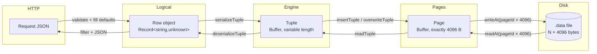

The representation changes exactly four times, and each change is owned by exactly one file:

| Boundary | Owned by | Direction |
| --- | --- | --- |
| JSON ↔ `Row` | Nest / `class-transformer` | both |
| `Row` ↔ tuple `Buffer` | `tuple-serializer.ts` / `tuple-deserializer.ts` | both |
| tuple ↔ page `Buffer` | `page-serializer.ts` / `page-deserializer.ts` | both |
| page ↔ file bytes | `pager.service.ts` → `storage.service.ts` | both |

---

# 8. Execution Flow

## 8.1 Bootstrap — from `node dist/main` to "listening"

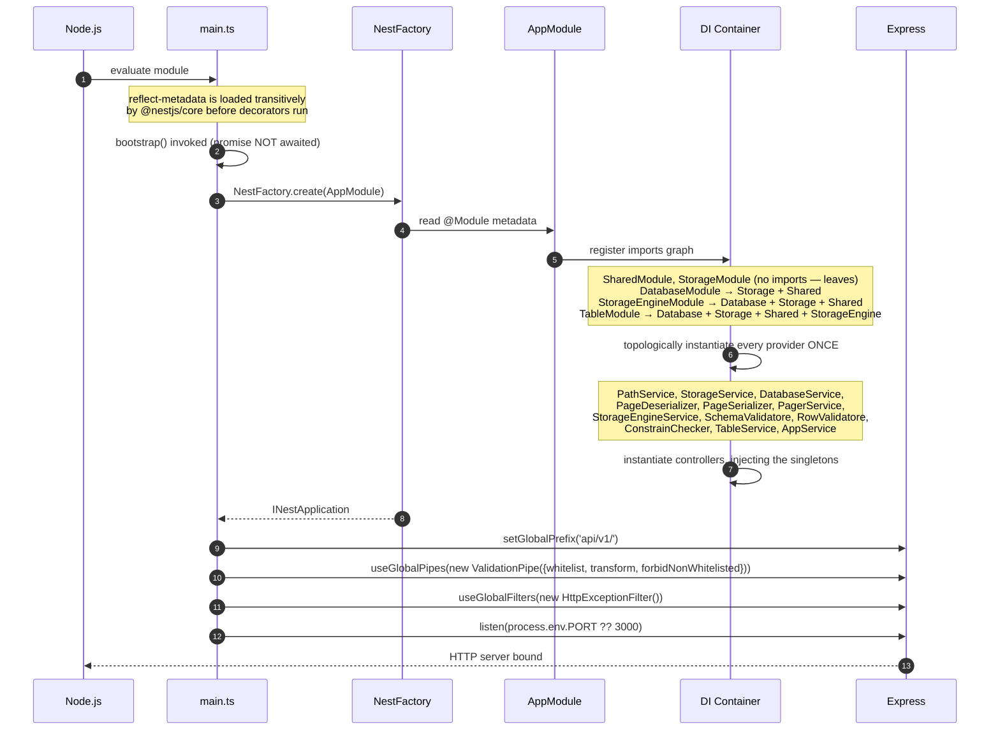

### Provider instantiation order

Nest resolves the graph bottom-up. The **guaranteed** ordering constraints, derived from the
constructor dependencies:

```
PathService, StorageService, PageDeserializer      (no project dependencies)
        ↓
PageSerializer            (needs PageDeserializer)
        ↓
PagerService              (needs PageSerializer, StorageService)
DatabaseService           (needs StorageService, PathService)
        ↓
StorageEngineService      (needs PathService, DatabaseService, StorageService,
                                 PagerService, PageSerializer, PageDeserializer)
        ↓
TableService              (needs DatabaseService, StorageService, PathService,
                                 SchemaValidatore, StorageEngine, RowValidatore, ConstrainChecker)
        ↓
Controllers               (DatabaseController, TableController, StorageEngineController, AppController)
```

`SchemaValidatoreService`, `RowValidatoreService`, and `ConstrainCheckerService` have no
dependencies and can be created at any point before `TableService`.

**One instance each.** Because `DatabaseModule` **exports** `DatabaseService` and three modules
import it, one might expect three instances. Nest does not work that way: a provider registered
in a module is a singleton for the whole application, and importing modules receive a
*reference*. This is what makes the `currentDatabase` field visible from `TableService` and
`StorageEngineService` alike. **The entire session model depends on this.**

**Nothing touches the filesystem at bootstrap.** No `databases/` directory is created, no schema
is preloaded, no file handle is opened. The first disk access happens on the first request.

**Failure mode.** `bootstrap()`'s promise is neither awaited nor `.catch`-ed
([main.ts:23](src/main.ts#L23)). A port-in-use error surfaces as an unhandled rejection.

---

## 8.2 Request lifecycle

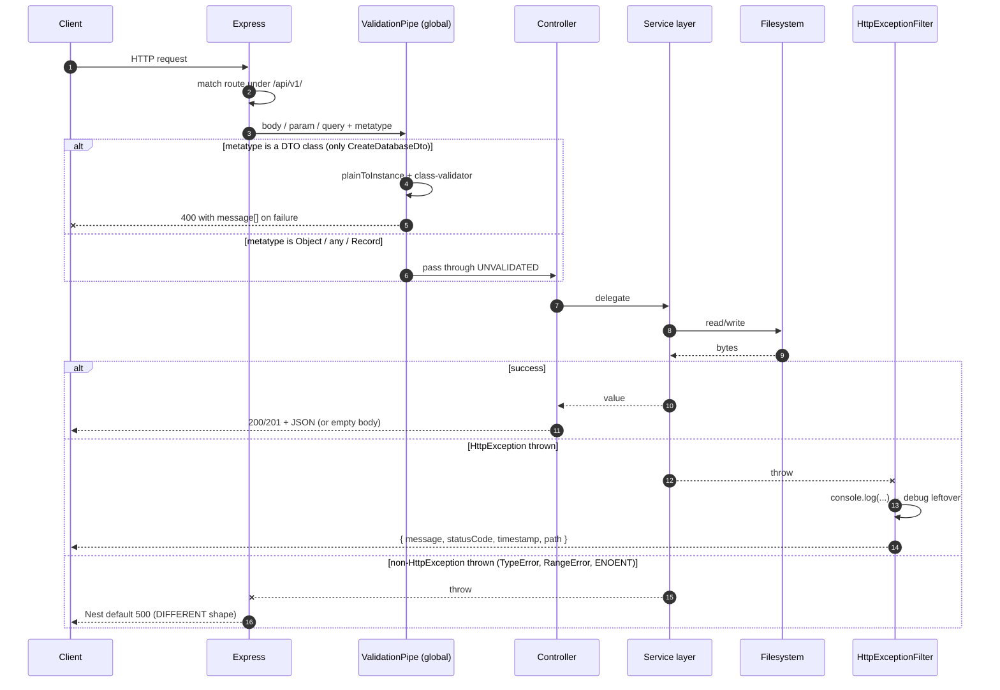

**The `ValidationPipe` branch is the important detail.** Nest's `ValidationPipe` inspects the
parameter's **design-time metatype**. When that metatype is `Object`, `Array`, `String`,
`Number`, `Boolean`, or `Function`, the pipe short-circuits and returns the value untouched.
`Record<string, unknown>` and `any` both erase to `Object`. Therefore:

| Endpoint | Body type | Validated? |
| --- | --- | --- |
| `POST /database` | `CreateDatabaseDto` | ✅ yes |
| `POST /table` | `any` | ❌ no |
| `POST /table/insert/:t` | `Record<string, unknown>` | ❌ no |
| `PATCH /table/update/:t` | inline object literal type | ❌ no |
| `DELETE /table/:t` | `Record<string, unknown>` | ❌ no |

`whitelist` and `forbidNonWhitelisted` therefore protect exactly one endpoint. All other input
safety comes from the hand-written validator services.

---

## 8.3 Storage lifecycle

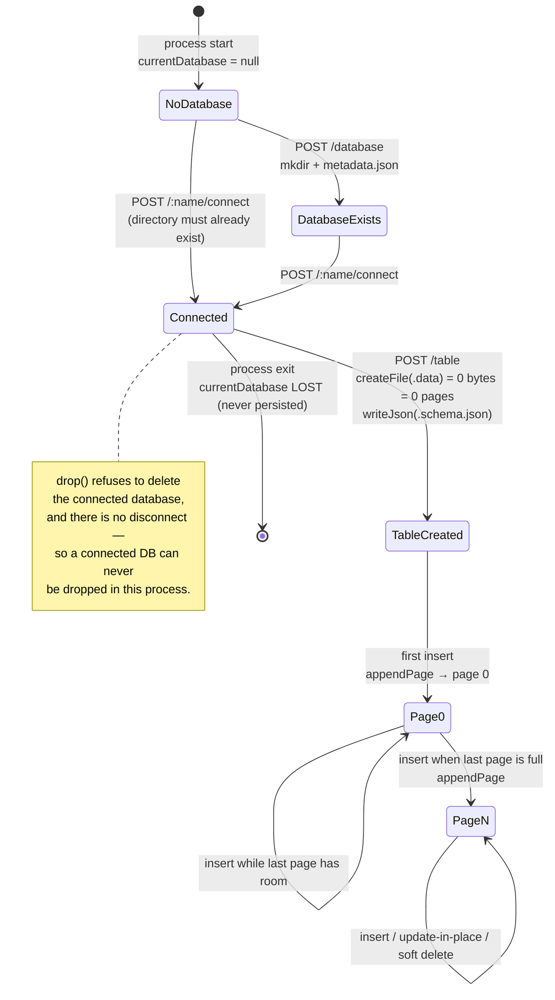

### Lifetimes

| Thing | Created | Destroyed | Persisted? |
| --- | --- | --- | --- |
| Nest DI singletons | bootstrap | process exit | no |
| `currentDatabase` | `POST /:name/connect` | process exit | **no** — must reconnect after every restart |
| Database directory | `POST /database` | `DELETE /database/:name` | yes |
| `metadata.json` | with the database | with the database | yes, **never read back** |
| `<table>.schema.json` | `POST /table` | never (no drop) | yes |
| `<table>.data` | `POST /table` (0 bytes) | never (no drop) | yes |
| A page | first insert that needs it | never | yes |
| A slot | `insertTuple` | never — tombstoned at most | yes |
| A file handle | per `readAt`/`writeAt` call | end of that call | n/a |

**There is no shutdown hook.** No `OnModuleDestroy`, no `enableShutdownHooks()`, no flush, no
`fsync`. Killing the process mid-write can leave a partially written 4096-byte page, and
`pageCount`'s `Math.floor` will silently ignore a trailing partial page.

---

# 9. Architecture Decisions

## Why classes and not plain modules of functions?

Because **NestJS's dependency injection operates on classes**. A `@Injectable()` class can
declare its collaborators in a constructor and let the container supply them, which gives three
concrete benefits here:

1. **Singleton lifetime for free.** `DatabaseService` must be a singleton or `currentDatabase`
   would not be shared. DI guarantees that without any manual global.
2. **Substitutability.** `PageSerializer` receives a `PageDeserializer`; a test could pass a
   fake. (No tests exist yet, but the seam does.)
3. **Explicit dependency graphs.** Reading a constructor tells you exactly what a class touches.
   `StorageEngineService`'s six-parameter constructor is a truthful statement of its coupling.

Where DI buys nothing, the code **deliberately does not use a class** — `serializeTuple`,
`deserializeTuple`, `sizeOfValue`, `writeValue`, and `readValue` are bare exported functions,
because they depend on nothing but their arguments.

## Why services and not logic in controllers?

All five `TableController` handlers are one-line delegates. This keeps HTTP concerns
(`@Param`, `@Body`, status codes) out of the domain, and — more practically — it means the same
`TableService.insert` will be reusable by the future SQL executor
([PLAN.md:101](PLAN.md#L101)) without going through HTTP.

## Why interfaces instead of classes for data shapes?

`PageHeader`, `Slot`, `RowId`, `TableSchema`, and `ColumnDefinition` are all `interface`s, which
are **erased at compile time**. They cost zero runtime bytes and zero allocations — which
matters for `Slot`, since one is constructed for every slot on every page of every scan. They
also describe data that arrives from `JSON.parse` or `Buffer.read*`, where a class instance
would be a lie anyway.

The DTOs are the exception: they are `class`es because `class-validator` needs a runtime
constructor to attach decorator metadata to.

## Why `Buffer` and not strings or JSON?

Four reasons, all visible in the code:

1. **No delimiter to corrupt.** [BINARY_STORAGE.md:35-53](BINARY_STORAGE.md#L35-L53) describes
   the failure the old `.ndjson` format had: a newline inside a value destroys every following
   row. Length-prefixed binary has no delimiter at all.
2. **Fixed-size records enable random access.** You cannot seek to "row 400" in a text file
   without scanning; you can seek to page 3 in a binary file with one multiplication.
3. **Compactness.** `{"id":1,"age":13}` is 17 bytes as JSON, 8 bytes as a tuple.
4. **Type fidelity.** JSON has one number type. `Buffer.writeInt32LE` versus
   `writeBigInt64LE` versus `writeUInt8` preserves the declared column type exactly.

## Why binary storage at all?

Because the project's purpose is to *be* a database engine, not to wrap one. Every real engine
— PostgreSQL, SQLite, InnoDB — stores fixed-size pages of binary tuples. Implementing that is
the point ([PLAN.md:64-76](PLAN.md#L64-L76)).

## Why separate serializers and deserializers?

Four files where one would do, because:

- **Different dependency profiles.** `PageDeserializer` depends on **nothing**;
  `PageSerializer` depends on `PageDeserializer`. Merging them would give the read path a
  dependency it does not need.
- **Reads vastly outnumber writes.** Every operation scans; only mutations write. Keeping the
  read path dependency-free keeps it cheap and trivially testable.
- **The symmetry is the specification.** `writeValue` and `readValue` sitting side by side in
  [type-codec.ts](src/storage-engine/serialization/type-codec.ts) makes any asymmetry visible on
  one screen. (That is exactly how the `TIMESTAMP` ISO-normalization asymmetry is spottable.)

## Why the page abstraction?

A page is the **unit of I/O**. 4096 bytes matches the OS page size and typical filesystem block
size, so reading one logical page is one physical block read with no read-modify-write penalty
at the device level.

The decisive benefit is in `updateRow`: changing one row rewrites **4096 bytes**, not the whole
file. [BINARY_STORAGE.md:54-58](BINARY_STORAGE.md#L54-L58) records this as reason #2 for the
rewrite.

## Why slots?

**Indirection.** This is the single most important idea in the codebase, and
[BINARY_STORAGE.md:146-179](BINARY_STORAGE.md#L146-L179) is devoted to it.

A row's address is its **slot number**, not its byte position. The slot points at the bytes. So:

- A tuple can be moved within its page (future compaction) by editing 2 bytes in its slot —
  every outstanding `RowId` stays valid.
- A tuple can be tombstoned by setting its slot's offset to `0` without touching the tuple area.
- Variable-length tuples work, because the slot carries the length.

Without a directory, a row's address *is* its position, so nothing could ever move and a page
could never be compacted.

## Why offsets grow downward while slots grow upward?

```
+--------------------------------------+ 0
| header (16 B)                        |
+--------------------------------------+ 16
| slot 0 | slot 1 | slot 2 |  ↓ grows down
+--------------------------------------+
|                                      |
|            FREE SPACE                |   free = tupleStart − (16 + slotCount×4)
|                                      |
+--------------------------------------+
| ...  | tuple 2 | tuple 1 | tuple 0 |   ↑ grows up
+--------------------------------------+ 4096
```

Both regions are variable-length, and neither's final size is known in advance. Growing them
from opposite ends means **all free space is one contiguous block in the middle**, and "is the
page full?" is a single subtraction — `freeSpace()` is four lines. Any other arrangement would
need either a fixed directory cap (wasting space on wide-row tables) or a free-list.

## Why `DELETED_OFFSET = 0`?

Offset 0 lies inside the 16-byte header, so **no legitimate tuple can ever begin there**. That
makes `0` an unambiguous tombstone that costs zero extra bytes — no separate `deleted` flag byte
per slot ([BINARY_STORAGE.md:134-136](BINARY_STORAGE.md#L134-L136)).

## Why is page 0 not special?

Because `pageCount` is derived: `Math.floor(fileSize / PAGE_SIZE)`. There is no metadata page to
keep in sync with reality, no risk of a stored count drifting, and an empty file is
unambiguously zero pages ([BINARY_STORAGE.md:255](BINARY_STORAGE.md#L255)).

## Why soft delete?

[BINARY_STORAGE.md:256](BINARY_STORAGE.md#L256): *"Deleted rows stay readable and restorable."*
It also sidesteps in-page compaction entirely — a soft delete is a normal in-place update.

The documented cost: a deleted row still holds its primary key and unique values, so those
values can never be reused ([BINARY_STORAGE.md:262-263](BINARY_STORAGE.md#L262-L263)).

## Why "try the last page, else append"?

One page read per insert, instead of maintaining a free-space map or scanning for a page with
room ([BINARY_STORAGE.md:258](BINARY_STORAGE.md#L258)). It is optimal for append-only workloads
and wastes space only after relocating updates — which is the deliberate trade.

## Why "rewrite in place, else kill and re-insert" for updates?

About fifteen lines of code, versus forwarding pointers that every reader would have to chase
([BINARY_STORAGE.md:257](BINARY_STORAGE.md#L257)). The cost is a changed `RowId`, which is free
today because no `RowId` survives a request.

## Why this folder structure?

It mirrors the **layer stack** (§1). Each folder is a Nest module boundary, and a module's
`exports` array is an enforced public API — `PagerService` and the page serializers are
providers of `StorageEngineModule` but are **not exported**, so `TableService` literally cannot
inject them and cannot see a `Buffer`. The folder structure is not cosmetic; it is enforced
encapsulation.

## Why does `PathService` exist for four one-line methods?

So the on-disk layout can change in one file. Moving to `databases/<db>/tables/<t>/data.bin`
would be a four-line edit. (The rule is broken exactly once, in
[database.service.ts:26](src/database/database.service.ts#L26).)

## Why is the current database a mutable field rather than a request parameter?

It imitates a SQL client session (`\c dbname` in `psql`). It keeps every URL free of a database
segment. The cost — process-global state, no multi-tenancy, lost on restart — is real and is
documented in §16 (TD-4).

---

# 10. Storage Format

Three file types live under `databases/<db>/`. Two are JSON; one is binary.

## 10.1 `metadata.json` — per database

UTF-8, pretty-printed with 2-space indentation (`JSON.stringify(x, null, 2)`).

```json
{
  "name": "shop",
  "version": "1.0.0",
  "createdAt": "2026-08-07T12:00:00.000Z"
}
```

Written once by `DatabaseService.createMetaData`. **Never read back by any code.**

## 10.2 `<table>.schema.json` — per table

UTF-8, **minified** (`writeJson` uses a bare `JSON.stringify`). This is the catalog, and it is
re-read from disk on **every** insert, scan, and update.

```json
{"name":"user","columns":[{"name":"id","type":"INTEGER","primaryKey":true},{"name":"name","type":"VARCHAR","length":20},{"name":"isActive","type":"BOOLEAN","default":true}]}
```

**The `columns` array order is the physical byte order of every tuple.** It also fixes the
null-bitmap bit assignment. Reordering it corrupts all existing data. `isActive` is always
appended last by `addIsActiveColumn`.

## 10.3 `<table>.data` — the heap file

A flat sequence of **N × 4096-byte pages**, no file header, no footer. `N` is derived as
`floor(fileSize / 4096)`.

```
byte 0        4096       8192       12288
  +----------+----------+----------+----------+
  |  page 0  |  page 1  |  page 2  |  page 3  |  ...
  +----------+----------+----------+----------+
      ^
      page P begins at byte P × 4096
```

### Page layout (4096 bytes)

```
        0                                                              4095
        +----------+-----------------+--------------------+--------------+
        |  HEADER  | SLOT DIRECTORY  |     FREE SPACE     | TUPLE AREA   |
        | 16 bytes |  4 B per slot   |                    |              |
        +----------+-----------------+--------------------+--------------+
        |          |  grows down →   |                    | ← grows up   |
        0         16          16+4×slotCount        tupleStart        4096
```

### The 16-byte page header

| Offset | Size | Field | Type | Meaning | Written by |
| :---: | :---: | --- | --- | --- | --- |
| `0` | 4 | `pageId` | `UInt32LE` | This page's own index. | `writeHeader` |
| `4` | 2 | `slotCount` | `UInt16LE` | Directory entries, **including tombstones**. Never decreases. | `writeHeader` |
| `6` | 2 | `tupleStart` | `UInt16LE` | Lowest byte occupied by a tuple. `4096` when empty. | `writeHeader` |
| `8` | 8 | *reserved* | — | Always zero. Room for a checksum / LSN / free-space hint. | **never written** |

Byte-level view of a freshly created page 0:

```
offset:  00 01 02 03  04 05  06 07  08 09 0A 0B 0C 0D 0E 0F
value:   00 00 00 00  00 00  00 10  00 00 00 00 00 00 00 00
         └──pageId=0─┘ └cnt=0┘ └────┘ └──────reserved──────┘
                              tupleStart = 0x1000 = 4096
```

### One slot (4 bytes) — slot `i` lives at `16 + i × 4`

| Offset | Size | Field | Type | Meaning |
| :---: | :---: | --- | --- | --- |
| `+0` | 2 | `offset` | `UInt16LE` | Byte position of the tuple in this page. **`0` = tombstone.** |
| `+2` | 2 | `length` | `UInt16LE` | Tuple size in bytes. `0` when tombstoned. |

```
slot 0 → bytes 16..19
slot 1 → bytes 20..23
slot 2 → bytes 24..27
slot i → bytes 16+4i .. 19+4i
```

### Free space

```
freeSpace = tupleStart − (PAGE_HEADER_SIZE + slotCount × SLOT_SIZE)
          = tupleStart − (16 + slotCount × 4)
```

An insert requires `freeSpace >= tuple.length + SLOT_SIZE` — **the new slot is counted too**.

- Empty page: `4096 − 16 = 4080` bytes free.
- Maximum single tuple: `4096 − 16 − 4 = 4076` bytes.

### A worked page, after three inserts of 22-byte tuples

```
0        16   20   24                                    4030 4052 4074 4096
+--------+----+----+----+ ······················· +------+----+----+----+
| header |slot|slot|slot|      FREE SPACE         |tuple |tup |tup |
|        | 0  | 1  | 2  |      4030−28 = 4002 B   |  2   | 1  | 0  |
+--------+----+----+----+ ······················· +------+----+----+
           |    |    |                               ^      ^    ^
           |    |    └── offset=4030, length=22 ─────┘      |    |
           |    └─────── offset=4052, length=22 ────────────┘    |
           └──────────── offset=4074, length=22 ─────────────────┘

header: pageId=0  slotCount=3  tupleStart=4030
free  : 4030 − (16 + 3×4) = 4002 bytes
```

Note that **slot order and physical order are reversed**: slot 0 holds the *highest* offset,
because tuples are allocated downward while slots are allocated upward.

### After tombstoning slot 1 (via `markDeleted`)

```
slot 0: offset=4074 length=22
slot 1: offset=0000 length=00     ← tombstone; the 22 bytes at 4052 are ORPHANED
slot 2: offset=4030 length=22

header: pageId=0  slotCount=3 (UNCHANGED)  tupleStart=4030 (UNCHANGED)
free  : still 4002 — the 22 orphaned bytes are NOT recoverable
```

This is the space leak documented in §16 (TD-13). There is no compaction pass.

## 10.4 Tuple format

```
+------------------+---------------------------------------------------+
|   NULL BITMAP    |  VALUES, packed in schema-column order,            |
|  ceil(n/8) bytes |  NULL columns contribute ZERO bytes                |
+------------------+---------------------------------------------------+
```

There is **no length field, no column count, no schema id, and no checksum** inside a tuple.
The slot supplies the total length; the schema supplies everything else.

### The null bitmap

- Size: `Math.ceil(columns.length / 8)` bytes. 1–8 columns → 1 byte; 9–16 → 2 bytes.
- Column `i` maps to **byte `floor(i / 8)`, bit `i % 8`** (least-significant bit first).
- **Bit set (1) = the column is NULL** and occupies no value bytes.
- Written by `serializeTuple` as `buffer[byteIndex] += 2 ** bitIndex`.
- Read by `deserializeTuple` as `floor(buffer[byteIndex] / 2**bitIndex) % 2 === 1`.

It exists because binary has no natural "nothing here" — the integer `0` and *absent* look
identical as bytes ([BINARY_STORAGE.md:194-200](BINARY_STORAGE.md#L194-L200)).

> **In practice the bitmap is currently always `0x00`**, because `RowValidatoreService` rejects
> every null/undefined value before serialization (§4.5). The NULL machinery is complete and
> correct but unreachable through the HTTP API.

### Per-type encodings

| `ColumnType` | On-disk layout | Size | Writer | Reader |
| --- | --- | :---: | --- | --- |
| `BOOLEAN` | `0x00` or `0x01` | 1 | `writeUInt8(v ? 1 : 0)` | `readUInt8() === 1` |
| `INTEGER` | 32-bit signed, little-endian | 4 | `writeInt32LE` | `readInt32LE` |
| `TIMESTAMP` | 64-bit signed ms since epoch, little-endian | 8 | `writeBigInt64LE(BigInt(new Date(v).getTime()))` | `new Date(Number(readBigInt64LE())).toISOString()` |
| `VARCHAR(n)` | `UInt16LE` byte-length, then raw UTF-8 | `2 + b` | `writeUInt16LE(b)` + `write(v,'utf8')` | `readUInt16LE` + `toString('utf8', ...)` |
| `TEXT` | **identical to `VARCHAR`** | `2 + b` | same | same |

`b` is `Buffer.byteLength(value, 'utf8')` — **UTF-8 bytes, not characters**.

> ⚠️ **`TIMESTAMP` diverges from the design doc.** [BINARY_STORAGE.md:208-214](BINARY_STORAGE.md#L208-L214)
> specifies a **double** (`writeDoubleLE`); the code uses **`BigInt64LE`**. Same 8 bytes, **not
> byte-compatible**. The code is authoritative.

### Text is not padded

```
"ahmed" in a VARCHAR(20) column:

+-------+---+---+---+---+---+
| 05 00 | a | h | m | e | d |
+-------+---+---+---+---+---+
 length   the 5 UTF-8 bytes      = 7 bytes total, not 20
 (2 B, LE)
```

### Worked example — the `user` table

Schema (six columns, in order):

| # | Column | Type |
| --- | --- | --- |
| 0 | `id` | `INTEGER` |
| 1 | `name` | `VARCHAR(20)` |
| 2 | `age` | `INTEGER` |
| 3 | `phone` | `VARCHAR(20)` |
| 4 | `isActive` | `BOOLEAN` |
| 5 | `isBlocked` | `BOOLEAN` |

Row: `{"id":1,"name":"uiu2i","age":13,"phone":"11","isActive":true,"isBlocked":true}`

```
bitmapSize = ceil(6 / 8) = 1 byte

off  bytes                        field           meaning
---  ---------------------------  --------------  ------------------------
 0   00                           null bitmap     no column is NULL
 1   01 00 00 00                  id              INTEGER 1
 5   05 00                        name.length     5 UTF-8 bytes
 7   75 69 75 32 69               name.text       "uiu2i"
12   0D 00 00 00                  age             INTEGER 13
16   02 00                        phone.length    2
18   31 31                        phone.text      "11"
20   01                           isActive        true
21   01                           isBlocked       true
                                  ---------------
                                  TOTAL = 22 bytes
```

Three such rows occupy 66 tuple bytes + 12 slot bytes + 16 header bytes = 94 of 4096. They all
fit in page 0 ([BINARY_STORAGE.md:228-246](BINARY_STORAGE.md#L228-L246) gives the same worked
example).

## 10.5 Serialization and deserialization formats, summarized

**Serialize (`Row` → `Buffer`)**

```
bitmapSize ← ceil(columnCount / 8)
size       ← bitmapSize + Σ sizeOfValue(col, row[col]) for every NON-NULL column
buffer     ← Buffer.alloc(size)                 // zero-filled ⇒ bitmap starts clean
offset     ← bitmapSize
for (col, i) in columns:
    if row[col] is null/undefined → set bit i in the bitmap; write NO bytes
    else                          → offset ← writeValue(buffer, offset, col, row[col])
```

**Deserialize (`Buffer` → `Row`)**

```
bitmapSize ← ceil(columnCount / 8)
offset     ← bitmapSize
for (col, i) in columns:
    if bit i is set → row[col] ← null; DO NOT advance offset
    else            → {value, nextOffset} ← readValue(buffer, offset, col)
                      row[col] ← value; offset ← nextOffset
```

**The two must agree exactly.** They share `ColumnType` and the same field ordering, but there
is no test asserting the round trip.

## 10.6 Complete on-disk diagram

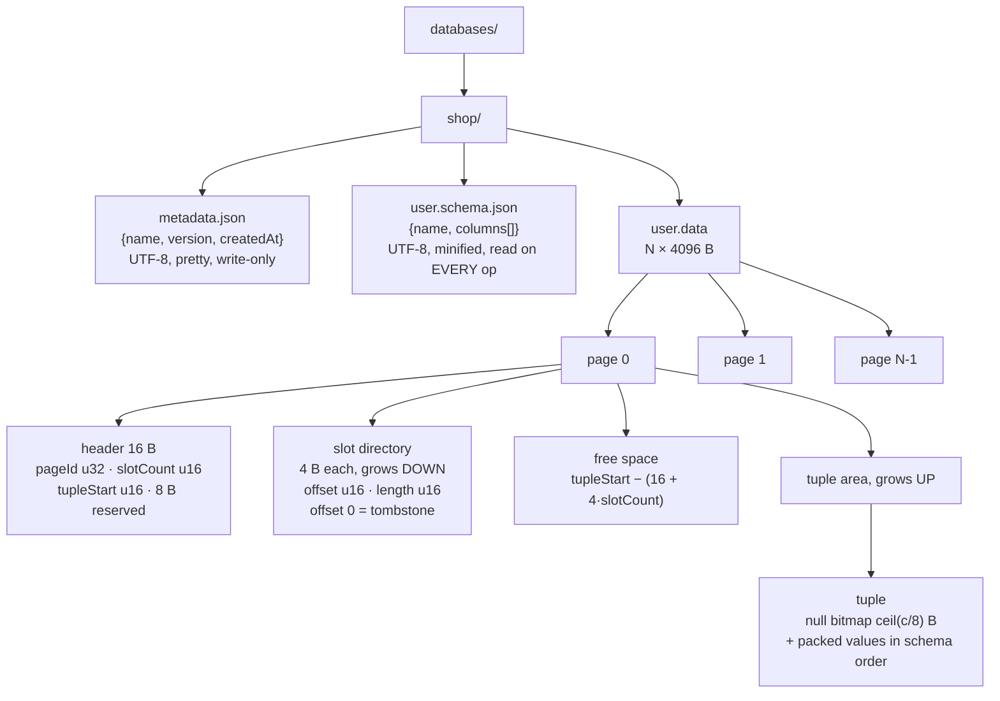

---

# 11. Algorithms

## 11.1 INSERT (end to end)

```
TableService.insert(tableName, row)
────────────────────────────────────────────────────────────────────
 1. schema  ← readSchema(tableName)              ← file read + JSON.parse
 2. allRows ← scan(tableName).map(e => e.row)    ← FULL TABLE SCAN, O(n)
 3. ConstrainChecker.validate(row, allRows, schema)
        a. fillDefault        — MUTATES row (isActive: true, etc.)
        b. validatePrimaryKey — 400 if PK null; 409 if duplicate (loose ==)
        c. validateuniqueness — 409 if any unique column collides (strict ===)
 4. RowValidatore.validate(row, schema)
        a. validateRequiredColumns — 400 Missing column
        b. validateUnknownColumns  — 400 Unknown column
        c. validateTypes           — 400 type/length error
 5. StorageEngine.insertRow(tableName, row)
        a. requireDataPath                       ← 404 if no .data file
        b. schema ← readSchema                   ← SECOND read this request
        c. tuple  ← serializeTuple(row, schema)
        d. N ← pageCount = floor(fileSize / 4096)
        e. if N > 0:
               page ← readPage(N-1)              ← ONLY the last page is tried
               slotId ← insertTuple(page, tuple)
               if slotId !== null:
                   writePage(N-1, page);  return {pageId: N-1, slotId}
        f. {pageId, page} ← appendPage()         ← writes an EMPTY page first
           slotId ← insertTuple(page, tuple)
           if slotId === null: throw 400 "Row is too large to fit in one page."
           writePage(pageId, page)
           return {pageId, slotId}
```

**Why step 3 precedes step 4.** `fillDefault` must run before type validation, or a defaulted
column would be seen as `undefined` and rejected. The ordering is load-bearing and undocumented
in the code.

**Complexity.**

| Aspect | Cost |
| --- | --- |
| Disk reads | 1 schema file + **P page reads** (scan) + 1 schema file + 1 page read |
| Disk writes | 1 page (or 2, if a page is appended) |
| CPU | O(n·u) constraints + O(c) validation + O(c+b) serialization |
| Memory | **O(n)** — every row in the table is materialized |
| **Bulk-loading n rows** | **O(n²)** |

**Edge cases.** Tuple > 4076 bytes → 400. Free space in earlier pages is never reused.
Concurrent inserts race on the last page. No `fsync`.

## 11.2 `insertTuple` — placing a tuple inside a page

```
insertTuple(page, tuple) → slotId | null
────────────────────────────────────────────────────────────
 1. header ← readHeader(page)
 2. needed ← tuple.length + SLOT_SIZE          ← the new SLOT counts too
 3. if freeSpace(page) < needed: return null   ← "page full" signal
 4. offset ← header.tupleStart − tuple.length  ← allocate DOWNWARD
 5. tuple.copy(page, offset)
 6. writeSlot(page, header.slotCount, offset, tuple.length)   ← append to directory
 7. header.slotCount  += 1
    header.tupleStart  = offset
    writeHeader(page, header)
 8. return header.slotCount − 1
```

**Invariant maintained.** After every call, `tupleStart` is the lowest occupied byte and
`slotCount` is the number of directory entries. Steps 5–7 must all happen or the page is
inconsistent — they do, because it is synchronous in-memory code with no `await`.

**Complexity.** O(tuple.length) for the copy; O(1) otherwise. **Never scans the directory** —
insertion is always at the end.

## 11.3 UPDATE — in place or relocate

```
StorageEngine.updateRow(tableName, rowId, row)
────────────────────────────────────────────────────────────
 1. tuple ← serializeTuple(row, schema)
 2. page  ← readPage(rowId.pageId)
 3. slot  ← readSlot(page, rowId.slotId)
 4. if !slot.deleted AND tuple.length <= slot.length:
        tuple.copy(page, slot.offset)                 ← IN PLACE
        writeSlot(page, slotId, slot.offset, tuple.length)
        writePage(rowId.pageId, page)
        return rowId                                  ← SAME address
 5. else:                                             ← RELOCATE
        markDeleted(page, rowId.slotId)               ← offset ← 0, length ← 0
        writePage(rowId.pageId, page)                 ← WRITE #1
        return insertRow(tableName, row)              ← WRITE #2, NEW address
```

**Why the length test is `<=` and not `==`.** A shrinking tuple can reuse the same offset; only
a *growing* one cannot.

**The relocation hazard.** Steps in branch 5 are **two independent, unsynchronized disk
writes**. A crash between them tombstones the old tuple without writing the new one — the row is
**permanently lost**. There is no WAL, no journal, no rollback.

**Space forfeited on shrink.** Writing the smaller `length` back into the slot means the
difference is unreachable forever, and the row can never grow back into space it once owned.

**Complexity.** In place: 1 page read + 1 page write. Relocating: 1 read + 1 write + a full
`insertRow`.

## 11.4 DELETE — soft delete

```
TableService.delete(tableName, where)
    → TableService.update(tableName, where, { isActive: false })
```

That is the entire implementation. Consequences:

- The row keeps its slot, its bytes, and its `RowId`.
- `isActive` is a 1-byte `BOOLEAN`, so `false` and `true` serialize to the **same tuple
  length** — `overwriteTuple` always succeeds, and a delete never relocates.
- `TableService.select` hides the row via `row.isActive !== false`.
- `GET /api/v1/storage-engine/rows/:tableName` still returns it.
- **The row's PK and unique values remain occupied forever**
  ([BINARY_STORAGE.md:262-263](BINARY_STORAGE.md#L262-L263)).
- **The file never shrinks.**

`PageSerializer.markDeleted` — the *hard* delete primitive — is reachable **only** from the
relocation branch of `updateRow`. No user-facing operation tombstones a slot.

## 11.5 SEARCH / SELECT — full sequential scan

```
scan(tableName)
────────────────────────────────────────────────────────────
 for pageId in 0 .. pageCount−1:
     page   ← readPage(pageId)                     ← open/read/close per page
     header ← readHeader(page)
     for slotId in 0 .. header.slotCount−1:
         tuple ← readTuple(page, slotId)           ← null ⇔ tombstoned
         if tuple is null: continue
         rows.push({ rowId: {pageId, slotId},
                     row: deserializeTuple(tuple, schema) })
 return rows

TableService.select then applies:
     .filter(row => row.isActive !== false)        ← soft-delete filter
     .filter(row => keys.every(k => row[k] === where[k]))   ← STRICT equality
```

**There is no index, no B-tree, no hash lookup, no early exit.** Every query — including a
lookup by primary key — reads every page and decodes every live tuple. The `indexed?: boolean`
flag on `ColumnDefinition` is never consulted; `src/index/` is empty.

**Complexity.** O(P) page reads, O(R) decodes, O(R) memory, O(R·k) filtering. **O(n) for every
query regardless of selectivity.**

**Ordering.** Physical order — page ascending, then slot ascending. That equals insertion order
*except* for rows relocated by a growing update, which jump to the end.

## 11.6 Serialization / deserialization

Covered in full in §5.1, §5.2, and §10.5. The essential points:

- **Two passes to serialize** (measure, then write) because `Buffer.alloc` needs an exact size.
- **Positional decoding** — field `i`'s offset is only knowable after fields `0..i−1` have been
  decoded. This is why the schema column array must never be reordered.
- **NULL costs one bit and zero value bytes.**
- Both are O(c + b).

## 11.7 Schema validation (CREATE TABLE)

```
addIsActiveColumn(schema)                    ← push isActive:BOOLEAN default true, if absent
SchemaValidatore.validate(schema):
    1. validateTableName        — name.trim() non-empty          → 400
    2. validateColumnsExist     — columns.length > 0             → 400
    3. validateColumnNames      — each name.trim() non-empty     → 400
    4. validateDuplicateColumns — Set-based, first repeat wins   → 400
    5. validateTypes            — Set(Object.values(ColumnType)) → 400
```

Fail-fast. O(c) overall — the two `Set`s turn what would be O(c²) nested scans into O(c).

## 11.8 Constraint checking

```
fillDefault(row, schema)                     O(c)     MUTATES row
    for each column with default != null:
        if row[name] == null: row[name] ← column.default

validatePrimaryKey(row, allRows, schema, ignoredIndex)      O(n)
    pk ← columns.find(c => c.primaryKey)?.name
    if no pk: return                          ← PKs are optional
    if row[pk] == null: throw 400
    if allRows.some((r,i) => r[pk] == row[pk] && i != ignoredIndex): throw 409

validateuniqueness(row, allRows, schema, ignoredIndex)      O(u·n)
    for each column with unique === true:
        if allRows.some((r,i) => r[key] === row[key] && i != ignoredIndex): throw 409
```

**`ignoredIndex`** is the position in `allRows` of the row being updated, so it does not
conflict with itself. `undefined` on INSERT, where `i != undefined` is always true — correct by
accident of loose comparison, but correct.

**Total O(n·u).** A hash index over the PK and unique columns would make this O(1); that is the
single highest-value optimization available (§17).

## 11.9 Row validation

```
validateRequiredColumns  O(c)   every schema column must be `in` row, unless it has a default
validateUnknownColumns   O(c+k) Set of allowed names; every row key must be in it
validateTypes            O(c)   switch on column.type; see the table in §4.5
```

## 11.10 Parsing

**There is no SQL parser.** No lexer, no tokenizer, no AST, no recursive-descent parser exists
in `src/`. [PLAN.md:789-801](PLAN.md#L789-L801) specifies one as Phase 1, and `src/executor/` is
the reserved (empty) home for it. The only parsing performed today is `JSON.parse` on the two
JSON catalog files, plus whatever Express does to the request body.

---

# 12. Dependencies

## Runtime dependencies (7)

### `@nestjs/common` `^11.0.1`
Supplies `@Module`, `@Injectable`, `@Controller`, the HTTP method decorators, `@Body`/`@Param`/
`@Query`, `HttpException`, `ValidationPipe`, and the `ExceptionFilter` interface. **Every
`throw` in the project throws an `HttpException` from this package** — it is what lets a
validation failure deep in `ConstrainCheckerService` become a correct HTTP 409 without any layer
in between knowing about HTTP.

### `@nestjs/core` `^11.0.1`
The DI container and `NestFactory`. **This is the load-bearing dependency**: the singleton
guarantee it provides is what makes `DatabaseService.currentDatabase` a working session, and its
module system is what enforces the encapsulation described in §9 (`PagerService` being
unreachable from `TableService`).

### `@nestjs/platform-express` `^11.0.1`
Binds Nest to Express. Provides the `Request`/`Response` objects that `HttpExceptionFilter`
uses directly. Could be swapped for Fastify — the only coupling is the `express` type import in
[transform.interceptor.ts:7](src/shared/interceptors/transform.interceptor.ts#L7).

### `class-validator` `^0.15.1`
Powers the `@IsString`, `@IsNotEmpty`, `@IsIn`, `@Length`, `@ValidateNested`, `@Min`, `@Allow`
decorators on the DTOs. **Currently exercised by exactly one endpoint** (`POST /database`),
because the other DTOs are not wired to routes. Also used indirectly:
[create-column.dto.ts:13](src/table/dtos/create-column.dto.ts#L13) builds its allow-list from
`Object.values(ColumnType)`.

### `class-transformer` `^0.5.1`
Required by `ValidationPipe` when `transform: true`. Converts the plain parsed body into a DTO
instance so decorator metadata can be read, and provides `@Type(() => CreateColumnDto)` for
nested array validation in `CreateTableDto`.

### `reflect-metadata` `^0.2.2`
The runtime metadata reflection API that `emitDecoratorMetadata`
([tsconfig.json:10](tsconfig.json#L10)) emits into. **Without it, constructor-parameter
injection cannot work at all** — Nest reads `design:paramtypes` from this registry to know that
`TableService`'s first parameter is a `DatabaseService`. It is imported transitively by
`@nestjs/core`; there is no explicit `import 'reflect-metadata'` in `src/`.

### `rxjs` `^7.8.1`
A hard peer dependency of `@nestjs/core` (interceptors and the request pipeline are built on
`Observable`). **Not imported anywhere in `src/`** — it is present because Nest requires it, not
because this project uses it. (It would become relevant the moment a real interceptor is
written in `src/shared/interceptors/`.)

### What is deliberately absent

No database driver, no ORM, no query builder, no SQL parser, no serialization library
(`protobufjs`, `msgpack`), no `fs-extra`, no `lodash`, no validation library beyond
`class-validator`, no logging library. This is the "no external packages" rule from
[PLAN.md:68-70](PLAN.md#L68-L70) holding in practice.

## Why TypeScript?

1. **Nest requires decorator metadata**, which needs `experimentalDecorators` +
   `emitDecoratorMetadata` — a TypeScript feature.
2. **Binary code is the code most worth type-checking.** `writeInt32LE(value as number, offset)`
   makes the unchecked cast *visible*; in plain JavaScript it would be invisible.
3. **Interfaces document the format at zero runtime cost.** `PageHeader` and `Slot` compile away
   entirely.

Note that **full `strict` is off** ([tsconfig.json](tsconfig.json)): `noImplicitAny: false`,
`strictBindCallApply: false`, `noFallthroughCasesInSwitch: false`. Only `strictNullChecks` is
enabled. This is why `sizeOfValue`'s non-exhaustive-looking `switch` and the `as` casts in
`type-codec.ts` compile without complaint.

## Why Node.js?

Two APIs make the project possible:

- **`Buffer`** — a first-class, mutable, fixed-size byte array with typed accessors
  (`writeInt32LE`, `readUInt16LE`, `subarray`, `copy`). Every line of the storage engine depends
  on it.
- **`fs/promises`, specifically `FileHandle.read`/`.write` with a `position` argument** — random
  positional I/O without reading the whole file. Without it, paging is impossible.
  `StorageService.readAt`/`writeAt` are thin wrappers over exactly this.

`stat().size` supplying `pageCount` for free is a third, smaller reason.

## Dev dependencies — the notable ones

| Package | Why |
| --- | --- |
| `@nestjs/cli` | `nest build` / `nest start --watch`, driven by [nest-cli.json](nest-cli.json). |
| `typescript` `^5.7.3` | The compiler. |
| `ts-node`, `tsconfig-paths` | Used by the `test:debug` script. |
| `jest`, `ts-jest`, `@types/jest` | Configured inline in `package.json`. **No test file exists.** |
| `supertest`, `@types/supertest` | Intended for e2e HTTP tests. **No `test/` directory exists**, so `test:e2e` cannot run. |
| `eslint`, `typescript-eslint`, `@eslint/js` | Type-checked linting. |
| `prettier`, `eslint-config-prettier`, `eslint-plugin-prettier` | Formatting; `eslint-config-prettier` disables conflicting rules. |
| `@types/node`, `@types/express` | Types for `Buffer`/`fs` and for the `Request`/`Response` in the filter. |
| `source-map-support` | Maps stack traces back to `.ts`. Declared but never imported in `src/`. |
| `globals` | Supplies `globals.node` / `globals.jest` to the flat ESLint config. |
| `ts-loader` | A webpack loader. **Unused** — `nest build` uses `tsc` here, since no webpack config is present. |

---

# 13. Coding Conventions

## Naming conventions

| Kind | Convention | Examples | Deviations found |
| --- | --- | --- | --- |
| **Classes** | `PascalCase`, suffixed by role | `TableService`, `PageSerializer`, `DatabaseController` | `SchemaValidatoreService`, `RowValidatoreService` (spurious "e"); `ConstrainCheckerService` (missing "t") |
| **Interfaces** | `PascalCase`, no `I` prefix | `TableSchema`, `PageHeader`, `Slot`, `RowId` | — |
| **Enums** | `PascalCase` type, `SCREAMING_SNAKE` members | `ColumnType.INTEGER` | — |
| **Methods** | `camelCase`, verb-first | `insertRow`, `readHeader`, `requireCurrentDatabase` | `validateuniqueness` (missing capital U) |
| **Constants** | `SCREAMING_SNAKE_CASE` | `PAGE_SIZE`, `SLOT_SIZE`, `DELETED_OFFSET` | — |
| **Injected properties** | `private readonly camelCase` | `storageService`, `pagerService` | **`TableService` names three of seven in PascalCase**: `SchemaValidatoreService`, `RowValidatoreService`, `ConstrainCheckerService` |
| **Free functions** | `camelCase`, verb-first | `serializeTuple`, `readValue` | — |
| **Booleans** | `is`-prefixed | `isActive`, `isNull`, `deleted` | — |

**A useful convention worth preserving:** methods prefixed `require*` (`requireCurrentDatabase`,
`requireDataPath`) **throw rather than return null**. `get*` methods return a value or `null`.
This is consistent across both classes that use it.

## File naming

| Kind | Pattern | Examples |
| --- | --- | --- |
| Modules | `<feature>.module.ts` | `table.module.ts` |
| Services | `<feature>.service.ts` | `storage-engine.service.ts` |
| Controllers | `<feature>.controller.ts` | `database.controller.ts` |
| DTOs | `<action>-<entity>.dto.ts` | `create-table.dto.ts` |
| Interfaces | `<name>.interface.ts` | `slot.interface.ts` |
| Constants | `constant.<feature>.ts` | `constant.pager.ts` |
| Serializers | `<scope>-<direction>.ts` | `page-serializer.ts`, `tuple-deserializer.ts` |

All lowercase `kebab-case`. **Known typos:**

- `storag-engine.controller.ts` — missing `e`
- `row.id.inerface.ts` — `inerface`, and it uses dots where the rest of the codebase uses hyphens
- `constrain-checkers.service.ts` — plural file, singular class
- `constant.pager.ts` — inverted versus the `pager.constant.ts` the rest of the codebase's
  ordering would predict
- `transform.interceptor.ts` — contains an exception filter, not an interceptor

## Folder naming

Lowercase, `kebab-case` for multi-word (`storage-engine`). Feature folders are singular
(`table`, `database`), sub-folders are plural (`dtos`, `interfaces`) — except `pager` and
`serialization`, which are named for the *concept* rather than the file kind. Every feature
folder maps 1:1 to a Nest module.

## Import style

Two styles coexist:

```ts
import { PagerService }  from './pager/pager.service';               // relative, same feature
import { PathService }   from 'src/shared/path.service';             // absolute, cross-feature
```

The absolute form is enabled by `"baseUrl": "./"`. The convention is *mostly* "relative within a
feature, `src/`-absolute across features", but it is not applied uniformly —
[database.service.ts](src/database/database.service.ts) uses `'../storage/storage.service'`
(relative) and `'src/shared/path.service'` (absolute) in adjacent lines.

## Error-handling strategy

**One mechanism: `throw new HttpException(message, statusCode)`.** There are no custom error
classes, no error codes, no `Result` types.

| Status | Meaning | Thrown by |
| --- | --- | --- |
| `400` | Bad input — no DB connected, missing/unknown column, type error, null PK, row too large | `DatabaseService`, `RowValidatoreService`, `ConstrainCheckerService`, `SchemaValidatoreService`, `StorageEngineService` |
| `404` | Not found — database, table, schema, or row | `DatabaseService`, `StorageEngineService`, `TableService` |
| `409` | Conflict — duplicate database, table, file, PK, or unique value | `DatabaseService`, `TableService`, `StorageService`, `ConstrainCheckerService` |
| `500` | Table creation failed | `TableService.create` |

**Validation is fail-fast**: the first violation throws; no error is accumulated. So a row with
three problems reports only the first.

**The strategy has two documented gaps:**

1. **Only `HttpException` is caught.** A `RangeError` from an out-of-range `INTEGER`, an
   `ENOENT` from `fs`, or a `SyntaxError` from a corrupt schema file bypasses
   `HttpExceptionFilter` entirely and gets Nest's default 500 with a different body shape.
2. **`TableService.create` swallows the cause.** `catch { ... throw new HttpException('Failed to create table', 500) }`
   — the bare `catch` binds nothing, so the original error is unrecoverable.

## Validation strategy

Validation happens in **four distinct places**, in a deliberate order:

```
1. ValidationPipe (global, declarative)  ← ONLY POST /database is actually covered
2. SchemaValidatoreService               ← CREATE TABLE: is the schema well-formed?
3. ConstrainCheckerService               ← INSERT/UPDATE: defaults, then cross-row rules
4. RowValidatoreService                  ← INSERT/UPDATE: presence, unknown keys, types
```

Steps 3 and 4 are ordered so that `fillDefault` runs before type checking. Step 4 must be the
last gate before `serializeTuple`, because the serializer has **no error handling of its own**.

**Everything is validated in the service layer, not the controller.** This means the same
validation will apply when the SQL executor calls `TableService` directly.

## Other observable conventions

- **`private` for internals.** Helper methods are consistently `private`
  (`getDatabasePath`, `requireDataPath`, `addIsActiveColumn`, all validator sub-methods).
- **`readonly` on all injected dependencies.** Uniform, without exception.
- **Explicit return types on public methods**, generally omitted on private ones.
- **`Promise<void>` for commands, `Promise<T>` for queries** — a consistent
  command/query split.
- **Formatting**: single quotes, trailing commas everywhere, 2-space indent, semicolons.
  Enforced by Prettier on save ([.vscode/settings.json](.vscode/settings.json)).
- **Comments are rare and load-bearing when present.** The three that exist explain non-obvious
  decisions: the zero-pages invariant
  ([table.service.ts:38](src/table/table.service.ts#L38)), the raw-scan endpoint's purpose
  ([storag-engine.controller.ts:8](src/storage-engine/storag-engine.controller.ts#L8)), and the
  `Buffer` method reference table
  ([type-codec.ts:6-21](src/storage-engine/serialization/type-codec.ts#L6-L21)).

---

# 14. Current Features

## F1 — Create a database ✅

**Endpoint.** `POST /api/v1/database` · **Body** `{ "name": "shop" }`

**How it works internally.** `PathService.getDatabasePath` → `StorageService.exists` (409 if
present) → `mkdir -p` → build `{ name, version: '1.0.0', createdAt }` → write pretty-printed
`metadata.json`.

**This is the only endpoint with real DTO validation** (`CreateDatabaseDto`).

**Limits.** Not atomic — a failure after `mkdir` leaves an empty directory. Does not
auto-connect. The name is not sanitized.

## F2 — Connect to a database ✅

**Endpoint.** `POST /api/v1/database/:name/connect`

**How it works.** Check the directory exists (404 otherwise) → `this.currentDatabase = name`.

**Why it matters.** `currentDatabase` is the implicit first argument of every table and row
operation. `requireCurrentDatabase()` is called by `TableService.create`,
`StorageEngineService.readSchema`, and `StorageEngineService.requireDataPath`.

**Limits.** Process-global, not per-client. Lost on restart. `metadata.json` is never read or
validated. No disconnect. Returns an empty 201.

## F3 — Drop a database ✅

**Endpoint.** `DELETE /api/v1/database/:name`

**How it works.** 404 if absent → 400 if it is the connected database → `rm -r`.

**Limits.** Irreversible, no confirmation, no backup. **Because there is no disconnect, a
connected database can never be dropped in that process.**

## F4 — Create a table ✅

**Endpoint.** `POST /api/v1/table` · **Body** a `TableSchema`

**How it works.** `requireCurrentDatabase` → 409 if `<table>.data` exists →
`addIsActiveColumn` (appends `isActive BOOLEAN default true` unless already present) →
`SchemaValidatoreService.validate` (5 checks) → `createFile(<table>.data)` producing a
**zero-byte = zero-page** file → `writeJson(<table>.schema.json)` → on failure, delete the
`.data` file and throw 500.

**Limits.** No DTO validation (body is `any`). Only the `.data` file is checked for existence.
Rollback does not remove a partial schema file. The original error is swallowed.

## F5 — Automatic soft-delete column ✅

`addIsActiveColumn` guarantees every table has `isActive BOOLEAN default true`, **appended
last** so user column order (and therefore existing tuple layout) is preserved.

If the user declares their own `isActive`, theirs is kept — and if it is not `BOOLEAN`, DELETE
is permanently broken for that table (the update would fail type validation).

## F6 — Insert a row ✅

**Endpoint.** `POST /api/v1/table/insert/:tableName`

**How it works.** Full algorithm in §11.1. Summary: read schema → **full scan** → constraints +
defaults → row validation → serialize → try the last page, else append → write one page.

**Limits.** O(n) per insert / O(n²) bulk. Only the last page is considered. Max tuple 4076 bytes.
No `fsync`. No concurrency control. Returns an empty 201 — **the `RowId` is computed but
discarded** by `TableService.insert`, which declares `Promise<void>`.

## F7 — Select rows with an equality filter ✅ (partially)

**Endpoint.** `GET /api/v1/table/select/:tableName?col=value`

**How it works.** Full scan → drop `isActive === false` → keep rows where **every** `where` key
matches with `===`.

**Limits.** **Query-string values are always strings, and the comparison is strict — so filters
on `INTEGER`, `BOOLEAN`, and `TIMESTAMP` columns never match anything** (§16 TD-6). No indexes,
no ordering, no projection, no pagination, no comparison operators, no `AND`/`OR`. Everything is
materialized in memory.

## F8 — Update a row ✅

**Endpoint.** `PATCH /api/v1/table/update/:tableName` · **Body**
`{ "where": {...}, "updates": {...} }`

**How it works.** Full scan → take `Object.keys(where)[0]` → `findIndex` first match (404 if
none) → shallow-merge → re-run constraints with `ignoredIndex` → re-run row validation →
`updateRow`: overwrite in place if `tuple.length <= slot.length`, else tombstone and re-insert.

**Limits.** **Exactly one row per call despite the plural route name.** Only the first `where`
key is used. Relocation is two non-atomic writes — a crash between them loses the row.

## F9 — Soft delete ✅

**Endpoint.** `DELETE /api/v1/table/:tableName` · **Body** `{ "col": value }`

**How it works.** One line: `update(tableName, where, { isActive: false })`.

**Limits.** One row per call. Nothing is freed on disk. The row's PK and unique values stay
occupied forever. Deleted rows remain visible via the storage-engine debug endpoint.

## F10 — Slotted-page binary storage ✅

The core feature. 4096-byte pages, a 16-byte header, a 4-byte-per-slot directory growing down,
tuples growing up, `offset === 0` as tombstone, `pageCount` derived from file size. Full
specification in §10.

## F11 — Binary tuple encoding with a null bitmap ✅ (bitmap unreachable)

Five types with defined encodings, length-prefixed UTF-8 text with no padding, and a
`ceil(c/8)`-byte null bitmap. **Complete and correct — but `RowValidatoreService` rejects every
null value, so the bitmap is always all-zeros in practice.**

## F12 — Stable row addressing (`RowId`) ✅

`{ pageId, slotId }`, returned by `insertRow`/`updateRow` and attached to every `scan()` entry.
Stable across in-place updates and (by design) across future compaction. Changes on relocation.
Currently used only internally by `TableService.update` and exposed by the debug endpoint.

## F13 — Constraint enforcement ✅

Primary key (presence + uniqueness, first flagged column only, `==` comparison), unique columns
(`===` comparison), and column defaults. All O(n·u) via full scan.

## F14 — Schema validation ✅

Five structural checks at CREATE TABLE. See §11.7.

## F15 — Row validation ✅

Required columns (unless defaulted), unknown-column rejection, and per-type checks including
`VARCHAR` length. See §4.5.

## F16 — Uniform HTTP error shape ✅ (for `HttpException` only)

`{ message, statusCode, timestamp, path }` from `HttpExceptionFilter`. Non-`HttpException`
errors bypass it.

## F17 — Storage-engine inspection endpoints ✅

`GET /api/v1/storage-engine/rows/:tableName` — a raw scan **including soft-deleted rows**, each
with its `RowId`. `GET /api/v1/storage-engine/schema/:tableName` — the parsed schema.

Genuinely useful: it is the only way to observe soft-deleted rows and physical addresses.

## F18 — Global API versioning ✅

Every route is under `/api/v1/` via `setGlobalPrefix`.

## Feature summary

| # | Feature | Status | Main limitation |
| --- | --- | --- | --- |
| F1 | Create database | ✅ | not atomic; name unsanitized |
| F2 | Connect | ✅ | process-global; lost on restart |
| F3 | Drop database | ✅ | cannot drop the connected one |
| F4 | Create table | ✅ | body unvalidated |
| F5 | Auto `isActive` | ✅ | breaks if user declares a non-BOOLEAN `isActive` |
| F6 | Insert | ✅ | O(n) per insert; last page only |
| F7 | Select | ⚠️ | non-string filters never match |
| F8 | Update | ✅ | one row; first `where` key; non-atomic relocation |
| F9 | Soft delete | ✅ | one row; no space reclaimed |
| F10 | Slotted pages | ✅ | no compaction |
| F11 | Tuple + null bitmap | ⚠️ | NULLs unreachable via HTTP |
| F12 | `RowId` | ✅ | changes on relocation |
| F13 | Constraints | ✅ | O(n) scan; `==` vs `===` inconsistency |
| F14 | Schema validation | ✅ | crashes on a missing `name` field |
| F15 | Row validation | ✅ | `nullable` ignored; INTEGER range unchecked |
| F16 | Error shape | ⚠️ | only `HttpException` |
| F17 | Debug endpoints | ✅ | — |
| F18 | API prefix | ✅ | — |

---

# 15. Missing Features

Inferred from the code (empty modules, unused fields, stubs) and cross-checked against
[PLAN.md](PLAN.md)'s roadmap.

## 🔴 High priority

### TODO-H1 — `DROP TABLE`
`TableService.drop()` is an **empty stub** with no parameters and no route
([table.service.ts:105](src/table/table.service.ts#L105)). A table, once created, can never be
removed except by dropping its whole database. Needs: delete `<table>.data` and
`<table>.schema.json`, plus a `DELETE /api/v1/table/:tableName/drop` route that does not collide
with the existing delete-rows route.

### TODO-H2 — Wire the DTOs to the routes
`CreateTableDto`, `CreateColumnDto`, and `InsertRowDto` exist and are correct, but **no
controller uses them**. `POST /api/v1/table` accepts `any`. The global `ValidationPipe` with
`whitelist` and `forbidNonWhitelisted` is configured and inert for four of five table endpoints.
This is the cheapest large safety win in the codebase — change `@Body() payload: any` to
`@Body() payload: CreateTableDto`.

### TODO-H3 — Sanitize database and table names
`PathService` passes user input straight into `path.join`, which resolves `..`. See §16 TD-9.
Needs an identifier regex (e.g. `/^[A-Za-z_][A-Za-z0-9_]{0,63}$/`) enforced before any path is
built.

### TODO-H4 — Fix the type-coerced `select` filter
Query-string values are strings; row values are typed; the comparison is `===`. Filtering an
`INTEGER` column is silently impossible. Needs coercion driven by the column's `ColumnType`
before comparison. See §16 TD-6.

### TODO-H5 — A catch-all exception filter
[src/shared/filter/all-exception.filter.ts](src/shared/filter/all-exception.filter.ts) is
**0 bytes**. Non-`HttpException` errors — `RangeError` from an out-of-range `INTEGER`, `ENOENT`,
`SyntaxError` from a corrupt schema — escape with a different response shape.

### TODO-H6 — Any automated test at all
Jest is fully configured (`rootDir: src`, `testRegex: .*\.spec\.ts$`, `ts-jest`), `supertest` is
installed, and **zero test files exist**. `test:e2e` points at `./test/jest-e2e.json`, and there
is no `test/` directory. The highest-value first test is a `serializeTuple` →
`deserializeTuple` round-trip property test — that pair is the correctness core of the entire
project and is currently unverified.

## 🟠 Medium priority

### TODO-M1 — Indexes
`src/index/index.module.ts` is empty; `ColumnDefinition.indexed` is never read. Every operation
is a full scan. A hash index on PK and unique columns would turn `ConstrainCheckerService`'s
O(n·u) into O(u), which would in turn make INSERT O(1) instead of O(n).

### TODO-M2 — Free-space management across pages
`insertRow` only ever tries the **last** page. Space freed by relocating updates in earlier pages
is unreachable forever. Needs either a free-space map or a scan-with-first-fit fallback.

### TODO-M3 — Page compaction / VACUUM
Tombstoned slots and bytes orphaned by shrinking overwrites are never reclaimed. The slot
directory exists precisely to make compaction possible
([BINARY_STORAGE.md:146-179](BINARY_STORAGE.md#L146-L179)) — the mechanism is in place, the
operation is not written.

### TODO-M4 — Multi-row UPDATE and DELETE
Both take only `Object.keys(where)[0]` and only the first match, despite the controller methods
being named `updateRows` and `deleteRows`.

### TODO-M5 — Make NULL reachable
The null bitmap is fully implemented and completely unreachable, because `validateColumnType`
has no null branch and `ColumnDefinition.nullable` is never consulted. Needs: honour `nullable`,
short-circuit type validation for null values, and stop `fillDefault` from overwriting an
explicit `null`.

### TODO-M6 — Schema caching
`readSchema` re-reads and re-parses the schema JSON on every insert, scan, and update — twice per
insert. An in-memory catalog (the purpose of the empty `src/schema/` module) would remove it.

### TODO-M7 — Per-session or per-request database selection
`currentDatabase` is one mutable field on a process-wide singleton. Two concurrent clients cannot
use two databases. Needs a request-scoped context, a header, or a URL segment.

### TODO-M8 — Durability (`fsync`) and crash safety
No `fsync` anywhere; a relocating update is two unsynchronized writes with a window in which a
crash loses the row. [PLAN.md:146-154](PLAN.md#L146-L154) specifies write-temp-then-rename and a
commit log; neither exists.

### TODO-M9 — Concurrency control
No locks, no mutexes, no file locking. Two concurrent inserts both read the last page, both
write it, and one row vanishes. Two concurrent `appendPage` calls compute the same `pageId`.

### TODO-M10 — Return the `RowId` from insert
`insertRow` computes and returns a `RowId`; `TableService.insert` declares `Promise<void>` and
discards it. The client never learns where the row went.

## 🟡 Low priority

### TODO-L1 — The SQL front end
The largest planned feature ([PLAN.md:789-801](PLAN.md#L789-L801)): a hand-written lexer, parser,
AST, validator, and executor behind `POST /execute/ddl` and `POST /execute/dml`.
`src/executor/` is the reserved empty home.

### TODO-L2 — Versioning and history
[PLAN.md:836-842](PLAN.md#L836-L842) specifies snapshots, a commit log at
`.history/history.ndjson`, and `GET /history`. Nothing exists.

### TODO-L3 — `ALTER TABLE`
Blocked by design: tuple decoding is positional and there is no schema version in the tuple, so
adding or removing a column corrupts every existing row (§5.2).

### TODO-L4 — More types
No `FLOAT`, `DECIMAL`, `DATE`, `BLOB`, `JSON`, or `UUID`. Adding one requires edits in five
places (§6.1).

### TODO-L5 — Ordering, projection, pagination, and comparison operators
`select` supports only equality on all keys. No `ORDER BY`, `LIMIT`, `OFFSET`, column selection,
or `>`/`<`/`LIKE`.

### TODO-L6 — Foreign keys, joins, `NOT NULL`, `CHECK`
No relational constraints beyond PK/unique. No multi-table operations.

### TODO-L7 — `LIST DATABASES` / `LIST TABLES`
No way to discover what exists; you must already know the name.

### TODO-L8 — Buffer pool / page cache
Every page read is a fresh `open`/`read`/`close`. A scan of a 100-page table is 100 syscall
round-trips.

### TODO-L9 — Remove the debug `console.log`
[transform.interceptor.ts:16](src/shared/interceptors/transform.interceptor.ts#L16) logs
`'Exceptionnnnnnnnnnnn'` on every error response.

### TODO-L10 — Fix filename and identifier typos
`storag-engine.controller.ts`, `row.id.inerface.ts`, `SchemaValidatoreService`,
`RowValidatoreService`, `ConstrainCheckerService`, `validateuniqueness`, `"can't be emtpy"`,
and the inverted `CreateDatabaseDto` message.

### TODO-L11 — Delete dead code
`StorageService.appendFile` + `AppendFileOptions`, `Page`, the duplicate `Row` interface, and the
three empty placeholder modules.

### TODO-L12 — Add `databases/` to `.gitignore`
Runtime data is currently trackable; a `test_db` was committed once already.

## Priority summary

| Priority | Count | Theme |
| --- | --- | --- |
| 🔴 High | 6 | Correctness and safety gaps in features that already exist |
| 🟠 Medium | 10 | Performance, durability, and completing half-built mechanisms |
| 🟡 Low | 12 | New capability, polish, and cleanup |

---

# 16. Technical Debt

Findings from reading the code. **Nothing here has been changed** — this section documents only.

## Correctness

### TD-1 — DTOs exist but are not wired to routes 🔴
**Where.** [table.controller.ts](src/table/table.controller.ts) versus
[src/table/dtos/](src/table/dtos/).

`POST /api/v1/table` types its body `any`; the insert/update/delete handlers use
`Record<string, unknown>` and inline object types. Nest's `ValidationPipe` **short-circuits when
the parameter metatype is `Object`** — which is what both `any` and `Record<string, unknown>`
erase to. So `whitelist: true` and `forbidNonWhitelisted: true` are configured globally and
apply to exactly one endpoint (`POST /database`).

**Why it matters.** `CreateTableDto` and `CreateColumnDto` are written and correct but never
execute. Malformed CREATE TABLE payloads reach `SchemaValidatoreService`, whose checks are
narrower — e.g. a missing `name` field produces a `TypeError` from `.trim()`, not a 400.

### TD-2 — `select` filter compares strings to typed values 🔴
**Where.** [table.service.ts:70](src/table/table.service.ts#L70).

```ts
.filter((row) => keys.every((key) => row[key] === where[key]))
```

`where` comes from `@Query()`, so **every value is a string**. Row values are typed — numbers,
booleans. `1 === '1'` is `false`.

**Failure.** `GET /api/v1/table/select/user?id=1` on an `INTEGER` primary key returns `[]`,
always. Only `TEXT`/`VARCHAR` filters work. Silent — no error, just an empty result.

Note the asymmetry: `update`'s `where` arrives in a JSON **body**, so its types survive and its
`===` works correctly. The two paths behave differently for the same-looking input.

### TD-3 — NULL is implemented but unreachable 🔴
**Where.** [row-validator.service.ts:38-92](src/table/row-validator.service.ts#L38-L92) versus
[tuple-serializer.ts](src/storage-engine/serialization/tuple-serializer.ts).

The tuple format has a complete null bitmap. `validateColumnType` has **no null/undefined
branch**: `Number.isInteger(null)` is false, `typeof null !== 'boolean'`, etc. Every null is
rejected with a 400.

`ColumnDefinition.nullable` — the field that would control this — **is never read by any code**.

**Result.** The bitmap is always `0x00` in every row ever written through the API. A substantial,
correct piece of the storage engine is dead on arrival.

### TD-4 — `currentDatabase` is process-global mutable state 🔴
**Where.** [database.service.ts:10](src/database/database.service.ts#L10).

A single `string | null` field on an application-wide singleton.

**Consequences.**
- Two clients cannot use two databases; the second `connect` silently changes the first
  client's context mid-flight.
- Lost on every restart — every client must reconnect.
- There is **no disconnect**, so once connected you can never drop that database in that process
  ([database.service.ts:65-69](src/database/database.service.ts#L65-L69)).

### TD-5 — Relocating updates are non-atomic and can lose the row 🔴
**Where.** [storage-engine.service.ts:104-107](src/storage-engine/storage-engine.service.ts#L104-L107).

```ts
this.pageSerializer.markDeleted(page, rowId.slotId);
await this.pagerService.writePage(dataPath, rowId.pageId, page);   // write #1
return this.insertRow(tableName, row);                             // write #2
```

Two independent writes with no journal. A crash, an `ENOSPC`, or a thrown "row too large" between
them **destroys the row permanently** — the old copy is already tombstoned.

Compounding it: there is no `fsync` anywhere, so even a successful pair of writes may not have
reached stable storage.

### TD-6 — `INTEGER` range is never validated 🟠
**Where.** [row-validator.service.ts:40](src/table/row-validator.service.ts#L40) versus
[type-codec.ts:49](src/storage-engine/serialization/type-codec.ts#L49).

`Number.isInteger(9e15)` is `true`; `writeInt32LE(9e15, …)` throws `ERR_OUT_OF_RANGE`. That
`RangeError` is **not** an `HttpException`, so it bypasses `HttpExceptionFilter` and surfaces as
an unshaped 500.

**Reachable today** with `{"id": 3000000000}`.

### TD-7 — `VARCHAR(n)` is validated in UTF-16 units, stored in UTF-8 bytes 🟠
**Where.** [row-validator.service.ts:66](src/table/row-validator.service.ts#L66)
(`value.length`) versus
[type-codec.ts:33](src/storage-engine/serialization/type-codec.ts#L33)
(`Buffer.byteLength(value, 'utf8')`).

`'مرحبا'` is 5 UTF-16 units and 10 UTF-8 bytes. A `VARCHAR(5)` column accepts it and stores 10
bytes. Not corrupting — `sizeOfValue` and `writeValue` agree with each other — but the declared
constraint does not mean what it appears to.

### TD-8 — `==` and `===` used inconsistently for the same kind of check 🟠
**Where.** [constrain-checkers.service.ts:33](src/table/constrain-checkers.service.ts#L33)
(`el[primaryKey] == row[primaryKey]`) versus
[line 55](src/table/constrain-checkers.service.ts#L55) (`ele[key] === row[key]`).

Primary-key duplication uses loose equality (so `1` collides with `'1'`); uniqueness uses strict
(so it does not). Two nearly identical checks with two different semantics, and nothing in the
code explains why.

### TD-9 — Unsanitized names allow path traversal 🔴 (security)
**Where.** [path.service.ts](src/shared/path.service.ts), all four methods.

`databaseName` and `tableName` come from the request body or URL and are passed straight to
`path.join`, which **resolves `..` segments**.

```
POST /api/v1/database  { "name": "../../escaped" }
  → path.join(cwd, 'databases', '../../escaped')
  → a directory created OUTSIDE the data root
```

`DELETE /api/v1/database/:name` reaches `rm -r` on the same unsanitized path. `CreateDatabaseDto`
enforces only `@IsString` and `@IsNotEmpty` — no character restriction. Table names have no DTO
at all.

### TD-10 — `TableService.create` swallows the original error 🟠
**Where.** [table.service.ts:42-45](src/table/table.service.ts#L42-L45).

```ts
} catch {
  await this.storageService.deleteFile(dataPath);
  throw new HttpException(`Failed to create table ${dto.name}`, 500);
}
```

The bare `catch` binds nothing. `EACCES`, `ENOSPC`, and a `JSON.stringify` failure are
indistinguishable. The rollback also deletes only the `.data` file — a partially written
`.schema.json` survives, and since `create` checks only for `.data`, a retry silently overwrites
it.

### TD-11 — `readAt`'s short-read result is discarded 🟠
**Where.** [pager.service.ts:32-37](src/storage-engine/pager/pager.service.ts#L32-L37).

`StorageService.readAt` returns `bytesRead`; `readPage` ignores it. Reading past EOF yields an
all-zero buffer that `readHeader` decodes as `{pageId: 0, slotCount: 0, tupleStart: 0}` — a
structurally valid empty page. **A truncated or corrupt file reads as "no rows" instead of
raising.**

### TD-12 — `SchemaValidatoreService` crashes on a missing `name` 🟠
**Where.** [schema-validator.service.ts:16](src/table/schema-validator.service.ts#L16).

`schema.name.trim()` throws `TypeError: Cannot read properties of undefined` when `name` is
absent — not an `HttpException`, so it escapes the filter as an unshaped 500. Directly reachable
because of TD-1. Same class of problem at
[line 20](src/table/schema-validator.service.ts#L20) for a missing `columns`.

## Performance

### TD-13 — Space is leaked and never reclaimed 🟠
Three independent leaks, none with a compaction pass to recover them:

1. **Tombstoned slots** (`markDeleted`) leave their tuple bytes orphaned; `tupleStart` and
   `slotCount` never move back.
2. **Shrinking overwrites** (`overwriteTuple`) write the smaller length into the slot; the
   difference becomes unreachable and the row can never grow back into space it once owned.
3. **Soft deletes** by design never free anything.

`freeSpace()` measures only the contiguous middle gap, so none of this is even visible to the
allocator. The file only ever grows.

### TD-14 — Only the last page is ever considered for insertion 🟠
**Where.** [storage-engine.service.ts:44-53](src/storage-engine/storage-engine.service.ts#L44-L53).

A deliberate trade ([BINARY_STORAGE.md:258](BINARY_STORAGE.md#L258)) that is optimal for
append-only load. But combined with TD-13, space freed in earlier pages by relocation is
**permanently unreachable**.

### TD-15 — Every write operation performs a full table scan 🔴
**Where.** [table.service.ts:50](src/table/table.service.ts#L50),
[table.service.ts:79](src/table/table.service.ts#L79).

Insert, update, and delete all call `scan()` — which reads **every page** and decodes **every
live tuple** into memory — solely so `ConstrainCheckerService` can check PK and uniqueness.

- Insert is **O(n)**; bulk-loading n rows is **O(n²)**.
- Peak memory is the whole table.
- With one `open`/`read`/`close` per page (TD-17), it is O(pages) syscall round-trips.

**This is the single most consequential performance characteristic of the system**, and the fix
(a PK/unique hash index) is exactly what the empty `src/index/` module was reserved for.

### TD-16 — The schema is re-read from disk on every operation 🟠
**Where.** [storage-engine.service.ts:24-35](src/storage-engine/storage-engine.service.ts#L24-L35).

No caching. A single insert reads and `JSON.parse`s the schema file **twice** — once in
`TableService.insert`, once inside `insertRow` — plus a third time inside the `scan` it performs.

### TD-17 — A fresh file handle per page access 🟠
**Where.** [storage.service.ts:64-85](src/storage/storage.service.ts#L64-L85).

`readAt` and `writeAt` each `open` … `close`. No handle cache, no buffer pool. Scanning a
100-page table is 100 open/read/close cycles.

### TD-18 — `appendPage` writes the page twice 🟡
**Where.** [pager.service.ts:47-55](src/storage-engine/pager/pager.service.ts#L47-L55).

`appendPage` writes a zeroed page so `pageCount` becomes correct immediately; `insertRow` then
writes the same page again with the tuple. Two 4096-byte writes for one row.

### TD-19 — No streaming or pagination anywhere 🟠
`scan()` materializes the entire table. There is no cursor, no `LIMIT`, no generator. A table
larger than available memory cannot be read at all.

## Maintainability

### TD-20 — A file named `interceptor` contains an exception filter 🟠
[src/shared/interceptors/transform.interceptor.ts](src/shared/interceptors/transform.interceptor.ts)
exports `HttpExceptionFilter`, while
[src/shared/filter/all-exception.filter.ts](src/shared/filter/all-exception.filter.ts) — the
correct home — is **0 bytes**. [PLAN.md:169](PLAN.md#L169) flags this itself.

### TD-21 — Debug logging left in production code 🟡
[transform.interceptor.ts:16](src/shared/interceptors/transform.interceptor.ts#L16):
`console.log('Exceptionnnnnnnnnnnn', exception.getResponse())` fires on every error response.
Line 22 is a second, commented-out log.

### TD-22 — Dead code 🟡

| Item | Where | Note |
| --- | --- | --- |
| `StorageService.appendFile` | [storage.service.ts:40](src/storage/storage.service.ts#L40) | zero callers |
| `AppendFileOptions` | [append-file.interface.ts](src/storage/interfaces/append-file.interface.ts) | used only by the above |
| `Row` (interface) | [row.interface.ts](src/storage-engine/interfaces/row.interface.ts) | duplicate; imported by nothing |
| `Page` | [page-header.interface.ts:9](src/storage-engine/pager/page-header.interface.ts#L9) | imported by nothing |
| `CreateTableDto`, `CreateColumnDto`, `InsertRowDto` | [src/table/dtos/](src/table/dtos/) | not wired to routes |
| `ColumnDefinition.nullable` | [table-schema.interface.ts:12](src/table/interfaces/table-schema.interface.ts#L12) | never read |
| `ColumnDefinition.indexed` | [table-schema.interface.ts:16](src/table/interfaces/table-schema.interface.ts#L16) | never read |
| `DatabaseMetadata` | [database.metadata.interface.ts](src/database/interfaces/database.metadata.interface.ts) | written, never read back |
| `TableService.drop()` | [table.service.ts:105](src/table/table.service.ts#L105) | empty stub |
| 3 empty modules | `executor/`, `index/`, `schema/` | 0 bytes each, imported by nothing |
| `AppController` / `AppService` | [src/app.controller.ts](src/app.controller.ts) | unmodified scaffolding |
| commented-out `validateTypes` | [row-validator.service.ts:99-111](src/table/row-validator.service.ts#L99-L111) | superseded implementation |

### TD-23 — Naming typos throughout 🟡
`SchemaValidatoreService`, `RowValidatoreService` (spurious "e"); `ConstrainCheckerService`
(missing "t"); `validateuniqueness` (missing capital); files `storag-engine.controller.ts` and
`row.id.inerface.ts`; messages `"Table name can't be emtpy"`, `` `Duplicate column "x.` ``
(unbalanced quote), and the inverted `"The name field must be empty when creating a database."`

**Why it matters beyond aesthetics:** the class names are what get typed at every injection site,
so each typo propagates. And three of `TableService`'s seven injected properties are named in
**PascalCase**, shadowing their class names
([table.service.ts:21-24](src/table/table.service.ts#L21-L24)).

### TD-24 — Duplicated logic and near-duplicates 🟡

| Duplication | Where |
| --- | --- |
| `Row` declared twice | `table-schema.interface.ts` + `row.interface.ts` |
| Null-bitmap bit arithmetic written twice, in different forms | `tuple-serializer.ts` (`+ 2**bit`) vs `tuple-deserializer.ts` (`floor(b / 2**bit) % 2`) — must stay in sync manually |
| `requireCurrentDatabase()` + path-build + `exists()` | repeated in `readSchema` and `requireDataPath` |
| `PAGE_HEADER_SIZE + slotId * SLOT_SIZE` | recomputed in `writeSlot` and `readSlot` |
| Two `where`-matching implementations | `select` (`every`, from query) vs `update` (`findIndex` on the first key, from body) |
| JSON writing | pretty in `createMetaData`, minified in `writeJson` |

### TD-25 — The layering has one inversion 🟠
`TableService` — the *logical* layer — obtains the catalog from
`StorageEngineService.readSchema`, so schema reading lives in the storage engine. §1's own layer
table says the storage engine should not know about "what a valid row is"; loading and parsing
the schema is squarely a catalog concern. `src/schema/` is the empty module reserved for it.

### TD-26 — `PathService`'s single-source-of-truth rule is broken once 🟡
[database.service.ts:26](src/database/database.service.ts#L26) calls
`path.join(dataBasePath, 'metadata.json')` directly instead of adding a
`getMetadataPath()` method.

### TD-27 — Inconsistent response shapes 🟡

| Endpoint | Response |
| --- | --- |
| `POST /database` | `{ message: "..." }` |
| `POST /database/:name/connect` | **201, empty body** |
| `DELETE /database/:name` | **200, empty body** |
| `POST /table` | **201, empty body** |
| `POST /table/insert/:t` | **201, empty body** (the `RowId` is computed and thrown away) |
| `GET /table/select/:t` | `{ data: [...] }` |
| `PATCH /table/update/:t` | **200, empty body** |
| `DELETE /table/:t` | **200, empty body** |
| `GET /storage-engine/*` | `{ data: ... }` |

Three different conventions. A `TransformInterceptor` — the thing the misnamed file was probably
meant to hold — would fix this in one place.

### TD-28 — `error.message` is sometimes a string, sometimes an array 🟡
`HttpExceptionFilter` extracts `.message` from the payload. `class-validator` produces
`string[]`; hand-thrown `HttpException`s produce `string`. Clients must handle both.

### TD-29 — Broken npm scripts 🟡
`format` and `lint` glob `{src,database,executor,index,schema,storage,test}/**/*.ts`, but only
`src/` exists at the root — the other six live *inside* `src/`. `test:e2e` points at
`./test/jest-e2e.json`; **there is no `test/` directory**, so it cannot run.

### TD-30 — `databases/` is not gitignored 🟡
Runtime data is trackable, and git history shows a `test_db` (including a stale `user.ndjson`
from the pre-binary format) was committed once already.

### TD-31 — Circular folder dependency between `pager/` and `serialization/` 🟡
`pager/pager.service.ts` imports `PageSerializer` from `serialization/`; both serialization
classes import constants and interfaces from `pager/`. No *class* cycle results, so Nest and
TypeScript both cope — but the two folders are not independently extractable.

### TD-32 — Strict mode is largely off 🟡
[tsconfig.json](tsconfig.json) enables only `strictNullChecks`. `noImplicitAny: false`,
`strictBindCallApply: false`, `noFallthroughCasesInSwitch: false`, and no
`strictPropertyInitialization`/`noUncheckedIndexedAccess`. Combined with `no-explicit-any` being
switched off in ESLint, the `as string` / `as number` casts in `type-codec.ts` pass unremarked.

## Hidden bugs — the shortlist

| # | Bug | Trigger | Symptom |
| --- | --- | --- | --- |
| 1 | `select` never matches non-string columns (TD-2) | `?id=1` on an `INTEGER` | silent empty result |
| 2 | `INTEGER` overflow (TD-6) | `{"id": 3000000000}` | unshaped 500 from `RangeError` |
| 3 | Missing `name` in CREATE TABLE (TD-12) | `POST /table {"columns":[...]}` | unshaped 500 from `TypeError` |
| 4 | Crash during a relocating update (TD-5) | grow a row past its slot, crash mid-way | **row lost permanently** |
| 5 | Concurrent inserts (TD-33 below) | two simultaneous `POST /insert` | one row silently overwritten |
| 6 | User-declared non-`BOOLEAN` `isActive` (F5) | `{"name":"isActive","type":"INTEGER"}` | DELETE permanently broken with a 400 |
| 7 | Truncated data file (TD-11) | partial write / disk full | reads as "no rows", no error |
| 8 | Path traversal (TD-9) | `{"name":"../../x"}` | files created or deleted outside the data root |
| 9 | Unique column omitted from two rows | two rows both lacking a `unique` column | spurious 409 (`undefined === undefined`) |
| 10 | Deleted row's PK is never reusable | soft delete then re-insert the same PK | 409 (documented as intended, surprising in practice) |

### TD-33 — No concurrency control at all 🔴
No locks, no mutexes, no `flock`, no serialization queue. Node's single-threaded event loop does
**not** help here, because every step is `await`ed — two requests interleave freely.

```
Request A: pageCount → 1        Request B: pageCount → 1
Request A: readPage(0)          Request B: readPage(0)      ← same bytes
Request A: insertTuple → slot 3
Request B: insertTuple → slot 3 ← same slot id, its own copy
Request A: writePage(0)
Request B: writePage(0)         ← A's row is gone
```

The same race applies to `appendPage` (two callers compute the same `pageId`) and to constraint
checking (two inserts both pass the uniqueness check before either writes).

---

# 17. Suggestions

Recommendations with their trade-offs. **None of these has been applied.**

## S1 — Wire up the DTOs 🔴 highest value per line changed

Change `@Body() payload: any` to `@Body() payload: CreateTableDto`, and add `InsertRowDto`-style
typing to the other handlers.

**Trade-off.** Nearly free — the DTOs are already written and the pipe is already global. The
only cost is that the insert body's *shape* is schema-dependent, so `InsertRowDto` cannot
validate a row's columns; it can only assert "this is a non-empty object". That is still strictly
better than nothing, and column validation already lives in `RowValidatoreService`.

## S2 — Add an identifier guard to `PathService` 🔴

```ts
private assertIdentifier(name: string): void {
  if (!/^[A-Za-z_][A-Za-z0-9_]{0,63}$/.test(name))
    throw new HttpException(`Invalid identifier "${name}".`, 400);
}
```

Call it at the top of every public method.

**Trade-off.** Rejects names that currently work (spaces, dots, Unicode). That is the point.
Putting it in `PathService` rather than in the DTOs means **every** caller is covered, including
the future SQL executor — a DTO-only fix would leave the traversal open to any non-HTTP entry
point.

## S3 — Coerce `select` filter values using the column type 🔴

Load the schema in `select` (it is already loaded by the `scan` underneath) and convert each
`where` value according to its `ColumnType` before comparing.

**Trade-off.** `select` currently does not read the schema at the `TableService` level, so this
adds a small coupling. The alternative — using `==` instead of `===` — is one character but
brings JavaScript's coercion rules along with it (`'' == 0`, `'1' == true`), which is worse.

## S4 — Introduce a hash index for PK and unique columns 🔴 biggest performance win

The dominant cost is TD-15: every insert scans the whole table purely to check constraints. A
`Map<value, RowId>` per PK/unique column, built lazily on first use and updated on write, turns
`ConstrainCheckerService` from O(n·u) into O(u) and INSERT from O(n) into O(1).

**Trade-offs.**
- Memory: one map entry per row per indexed column.
- Invalidation: the map must be updated on insert and update, and rebuilt on process start (there
  is no persistence). A stale map is a correctness bug, not just a performance one.
- It is the natural first occupant of the empty `src/index/` module, and it does not require the
  full B-tree that a range-query index would.

**Do this before any other optimization.** It is the one change that alters the system's
asymptotic behaviour.

## S5 — Cache the schema in memory 🟠

Add a `Map<string, TableSchema>` to a new `CatalogService` in the empty `src/schema/` module,
invalidated on CREATE/DROP TABLE.

**Trade-off.** Removes three disk reads and three `JSON.parse` calls per insert. The risk is a
stale cache if the schema file is edited by hand while the process runs — acceptable, and it
also fixes the layering inversion (TD-25) by moving `readSchema` out of the storage engine.

## S6 — Serialize writes per table with a mutex 🔴

A simple promise-chain mutex keyed by table path, wrapped around the read-modify-write sequence
in `insertRow` and `updateRow`.

**Trade-off.** Serializing writes costs concurrency, but the current alternative is **silent data
loss** (TD-33). Per-table (rather than global) keying keeps unrelated tables parallel. This is
the correct fix at this stage; page-level latching is the thing to build later, not now.

## S7 — Return the `RowId` from insert 🟠

Change `TableService.insert` to `Promise<RowId>` and have the controller return it. The value is
already computed and discarded.

**Trade-off.** None meaningful. It changes the response body from empty to
`{ data: { pageId, slotId } }`, which is more useful and consistent with the other endpoints.

## S8 — Write a round-trip property test first 🔴

Before anything else in the test suite: generate random rows for a random schema, assert
`deserializeTuple(serializeTuple(row, schema), schema)` equals `row`.

**Why first.** That pair is the correctness core of the entire project, it has no dependencies
(no Nest, no filesystem, no HTTP), and it is currently entirely unverified. It would immediately
catch the `TIMESTAMP` asymmetry and any future divergence between `sizeOfValue` and `writeValue`.

Then add `PageDeserializer` unit tests — it has zero dependencies and is the second-easiest thing
in the codebase to test.

## S9 — Add the catch-all exception filter 🔴

Fill in [all-exception.filter.ts](src/shared/filter/all-exception.filter.ts) with a `@Catch()`
filter that maps unknown errors to a 500 in the **same body shape**, register it in `main.ts`
before `HttpExceptionFilter`, and move `HttpExceptionFilter` into that folder.

**Trade-off.** Care is needed not to leak internal messages (an `fs` error exposes absolute
paths). Log the detail; return a generic message.

## S10 — Add a `TransformInterceptor` 🟠

The file `transform.interceptor.ts` is named for the thing it does not contain. An interceptor
wrapping every successful response in `{ data, statusCode, timestamp }` would resolve TD-27's
three competing conventions in one place — and would finally make the `rxjs` dependency earn its
place.

**Trade-off.** A breaking change for any existing client.

## S11 — Implement page compaction 🟠

A `compactPage(page)` that rewrites live tuples contiguously, updates their slot offsets, and
resets `tupleStart`. **The slot directory exists precisely to make this safe** — `RowId`s survive
it unchanged ([BINARY_STORAGE.md:155-179](BINARY_STORAGE.md#L155-L179)).

**Trade-off.** Deciding *when* to run it is the real design question: on-demand when an insert
fails, on a background timer, or as an explicit `VACUUM` endpoint. The explicit endpoint is the
right first step — it is testable and has no scheduling surprises.

## S12 — Add first-fit page selection, or a free-space map 🟠

Even a simple "try the last page, then scan backwards up to K pages" would recover most of the
space lost to TD-13 + TD-14.

**Trade-off.** Extra page reads per insert. A 2-byte free-space hint in the header's **reserved
bytes 8–15** would let a future free-space map be built without changing the on-disk layout —
the reserved region was left there for exactly this kind of extension.

## S13 — Make NULL reachable 🟠

Honour `ColumnDefinition.nullable`: short-circuit `validateColumnType` when the value is
null/undefined and the column is nullable; stop `fillDefault` from overwriting an explicit
`null`; treat a nullable column as optional in `validateRequiredColumns`.

**Trade-off.** It changes existing behaviour for schemas that already set `nullable: true` (they
would begin accepting nulls). Since the flag is currently ignored entirely, nothing depends on
the present behaviour.

## S14 — Add `fsync` and a write-ahead log 🟠

Short term: `handle.sync()` in `writeAt`. Longer term: the write-temp-then-rename and commit-log
approach from [PLAN.md:146-154](PLAN.md#L146-L154).

**Trade-off.** `fsync` per write is a large throughput cost (often 10× or worse on rotational
media). Given that this is a learning project, an explicit, documented "durability: none" is a
legitimate position — but TD-5's relocation window is a *correctness* hole, not a performance
trade, and should be closed regardless.

## S15 — Split `updateRow`'s two paths 🟡

The in-place path and the relocate path have different atomicity properties and different `RowId`
semantics. Making them separate private methods with explicit names
(`updateInPlace` / `relocateRow`) would make the hazard in the second one visible at the call
site.

## S16 — Housekeeping 🟡

Remove the debug `console.log`; delete the dead code listed in TD-22; fix the filename and
identifier typos (TD-23); correct the npm script globs (TD-29); add `databases/` to
`.gitignore`; rename the misnamed filter file. Each is individually trivial; together they
remove most of the friction a new reader hits in the first hour.

## What I would deliberately *not* change

- **The four-way serializer split.** It looks like over-engineering and is not: the dependency
  profiles genuinely differ, and the read path staying dependency-free is what makes it testable.
- **Deriving `pageCount` from the file size.** Storing it would introduce a synchronization
  bug for no gain.
- **`DELETED_OFFSET = 0`.** Elegant and correct — it costs zero bytes and cannot desynchronize.
- **Soft delete as the user-facing DELETE.** A documented, deliberate decision
  ([BINARY_STORAGE.md:256](BINARY_STORAGE.md#L256)) with understood consequences.
- **Growing slots down and tuples up.** The standard slotted-page design, for good reasons (§9).

---

# 18. Sequence Diagrams

## 18.1 Application startup

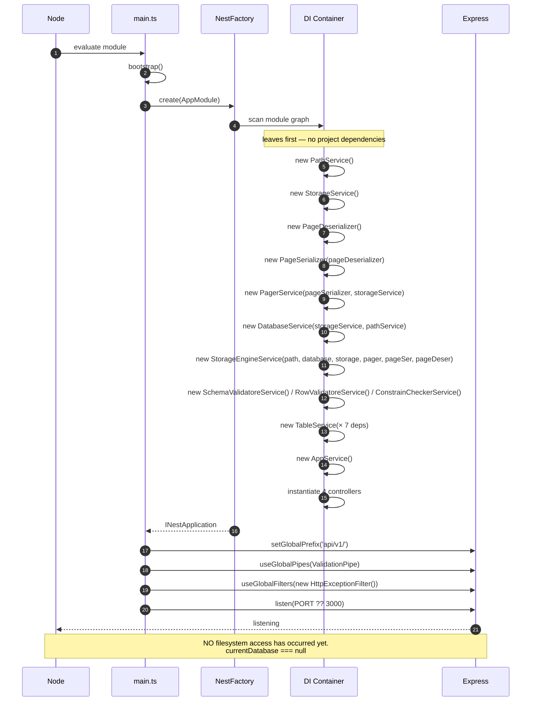

## 18.2 Create table

```mermaid
sequenceDiagram
    autonumber
    participant C as Client
    participant Ctl as TableController
    participant TS as TableService
    participant DB as DatabaseService
    participant PS as PathService
    participant SV as SchemaValidatoreService
    participant SS as StorageService
    participant FS as Filesystem

    C->>Ctl: POST /api/v1/table  { name, columns[] }
    Note over Ctl: body typed `any` ⇒ ValidationPipe SKIPS validation
    Ctl->>TS: create(dto)
    TS->>DB: requireCurrentDatabase()
    alt not connected
        DB--xC: 400 "No database is currently connected."
    end
    DB-->>TS: "shop"
    TS->>PS: getTablePath("shop","user")
    PS-->>TS: databases/shop/user.data
    TS->>SS: exists(dataPath)
    SS->>FS: access()
    alt already exists
        SS-->>TS: true
        TS--xC: 409 "Table user already exists"
    end
    TS->>TS: addIsActiveColumn(dto)
    Note over TS: pushes { isActive, BOOLEAN, default true }<br/>LAST, so user column order is preserved
    TS->>SV: validate(dto)
    SV->>SV: name / columns exist / names / duplicates / types
    alt any check fails
        SV--xC: 400
    end
    rect rgb(240,240,240)
    Note over TS,FS: try — rollback on any failure
    TS->>SS: createFile(dataPath)
    SS->>FS: writeFile(path, '')
    Note over FS: 0 bytes = 0 pages.<br/>The first insert creates page 0.
    TS->>PS: getSchemaPath("shop","user")
    TS->>SS: writeJson(schemaPath, dto)
    SS->>FS: writeFile(minified JSON)
    end
    alt anything threw
        TS->>SS: deleteFile(dataPath)
        Note over TS: the bare `catch` DISCARDS the cause;<br/>a partial .schema.json is NOT removed
        TS--xC: 500 "Failed to create table user"
    end
    TS-->>Ctl: void
    Ctl-->>C: 201, empty body
```

## 18.3 Insert row

```mermaid
sequenceDiagram
    autonumber
    participant C as Client
    participant Ctl as TableController
    participant TS as TableService
    participant SE as StorageEngineService
    participant CC as ConstrainChecker
    participant RV as RowValidatore
    participant TSer as serializeTuple
    participant PG as PagerService
    participant PSer as PageSerializer
    participant SS as StorageService

    C->>Ctl: POST /api/v1/table/insert/user  { id, name, age }
    Ctl->>TS: insert("user", row)

    TS->>SE: readSchema("user")
    SE->>SS: readFile(user.schema.json)
    SS-->>SE: JSON text
    SE-->>TS: TableSchema

    rect rgb(255,240,240)
    Note over TS,SS: FULL TABLE SCAN — O(n). The dominant cost.
    TS->>SE: scan("user")
    SE->>PG: pageCount()
    PG->>SS: fileSize() → /4096
    loop every page
        SE->>PG: readPage(pageId)
        PG->>SS: readAt(path, buf, pageId×4096)
        SE->>SE: readHeader
        loop slot 0..slotCount-1
            SE->>SE: readTuple (null ⇒ tombstoned, skipped)
            SE->>SE: deserializeTuple
        end
    end
    SE-->>TS: [{ rowId, row }, ...]
    end

    TS->>CC: validate(row, allRows, schema)
    CC->>CC: fillDefault — MUTATES row (isActive: true)
    CC->>CC: validatePrimaryKey → 400 null PK / 409 duplicate
    CC->>CC: validateuniqueness → 409
    CC-->>TS: ok

    TS->>RV: validate(row, schema)
    RV->>RV: required / unknown / types → 400
    RV-->>TS: ok

    TS->>SE: insertRow("user", row)
    SE->>SE: requireDataPath → 404 if missing
    SE->>SE: readSchema  (SECOND read this request)
    SE->>TSer: serializeTuple(row, schema)
    TSer->>TSer: pass 1 — sizeOfValue × columns
    TSer->>TSer: Buffer.alloc(totalSize)
    TSer->>TSer: pass 2 — writeValue × columns
    TSer-->>SE: tuple Buffer

    SE->>PG: pageCount()
    alt pageCount > 0
        SE->>PG: readPage(pageCount-1)
        SE->>PSer: insertTuple(page, tuple)
        PSer->>PSer: freeSpace < tuple.length + 4 ?
        alt fits
            PSer->>PSer: offset = tupleStart − len; copy; writeSlot; writeHeader
            PSer-->>SE: slotId
            SE->>PG: writePage(pageId, page)
            PG->>SS: writeAt(...)  ← NO fsync
            SE-->>TS: { pageId, slotId }
        else full
            PSer-->>SE: null
        end
    end
    alt no pages, or the last page was full
        SE->>PG: appendPage()
        PG->>PG: createPage(pageId) + writeHeader
        PG->>SS: writeAt(empty page)
        SE->>PSer: insertTuple(page, tuple)
        alt still does not fit
            PSer--xC: 400 "Row is too large to fit in one page."
        end
        SE->>PG: writePage(pageId, page)
    end
    SE-->>TS: RowId
    Note over TS: the RowId is DISCARDED — insert() returns void
    TS-->>Ctl: void
    Ctl-->>C: 201, empty body
```

## 18.4 Read (select) rows

```mermaid
sequenceDiagram
    autonumber
    participant C as Client
    participant Ctl as TableController
    participant TS as TableService
    participant SE as StorageEngineService
    participant PG as PagerService
    participant PD as PageDeserializer
    participant TD as deserializeTuple
    participant SS as StorageService

    C->>Ctl: GET /api/v1/table/select/user?name=ahmed
    Note over Ctl: @Query values are ALWAYS strings
    Ctl->>TS: select("user", { name: "ahmed" })
    TS->>SE: scan("user")
    SE->>SE: readSchema
    SE->>PG: pageCount → floor(size / 4096)
    loop pageId = 0 .. pageCount-1
        SE->>PG: readPage(pageId)
        PG->>SS: readAt(path, 4096-byte buf, pageId×4096)
        Note over PG,SS: fresh open/read/close every page.<br/>bytesRead is IGNORED.
        SS-->>PG: page Buffer
        SE->>PD: readHeader(page)
        PD-->>SE: { pageId, slotCount, tupleStart }
        loop slotId = 0 .. slotCount-1
            SE->>PD: readTuple(page, slotId)
            alt slot.offset === 0 (tombstone)
                PD-->>SE: null
                Note over SE: skipped
            else live
                PD-->>SE: Buffer.from(subarray)  ← a COPY
                SE->>TD: deserializeTuple(tuple, schema)
                TD->>TD: read the null bitmap bit per column
                TD->>TD: readValue per non-null column
                TD-->>SE: Row
            end
        end
    end
    SE-->>TS: [{ rowId, row }, ...]
    TS->>TS: .map(e => e.row)                    ← RowIds discarded
    TS->>TS: .filter(r => r.isActive !== false)  ← soft-delete filter
    TS->>TS: .filter(r => every key === )        ← STRICT; strings vs typed values
    TS-->>Ctl: Row[]
    Ctl-->>C: 200 { data: [...] }
```

## 18.5 Delete row (soft delete)

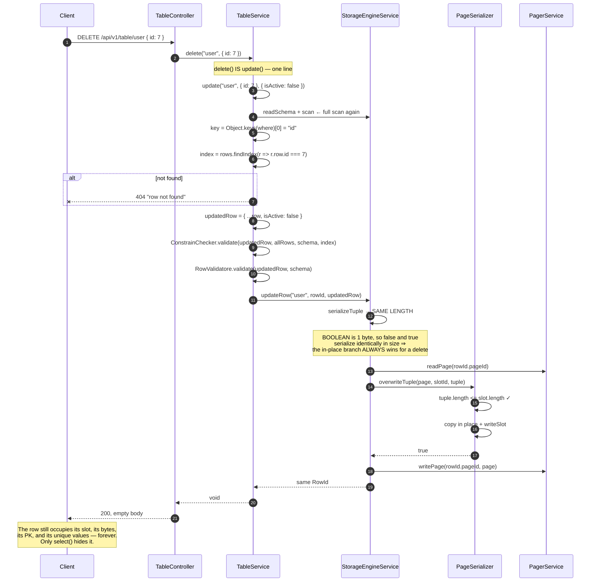

## 18.6 Update that grows (relocation) — the hazardous path

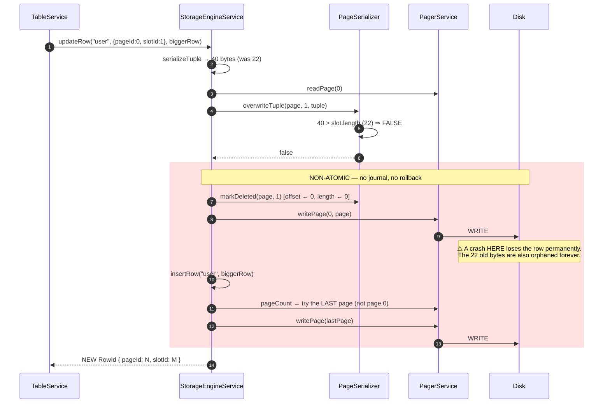

## 18.7 Serialization — `Row` → bytes

```mermaid
sequenceDiagram
    autonumber
    participant SE as StorageEngineService
    participant TS as serializeTuple
    participant TC as type-codec

    SE->>TS: serializeTuple(row, schema)
    TS->>TS: bitmapSize = ceil(columns.length / 8)
    rect rgb(240,248,255)
    Note over TS,TC: PASS 1 — measure
    TS->>TS: totalSize = bitmapSize
    loop every column
        alt value is null/undefined
            Note over TS: skip — NULL costs ZERO value bytes
        else
            TS->>TC: sizeOfValue(column, value)
            TC-->>TS: BOOLEAN 1 · INTEGER 4 · TIMESTAMP 8<br/>VARCHAR/TEXT 2 + Buffer.byteLength(utf8)
            TS->>TS: totalSize += size
        end
    end
    end
    TS->>TS: buffer = Buffer.alloc(totalSize)
    Note over TS: alloc zero-fills ⇒ the null bitmap<br/>starts as "nothing is null" for free
    TS->>TS: offset = bitmapSize
    rect rgb(240,255,240)
    Note over TS,TC: PASS 2 — write
    loop every (column, index)
        alt value is null/undefined
            TS->>TS: buffer[floor(i/8)] += 2 ** (i % 8)
            Note over TS: set the NULL bit; advance offset by NOTHING
        else
            TS->>TC: writeValue(buffer, offset, column, value)
            TC->>TC: writeUInt8 / writeInt32LE / writeBigInt64LE<br/>or writeUInt16LE(len) + write(text,'utf8')
            TC-->>TS: nextOffset
            TS->>TS: offset = nextOffset
        end
    end
    end
    TS-->>SE: tuple Buffer (exactly totalSize bytes)
```

## 18.8 Deserialization — bytes → `Row`

```mermaid
sequenceDiagram
    autonumber
    participant SE as StorageEngineService
    participant PD as PageDeserializer
    participant TD as deserializeTuple
    participant TC as type-codec

    SE->>PD: readTuple(page, slotId)
    PD->>PD: slot = readSlot(page, slotId)
    alt slot.offset === DELETED_OFFSET (0)
        PD-->>SE: null
        Note over SE: tombstoned — skipped by scan()
    end
    PD->>PD: Buffer.from(page.subarray(offset, offset + length))
    Note over PD: Buffer.from COPIES.<br/>subarray alone would alias the page memory.
    PD-->>SE: tuple Buffer
    SE->>TD: deserializeTuple(tuple, schema)
    TD->>TD: bitmapSize = ceil(columns.length / 8)
    TD->>TD: offset = bitmapSize
    loop every (column, index)
        TD->>TD: isNull = floor(buf[floor(i/8)] / 2**(i%8)) % 2 === 1
        alt isNull
            TD->>TD: row[name] = null
            Note over TD: offset does NOT advance
        else
            TD->>TC: readValue(buffer, offset, column)
            TC->>TC: readUInt8===1 / readInt32LE /<br/>new Date(Number(readBigInt64LE)).toISOString() /<br/>readUInt16LE(len) + toString('utf8')
            TC-->>TD: { value, nextOffset }
            TD->>TD: row[name] = value; offset = nextOffset
        end
    end
    TD-->>SE: Row
    Note over TD,SE: Decoding is POSITIONAL. Field i's offset is only<br/>knowable after fields 0..i−1 decode correctly.<br/>Reordering schema.columns corrupts every row.
```

---

# 19. Class Diagrams

## 19.1 Full application class diagram

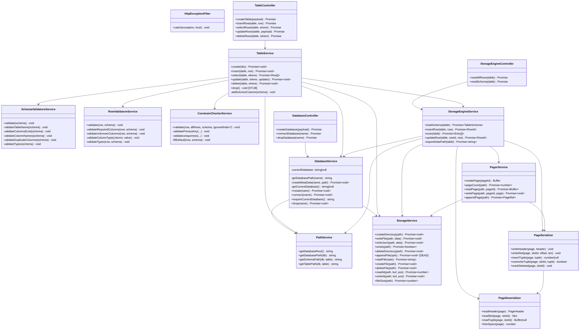

## 19.2 Storage-engine data model

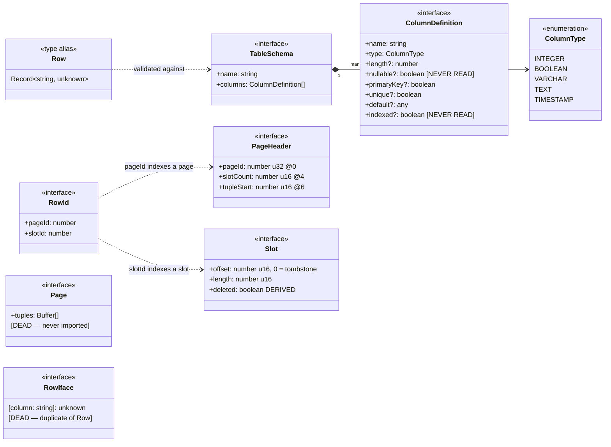

## 19.3 Module dependency graph

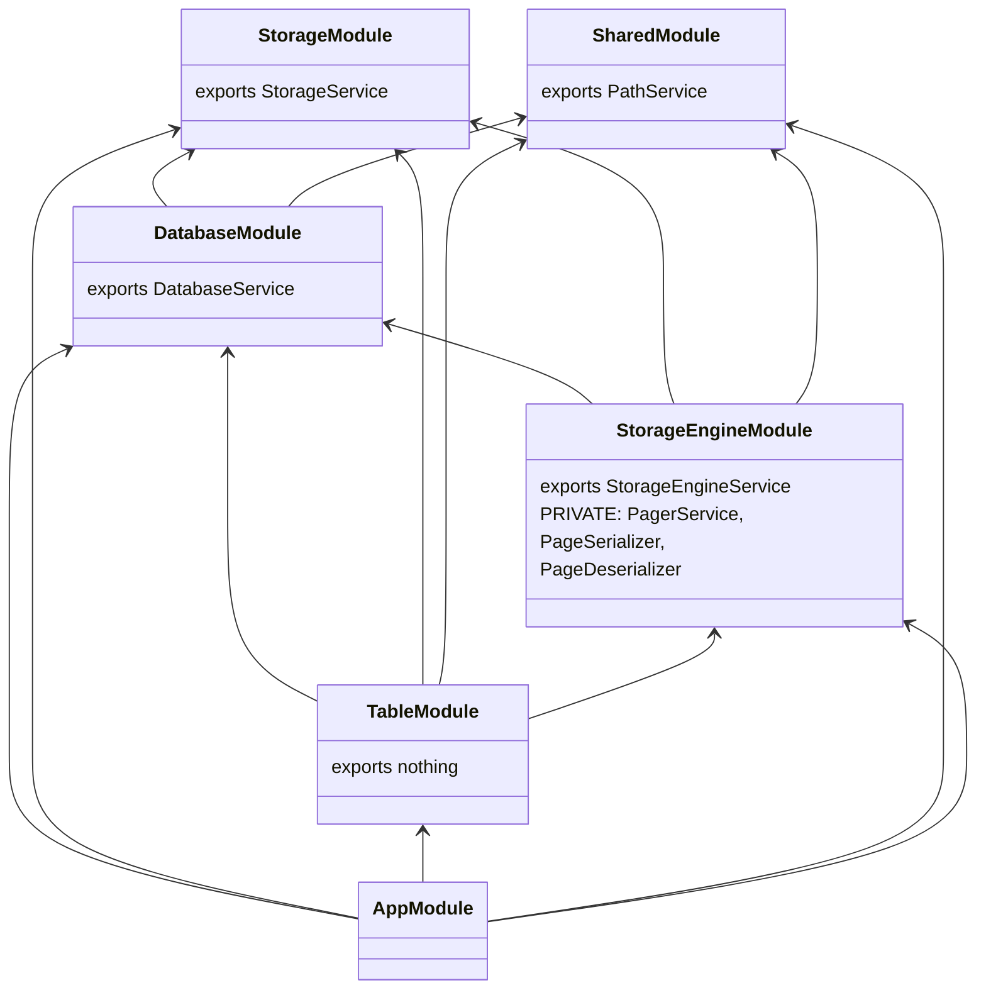

**The important detail:** `StorageEngineModule` exports **only** `StorageEngineService`.
`PagerService`, `PageSerializer`, and `PageDeserializer` are module-private, so `TableService`
cannot inject them and cannot obtain a `Buffer`. The module boundary is doing real
encapsulation work, not just organizing files.

---

# 20. Folder Tree

Complete tree of tracked source and configuration. `node_modules/` and `dist/` are omitted.

```
d:\db-engine\
│
├── .gitignore                     NestJS defaults. NOTE: databases/ is NOT ignored.
├── .prettierrc                    { singleQuote: true, trailingComma: "all" }
├── .vscode\
│   └── settings.json              format-on-save (Prettier) + eslint --fix on save
├── eslint.config.mjs              flat config; type-checked rules; 3 rules relaxed
├── nest-cli.json                  sourceRoot: src, deleteOutDir: true
├── package.json                   deps, scripts, inline Jest config
├── package-lock.json
├── tsconfig.json                  ES2023, nodenext, decorators on, strictNullChecks only
├── tsconfig.build.json            excludes node_modules, test, dist, *spec.ts
│
├── README.md                      ← this document
├── BINARY_STORAGE.md              37 KB — the slotted-page specification the engine was built from
├── PLAN.md                        36 KB — the broader roadmap (predates the binary rewrite)
├── Database.pdf                   untracked; contents not examined  [UNCERTAIN]
│
├── databases\                     RUNTIME DATA — created on first database create
│   └── <databaseName>\
│       ├── metadata.json          { name, version, createdAt } — written once, never read
│       ├── <table>.schema.json    TableSchema, minified — read on EVERY operation
│       └── <table>.data           binary heap file, N × 4096 bytes
│
└── src\
    ├── main.ts                    bootstrap: prefix api/v1/, global pipe, global filter, listen
    ├── app.module.ts              root module — imports the 5 feature modules
    ├── app.controller.ts          GET /api/v1/ → "Hello World!"  [scaffolding]
    ├── app.service.ts             getHello()                     [scaffolding]
    │
    ├── shared\                    cross-cutting; imports nothing (bottom of the graph)
    │   ├── shared.module.ts       provides + exports PathService
    │   ├── path.service.ts        THE single source of truth for on-disk paths
    │   ├── filter\
    │   │   └── all-exception.filter.ts        ⚠ 0 BYTES — empty placeholder
    │   └── interceptors\
    │       └── transform.interceptor.ts       ⚠ MISNAMED — contains HttpExceptionFilter
    │
    ├── storage\                   the ONLY folder that touches fs/promises
    │   ├── storage.module.ts      provides + exports StorageService
    │   ├── storage.service.ts     12 fs primitives; readAt/writeAt enable paging
    │   └── interfaces\
    │       └── append-file.interface.ts       AppendFileOptions  [DEAD]
    │
    ├── database\                  database lifecycle + the connected-DB session
    │   ├── database.module.ts     exports DatabaseService (shared singleton — load-bearing)
    │   ├── database.controller.ts POST / · POST /:name/connect · DELETE /:name
    │   ├── database.service.ts    create / connect / requireCurrentDatabase / drop
    │   ├── dtos\
    │   │   └── create-database.dto.ts         the ONLY DTO wired to a route
    │   └── interfaces\
    │       └── database.metadata.interface.ts DatabaseMetadata  [written, never read]
    │
    ├── table\                     the logical / catalog layer
    │   ├── table.module.ts        imports all 4 other modules; exports nothing
    │   ├── table.controller.ts    5 routes; NO DTOs — bodies typed any / Record
    │   ├── table.service.ts       create / insert / select / update / delete / drop[stub]
    │   ├── schema-validator.service.ts        5 structural checks at CREATE TABLE
    │   ├── row-validator.service.ts           required / unknown / per-type checks
    │   ├── constrain-checkers.service.ts      defaults + PK + unique (forces the full scan)
    │   ├── dtos\
    │   │   ├── create-table.dto.ts            [NOT WIRED]
    │   │   ├── create-column.dto.ts           [NOT WIRED]
    │   │   └── insert-row.dto.ts              [NOT WIRED]
    │   └── interfaces\
    │       └── table-schema.interface.ts      ColumnType · ColumnDefinition · TableSchema · Row
    │                                          ← the most-imported file in the project
    │
    ├── storage-engine\            the heart — rows ↔ bytes, and RowId
    │   ├── storage-engine.module.ts           exports ONLY StorageEngineService
    │   ├── storag-engine.controller.ts        ⚠ typo; raw-scan + schema debug endpoints
    │   ├── storage-engine.service.ts          readSchema / insertRow / scan / updateRow
    │   ├── interfaces\
    │   │   ├── row.id.inerface.ts             ⚠ typo; RowId { pageId, slotId }
    │   │   └── row.interface.ts               [DEAD — duplicate Row]
    │   ├── pager\                             file ↔ fixed-size pages
    │   │   ├── constant.pager.ts              PAGE_SIZE 4096 · HEADER 16 · SLOT 4 · DELETED 0
    │   │   ├── page-header.interface.ts       PageHeader; also Page [DEAD]
    │   │   ├── slot.interface.ts              Slot { offset, length, deleted(derived) }
    │   │   └── pager.service.ts               createPage/pageCount/readPage/writePage/appendPage
    │   └── serialization\                     all byte-level encode/decode
    │       ├── page-serializer.ts             writeHeader/writeSlot/insertTuple/overwrite/markDeleted
    │       ├── page-deserializer.ts           readHeader/readSlot/readTuple/freeSpace  (ZERO deps)
    │       ├── tuple-serializer.ts            serializeTuple()  — plain function
    │       ├── tuple-deserializer.ts          deserializeTuple() — plain function
    │       └── type-codec.ts                  sizeOfValue / writeValue / readValue
    │
    ├── executor\
    │   └── executor.module.ts                 ⚠ 0 BYTES — reserved for the SQL executor
    ├── index\
    │   └── index.module.ts                    ⚠ 0 BYTES — reserved for indexes
    └── schema\
        └── schema.module.ts                   ⚠ 0 BYTES — reserved for the catalog service
```

**File counts.** 43 TypeScript files in `src/` — 39 with content, **4 empty (0 bytes)**.
9 root-level configuration/documentation files.

---

# 21. API Documentation

**Base URL.** `http://localhost:3000/api/v1` (port from `process.env.PORT`, default `3000`).

**Global middleware.** A `ValidationPipe` (`whitelist`, `transform`, `forbidNonWhitelisted`) —
which, as explained in §8.2, only takes effect on `POST /database`. Plus
`HttpExceptionFilter`, which shapes every `HttpException`.

**Error body** (for `HttpException` only):

```json
{
  "message": "Database shop already exists",
  "statusCode": 409,
  "timestamp": "2026-08-07T12:00:00.000Z",
  "path": "/api/v1/database"
}
```

`message` is a **string** for hand-thrown exceptions and a **string array** for
`class-validator` failures. Errors that are not `HttpException`s (a `RangeError` from an
out-of-range `INTEGER`, an `ENOENT`, a `SyntaxError` from a corrupt schema) bypass this filter
and get Nest's default 500 with a different shape.

## Endpoint index

| # | Method | URL | Purpose | Body validated? |
| --- | --- | --- | --- | --- |
| 1 | `GET` | `/` | scaffold hello | n/a |
| 2 | `POST` | `/database` | create a database | ✅ `CreateDatabaseDto` |
| 3 | `POST` | `/database/:name/connect` | connect | n/a |
| 4 | `DELETE` | `/database/:name` | drop a database | n/a |
| 5 | `POST` | `/table` | create a table | ❌ `any` |
| 6 | `POST` | `/table/insert/:tableName` | insert a row | ❌ |
| 7 | `GET` | `/table/select/:tableName` | select rows | n/a (query) |
| 8 | `PATCH` | `/table/update/:tableName` | update one row | ❌ |
| 9 | `DELETE` | `/table/:tableName` | soft-delete one row | ❌ |
| 10 | `GET` | `/storage-engine/rows/:tableName` | raw scan incl. deleted | n/a |
| 11 | `GET` | `/storage-engine/schema/:tableName` | read the schema | n/a |

---

## 1. `GET /api/v1/`

**Handler.** [app.controller.ts:8-11](src/app.controller.ts#L8-L11)

**Response.** `200`, `text/html` body `Hello World!`

Unmodified NestJS scaffolding. Useful only as a liveness check.

---

## 2. `POST /api/v1/database`

Create a new database directory and its `metadata.json`.

**Handler.** [database.controller.ts:9-13](src/database/database.controller.ts#L9-L13)

**Request**

```json
{ "name": "shop" }
```

**Validation.** `CreateDatabaseDto` — `name` must be `@IsString` and `@IsNotEmpty`.
`forbidNonWhitelisted` rejects any extra property with a 400. **No character restriction: `..`
is accepted** (TD-9).

**Response** `201`

```json
{ "message": "Database shop created successfully." }
```

**Errors**

| Status | When | Message |
| --- | --- | --- |
| `400` | `name` missing, empty, or not a string | `["The name field must be empty when creating a database."]` (message text is inverted) |
| `400` | an extra property is present | `["property x should not exist"]` |

**Flow.** `getDatabasePath` → `exists` (409) → `mkdir -p` → write pretty-printed
`metadata.json`. **Does not connect.** Not atomic — a failure after `mkdir` leaves an empty
directory.

**Example**

```bash
curl -X POST http://localhost:3000/api/v1/database \
     -H 'Content-Type: application/json' \
     -d '{"name":"shop"}'
```

---

## 3. `POST /api/v1/database/:name/connect`

Set the process-wide current database.

**Handler.** [database.controller.ts:15-18](src/database/database.controller.ts#L15-L18)

**Request.** No body. `:name` is the database name.

**Response.** `201`, **empty body** — the handler returns `undefined`.

**Errors**

| Status | When | Message |
| --- | --- | --- |
| `404` | the directory does not exist | `Database shop does not exist` |

**Flow.** `exists(getDatabasePath(name))` → 404 → `this.currentDatabase = name`.

**Notes.** `metadata.json` is **never opened or validated** — only the directory's existence is
checked. The connection is process-global (TD-4), lost on restart, and **there is no
disconnect**, so a connected database can never subsequently be dropped.

**Every table and row endpoint returns 400 until this succeeds.**

---

## 4. `DELETE /api/v1/database/:name`

Delete a database directory and every table in it.

**Handler.** [database.controller.ts:20-23](src/database/database.controller.ts#L20-L23)

**Response.** `200`, empty body.

**Errors**

| Status | When | Message |
| --- | --- | --- |
| `404` | the database does not exist | `Database shop does not exist` |
| `400` | it is the currently connected database | `Cannot drop the currently connected database.` |

**Flow.** `exists` → 404 → compare against `currentDatabase` → 400 → `rm -r`.

**⚠️ Irreversible.** No confirmation, no backup, no soft delete at this level. The path is
unsanitized (TD-9).

---

## 5. `POST /api/v1/table`

Create a table: a zero-byte `.data` file plus a `.schema.json`.

**Handler.** [table.controller.ts:17-20](src/table/table.controller.ts#L17-L20)

**Request** — the body is typed `any`, so **nothing is validated by the pipe**.

```json
{
  "name": "user",
  "columns": [
    { "name": "id",    "type": "INTEGER", "primaryKey": true },
    { "name": "name",  "type": "VARCHAR", "length": 20 },
    { "name": "email", "type": "VARCHAR", "length": 64, "unique": true },
    { "name": "age",   "type": "INTEGER" },
    { "name": "joined","type": "TIMESTAMP" }
  ]
}
```

**Column fields.** `name` (required), `type` (required — one of `INTEGER`, `BOOLEAN`, `VARCHAR`,
`TEXT`, `TIMESTAMP`), `length?` (VARCHAR only), `primaryKey?`, `unique?`, `default?`.
`nullable?` and `indexed?` are accepted and **silently ignored** (TD-22).

**Response.** `201`, empty body.

**Errors**

| Status | When | Message |
| --- | --- | --- |
| `400` | no database connected | `No database is currently connected.` |
| `400` | empty table name | `Table name can't be emtpy` (sic) |
| `400` | no columns | `Table must contain at least one column` |
| `400` | an empty column name | `Column name cannot be empty` |
| `400` | duplicate column names | `Duplicate column "id.` (sic — unbalanced quote) |
| `400` | unknown type | `Unsupported type "FLOAT". Allowed types: INTEGER, BOOLEAN, VARCHAR, TEXT, TIMESTAMP.` |
| `409` | `<table>.data` already exists | `Table user already exists` |
| `500` | any file-write failure | `Failed to create table user` (cause discarded — TD-10) |
| **500 unshaped** | `name` field omitted entirely | `TypeError` from `.trim()` (TD-12) |

**Flow.** See §18.2. Note that **`isActive BOOLEAN default true` is appended automatically** to
every table (F5) and appears in the stored schema.

---

## 6. `POST /api/v1/table/insert/:tableName`

Insert one row.

**Handler.** [table.controller.ts:22-28](src/table/table.controller.ts#L22-L28)

**Request** — the whole body **is** the row.

```json
{ "id": 1, "name": "ahmed", "email": "a@b.c", "age": 30, "joined": "2026-08-07T00:00:00.000Z" }
```

`isActive` may be omitted; it defaults to `true`.

**Response.** `201`, **empty body**. The `RowId` is computed internally and discarded (TD-27).

**Errors**

| Status | When | Message |
| --- | --- | --- |
| `400` | no database connected | `No database is currently connected.` |
| `404` | no `.schema.json` | `Schema user does not exist` |
| `404` | no `.data` file | `Table user does not exist` |
| `400` | a required column is absent and has no default | `Missing column "email".` |
| `400` | a key is not in the schema | `Unknown column "nickname".` |
| `400` | wrong type | `Column "age" must be an INTEGER.` |
| `400` | over the declared VARCHAR length | `Column "name" exceeds VARCHAR(20).` |
| `400` | unparseable timestamp | `Column "joined" must be a valid TIMESTAMP.` |
| `400` | the primary key is null/absent | `primary key can't be nullable` |
| `409` | duplicate primary key | `Duplicate primary key "1".` |
| `409` | duplicate value in a `unique` column | `key:email is duplicated must be unique` |
| `400` | the tuple exceeds 4076 bytes | `Row is too large to fit in one page.` |
| **500 unshaped** | an `INTEGER` outside ±2 147 483 647 | `RangeError` (TD-6) |

**Validation order.** defaults → primary key → uniqueness → required → unknown → types. The
first failure wins; a row with several problems reports only one.

**Performance.** **O(n) per insert** — a full table scan runs before every write (TD-15).
Bulk-loading is O(n²).

**Note.** A soft-deleted row still occupies its PK and unique values, so those can never be
reused ([BINARY_STORAGE.md:262-263](BINARY_STORAGE.md#L262-L263)).

**Example**

```bash
curl -X POST http://localhost:3000/api/v1/table/insert/user \
     -H 'Content-Type: application/json' \
     -d '{"id":1,"name":"ahmed","email":"a@b.c","age":30,"joined":"2026-08-07"}'
```

---

## 7. `GET /api/v1/table/select/:tableName`

Return live rows, optionally filtered by equality on every supplied query parameter.

**Handler.** [table.controller.ts:30-36](src/table/table.controller.ts#L30-L36)

**Request.** Query string. `GET /api/v1/table/select/user?name=ahmed`.
No parameters returns every live row.

**Response** `200`

```json
{
  "data": [
    { "id": 1, "name": "ahmed", "email": "a@b.c", "age": 30,
      "joined": "2026-08-07T00:00:00.000Z", "isActive": true }
  ]
}
```

`TIMESTAMP` values always come back as ISO-8601 UTC, regardless of the input format.

**Errors**

| Status | When | Message |
| --- | --- | --- |
| `400` | no database connected | `No database is currently connected.` |
| `404` | no schema | `Schema user does not exist` |
| `404` | no data file | `Table user does not exist` |

An unknown filter column is **not** an error — it simply matches nothing.

**Filtering semantics.**
- Rows with `isActive === false` are excluded. Rows with `isActive` `undefined`/`null` are
  **included**.
- All supplied keys must match (logical AND). No `OR`, no `>`/`<`, no `LIKE`.
- **⚠️ Comparison is strict (`===`) against string query values, so filters on `INTEGER`,
  `BOOLEAN`, and `TIMESTAMP` columns never match** (TD-2). `?id=1` on an integer PK returns `[]`,
  silently.

**No ordering guarantee, no pagination, no projection.** Rows arrive in physical order, which is
insertion order except for rows moved by a growing update.

**Performance.** Full scan, O(n), entire table in memory — even for a primary-key lookup.

---

## 8. `PATCH /api/v1/table/update/:tableName`

Update **one** row.

**Handler.** [table.controller.ts:38-48](src/table/table.controller.ts#L38-L48)

**Request**

```json
{
  "where":   { "id": 1 },
  "updates": { "name": "ali", "age": 31 }
}
```

**Response.** `200`, empty body.

**Errors**

| Status | When | Message |
| --- | --- | --- |
| `400` | no database connected | `No database is currently connected.` |
| `404` | no schema / no data file | `Schema user does not exist` / `Table user does not exist` |
| `404` | no row matches | `row not found` |
| `400` / `409` | the merged row fails any validation or constraint | as for insert |

**Semantics — read carefully.**
- **Only `Object.keys(where)[0]` is used.** Additional `where` keys are silently ignored.
- **Only the first matching row is updated**, despite the handler being named `updateRows`.
- The merge is shallow: `{ ...existingRow, ...updates }`.
- The **merged** row is fully re-validated, so an update cannot produce an invalid row.
- Constraint checks skip the row being updated (`ignoredIndex`), so a no-op update does not
  self-conflict.
- Unlike `select`, `where` arrives in a JSON **body**, so types are preserved and `===` works
  correctly here.
- The scan includes soft-deleted rows, so `where` can match — and effectively resurrect — a
  deleted row.
- If the new tuple is larger than the old slot, the row is tombstoned and re-inserted, and its
  `RowId` changes. **That path is two non-atomic writes** (TD-5).

---

## 9. `DELETE /api/v1/table/:tableName`

Soft-delete **one** row by setting `isActive` to `false`.

**Handler.** [table.controller.ts:50-56](src/table/table.controller.ts#L50-L56)

**Request** — the body **is** the `where` object (not nested).

```json
{ "id": 1 }
```

**Response.** `200`, empty body.

**Errors.** Identical to `PATCH` — `404 row not found` if nothing matches, plus any validation
error from the merged row.

**Semantics.** Implemented as `update(tableName, where, { isActive: false })`. Therefore: one row
per call; only the first `where` key; **nothing is removed from disk**; the row keeps its
`RowId`, its bytes, its primary key, and its unique values permanently; and it remains visible
through endpoint 10.

**Note.** There is **no route to drop a table.** `TableService.drop()` is an empty stub and this
route occupies the URL a drop-table endpoint would naturally use.

---

## 10. `GET /api/v1/storage-engine/rows/:tableName`

A raw scan — **including soft-deleted rows** — with each row's physical address.

**Handler.** [storag-engine.controller.ts:9-12](src/storage-engine/storag-engine.controller.ts#L9-L12)

**Response** `200`

```json
{
  "data": [
    { "rowId": { "pageId": 0, "slotId": 0 },
      "row": { "id": 1, "name": "ahmed", "isActive": false } },
    { "rowId": { "pageId": 0, "slotId": 1 },
      "row": { "id": 2, "name": "sara",  "isActive": true } }
  ]
}
```

**Errors.** `400` if no database is connected; `404` if the schema or data file is missing.

**Purpose.** Debugging and verification. It bypasses `TableService` entirely, so it shows what is
*actually on disk*: soft-deleted rows, physical ordering, and the page/slot each row occupies.
Tombstoned slots (from relocating updates) are still skipped — those are invisible at every
layer.

---

## 11. `GET /api/v1/storage-engine/schema/:tableName`

Return the parsed `TableSchema`.

**Handler.** [storag-engine.controller.ts:14-17](src/storage-engine/storag-engine.controller.ts#L14-L17)

**Response** `200`

```json
{
  "data": {
    "name": "user",
    "columns": [
      { "name": "id", "type": "INTEGER", "primaryKey": true },
      { "name": "name", "type": "VARCHAR", "length": 20 },
      { "name": "isActive", "type": "BOOLEAN", "default": true }
    ]
  }
}
```

**Errors.** `400` if no database is connected; `404` `Schema user does not exist`.

Useful for confirming that `isActive` was appended and for reading the exact column order that
governs tuple layout.

---

## A complete worked session

```bash
BASE=http://localhost:3000/api/v1

# 1. create a database
curl -X POST $BASE/database -H 'Content-Type: application/json' -d '{"name":"shop"}'
# → { "message": "Database shop created successfully." }

# 2. connect (REQUIRED — everything below returns 400 without it)
curl -X POST $BASE/database/shop/connect
# → 201, empty body

# 3. create a table (isActive is appended automatically)
curl -X POST $BASE/table -H 'Content-Type: application/json' -d '{
  "name": "user",
  "columns": [
    {"name":"id","type":"INTEGER","primaryKey":true},
    {"name":"name","type":"VARCHAR","length":20},
    {"name":"email","type":"VARCHAR","length":64,"unique":true}
  ]
}'

# 4. insert
curl -X POST $BASE/table/insert/user -H 'Content-Type: application/json' \
     -d '{"id":1,"name":"ahmed","email":"a@b.c"}'
curl -X POST $BASE/table/insert/user -H 'Content-Type: application/json' \
     -d '{"id":2,"name":"sara","email":"s@b.c"}'

# 5. select — filtering by a TEXT column WORKS
curl "$BASE/table/select/user?name=ahmed"
# → { "data": [ { "id":1, "name":"ahmed", "email":"a@b.c", "isActive":true } ] }

# 5b. filtering by an INTEGER column SILENTLY RETURNS NOTHING (TD-2)
curl "$BASE/table/select/user?id=1"
# → { "data": [] }

# 6. update
curl -X PATCH $BASE/table/update/user -H 'Content-Type: application/json' \
     -d '{"where":{"id":1},"updates":{"name":"ahmed ali"}}'

# 7. soft delete
curl -X DELETE $BASE/table/user -H 'Content-Type: application/json' -d '{"id":2}'

# 8. select hides it...
curl "$BASE/table/select/user"
# → only id 1

# 9. ...but the raw scan still shows it, with its RowId
curl $BASE/storage-engine/rows/user
# → both rows; id 2 has isActive:false

# 10. its unique email is still taken — this is a 409
curl -X POST $BASE/table/insert/user -H 'Content-Type: application/json' \
     -d '{"id":3,"name":"noor","email":"s@b.c"}'
# → 409 "key:email is duplicated must be unique"
```

---

# 22. Internal Glossary

| Term | Definition |
| --- | --- |
| **Buffer** | Node.js's fixed-size, mutable byte array with typed accessors (`writeInt32LE`, `readUInt16LE`, `copy`, `subarray`). The only in-memory representation of on-disk data in this project. |
| **Catalog** | The database's own metadata — which tables exist and what columns they have. Here it is the set of `<table>.schema.json` files, read by `StorageEngineService.readSchema`. There is no dedicated catalog service yet (`src/schema/` is empty). |
| **Column definition** | One entry of `TableSchema.columns` — `ColumnDefinition`. Its **position in the array is physically meaningful**: it determines the value's byte order in every tuple and its bit in the null bitmap. |
| **Compaction** | Rewriting a page's live tuples contiguously to reclaim orphaned bytes, updating slot offsets as it goes. The slot directory exists to make this safe. **Not implemented.** |
| **Constraint** | A rule spanning more than one row — primary key and uniqueness here. Checked by `ConstrainCheckerService`, which is why every write performs a full scan. |
| **Data file** | `<table>.data` — the heap file. A flat sequence of N × 4096-byte pages with no file-level header. |
| **`DELETED_OFFSET`** | The constant `0`, used as a slot's tombstone marker. Safe because offset 0 is inside the page header, so no real tuple can ever begin there. |
| **Deserialization** | Bytes → objects. Three levels here: page header/slots (`PageDeserializer`), tuple → `Row` (`deserializeTuple`), one value (`readValue`). |
| **Directory (slot directory)** | The array of 4-byte slots starting at byte 16 of a page, growing downward. The **indirection layer** that makes `RowId`s stable. |
| **Free space** | `tupleStart − (PAGE_HEADER_SIZE + slotCount × SLOT_SIZE)` — the contiguous gap in the middle of a page. Does **not** include bytes orphaned by tombstones or shrunken tuples. |
| **Heap file** | A table's data file, storing rows in no particular order, with new rows appended wherever there is room. Contrast with an index-organized (clustered) table. `<table>.data` is a heap file. |
| **Little-endian (LE)** | Least-significant byte first. Every multi-byte field in this format is LE (`writeUInt16LE`, `writeInt32LE`, `writeBigInt64LE`) — matching x86/ARM native order, so no byte swapping is needed. |
| **Metadata** | Two things in this project: `metadata.json` (per database — written once, never read) and `<table>.schema.json` (per table — read on every operation). |
| **Null bitmap** | The first `ceil(columnCount / 8)` bytes of a tuple. Bit `i` set means column `i` is NULL and contributes **zero** value bytes. Necessary because in binary the integer `0` and *absent* are indistinguishable. **Currently always all-zeros**, because the row validator rejects nulls. |
| **Offset** | A byte position. Two distinct uses: a slot's `offset` (a tuple's position *within its page*) and the pager's `pageId × PAGE_SIZE` (a page's position *within the file*). |
| **Page** | A fixed 4096-byte block — the unit of I/O. Page `P` occupies bytes `P × 4096` through `P × 4096 + 4095`. |
| **Page header** | The first 16 bytes of a page: `pageId` (u32 @0), `slotCount` (u16 @4), `tupleStart` (u16 @6), and 8 reserved zero bytes @8. |
| **`pageCount`** | Not stored — **derived** as `Math.floor(fileSize / PAGE_SIZE)`. This is why page 0 is not special and why a zero-byte file is unambiguously zero pages. |
| **Pager** | The component translating "file" into "array of pages" — `PagerService`. The only place a page id is multiplied by `PAGE_SIZE`. |
| **`PAGE_SIZE`** | `4096`. Chosen to match a typical OS page / filesystem block, so one logical page read is one physical block read. |
| **Relocation** | What happens when an update grows a row past its slot: the old slot is tombstoned and the row is re-inserted elsewhere, receiving a **new `RowId`**. Two non-atomic writes. |
| **RID / `RowId`** | `{ pageId, slotId }` — a row's stable physical address, equivalent to PostgreSQL's `ctid`. Stable across in-place updates and future compaction; changes on relocation. |
| **Row** | A logical record as a JavaScript object — `Record<string, unknown>`. The currency of the logical layer. |
| **Schema** | A `TableSchema` — a table name plus an **ordered** array of `ColumnDefinition`s. Serialized to `<table>.schema.json`. Its column order must never change once rows exist. |
| **Serialization** | Objects → bytes. Split four ways here: page writes, page reads, tuple writes, tuple reads — plus the per-value `type-codec`. |
| **Slot** | One 4-byte directory entry: `offset` (u16) and `length` (u16). `offset === 0` means tombstoned. Slot `i` lives at byte `16 + i × 4`. |
| **Slot directory** | See *Directory*. |
| **Slotted page** | The page layout used here: a header, then a slot directory growing **down** from the top, and variable-length tuples growing **up** from the bottom, with free space in the middle. The standard design in real engines. |
| **Soft delete** | Marking a row inactive (`isActive: false`) rather than removing it. This project's user-facing DELETE. The row keeps its bytes, its `RowId`, its primary key, and its unique values forever. |
| **Storage engine** | The layer converting rows to bytes and back and owning `RowId` — `src/storage-engine/`. It knows nothing about HTTP or constraints. |
| **Tombstone** | A dead slot: `offset = 0`, `length = 0`. The slot index is burned permanently — `slotCount` never decreases — which is exactly what keeps existing `RowId`s valid. |
| **Tuple** | A row **as stored on disk**: a null bitmap followed by packed values in schema order. It carries no length, no column names, and no checksum — the slot supplies the length, the schema supplies everything else. |
| **`tupleStart`** | The page header field holding the lowest byte occupied by any tuple. `PAGE_SIZE` (4096) for an empty page. New tuples are placed at `tupleStart − tuple.length`. |
| **Type codec** | [type-codec.ts](src/storage-engine/serialization/type-codec.ts) — the three functions (`sizeOfValue`, `writeValue`, `readValue`) defining the on-disk encoding of a single value. The lowest-level file in the project. |
| **VACUUM** | The database term for reclaiming space from dead rows. **Not implemented** — see *Compaction*. |
| **WAL (write-ahead log)** | A durability technique: record the intended change before applying it, so a crash can be recovered. **Not implemented**, which is why relocation can lose a row. |

---

# 23. Learning Guide

A reading order for a new engineer. Follow it strictly — each stage assumes the previous one.

## Stage 0 — Orientation (30 minutes)

1. **[BINARY_STORAGE.md](BINARY_STORAGE.md), sections 1–5** (lines 33–266). Read this **before
   any code**. It explains *why* the storage engine looks the way it does, with diagrams. Nothing
   else in the project will make sense without it.
2. **§10 of this README** — the byte-level format, which fills in the details the design doc
   leaves implicit and flags where the code diverges from it.
3. **[package.json](package.json)** and **[src/app.module.ts](src/app.module.ts)** — five feature
   modules, seven runtime dependencies, no database library.

## Stage 1 — The bottom of the stack (1 hour)

Read in this exact order. These four files have almost no dependencies and are where every
concept is defined.

| # | File | Why here | What to take away |
| --- | --- | --- | --- |
| 1 | [constant.pager.ts](src/storage-engine/pager/constant.pager.ts) | 4 lines, defines everything | `PAGE_SIZE 4096`, `PAGE_HEADER_SIZE 16`, `SLOT_SIZE 4`, `DELETED_OFFSET 0` |
| 2 | [table-schema.interface.ts](src/table/interfaces/table-schema.interface.ts) | the project's vocabulary | `ColumnType`, `ColumnDefinition`, `TableSchema`, `Row` |
| 3 | [slot.interface.ts](src/storage-engine/pager/slot.interface.ts) + [page-header.interface.ts](src/storage-engine/pager/page-header.interface.ts) | the on-disk structures | `deleted` is **derived** from `offset === 0` |
| 4 | [type-codec.ts](src/storage-engine/serialization/type-codec.ts) | the lowest-level logic | how each of the five types becomes bytes; `writeValue` and `readValue` must mirror each other exactly |

**Checkpoint.** Before continuing, you should be able to answer, on paper: *how many bytes does
`{ id: 1, name: "ahmed" }` take for a two-column `INTEGER`/`VARCHAR(20)` schema?* (Answer: 1
bitmap + 4 + 2 + 5 = **12 bytes**.)

## Stage 2 — Tuples (30 minutes)

| # | File | Focus |
| --- | --- | --- |
| 5 | [tuple-serializer.ts](src/storage-engine/serialization/tuple-serializer.ts) | **why there are two passes** (measure, then write) |
| 6 | [tuple-deserializer.ts](src/storage-engine/serialization/tuple-deserializer.ts) | why decoding is **positional**, and what that forbids |

Read them **side by side**. They must agree byte for byte, and there is currently no test
enforcing that.

**Checkpoint.** Explain why reordering `schema.columns` corrupts every existing row.

## Stage 3 — Pages (1 hour)

| # | File | Focus |
| --- | --- | --- |
| 7 | [page-deserializer.ts](src/storage-engine/serialization/page-deserializer.ts) | **read this before the serializer.** Zero dependencies, 43 lines. `freeSpace()` is the key formula. |
| 8 | [page-serializer.ts](src/storage-engine/serialization/page-serializer.ts) | `insertTuple` is the most important method in the project. Note `needed = tuple.length + SLOT_SIZE`. |
| 9 | [pager.service.ts](src/storage-engine/pager/pager.service.ts) | file ↔ pages. Note `pageCount` is **derived**, not stored. |

**Checkpoint.** Draw a page after three 22-byte inserts, then after slot 1 is tombstoned. Where
does the reclaimed space go? (Answer: nowhere — that is TD-13.)

## Stage 4 — Raw I/O (20 minutes)

| # | File | Focus |
| --- | --- | --- |
| 10 | [storage.service.ts](src/storage/storage.service.ts) | only `readAt`, `writeAt`, and `fileSize` matter. Understand **why `writeAt` opens with `'r+'` and not `'w'`** — `'w'` truncates, which would destroy every other page. |
| 11 | [path.service.ts](src/shared/path.service.ts) | 19 lines. Every path in the system originates here. |

## Stage 5 — The engine (1 hour)

| # | File | Focus |
| --- | --- | --- |
| 12 | [storage-engine.service.ts](src/storage-engine/storage-engine.service.ts) | Read `insertRow` first, then `scan`, then `updateRow`. The relocation branch of `updateRow` is the most subtle code in the project — and the most dangerous (TD-5). |

**Checkpoint.** Trace an update that grows a row from 22 to 40 bytes. How many disk writes? What
happens to the old `RowId`? What breaks if the process dies between the two writes?

## Stage 6 — The logical layer (1 hour)

| # | File | Focus |
| --- | --- | --- |
| 13 | [schema-validator.service.ts](src/table/schema-validator.service.ts) | simplest of the three validators |
| 14 | [row-validator.service.ts](src/table/row-validator.service.ts) | `validateColumnType` is the whole type system |
| 15 | [constrain-checkers.service.ts](src/table/constrain-checkers.service.ts) | note that `fillDefault` **mutates** its argument, and that this is why it must run before type validation |
| 16 | [table.service.ts](src/table/table.service.ts) | the conductor. **`insert` is the file to understand best** — the `scan()` on line 50 is the system's dominant cost. |

**Checkpoint.** Why does `ConstrainCheckerService` run *before* `RowValidatoreService`, given
that constraint checking is far more expensive?

## Stage 7 — The HTTP surface (30 minutes)

| # | File | Focus |
| --- | --- | --- |
| 17 | [main.ts](src/main.ts) | prefix, global pipe, global filter |
| 18 | [database.service.ts](src/database/database.service.ts) | `currentDatabase` and `requireCurrentDatabase()` |
| 19 | [table.controller.ts](src/table/table.controller.ts) | five one-line delegates — and **notice that none of them uses a DTO** |
| 20 | [transform.interceptor.ts](src/shared/interceptors/transform.interceptor.ts) | the misnamed exception filter |

**Checkpoint.** Explain why `@Body() payload: any` means the global `ValidationPipe` does
nothing.

## Stage 8 — Verify your understanding by running it

Follow the worked session in §21. Then, using
`GET /api/v1/storage-engine/rows/:tableName`, confirm for yourself:

1. A soft-deleted row is still there, with `isActive: false` and its original `RowId`.
2. Its unique values are still taken (attempt a re-insert → 409).
3. `?id=1` on an integer column returns nothing (TD-2).
4. `POST` an oversized string until you hit `Row is too large to fit in one page.`

## Files you can safely skip on a first pass

[app.controller.ts](src/app.controller.ts), [app.service.ts](src/app.service.ts) (scaffolding);
all `*.module.ts` (configuration only — read them when you need to know what is exported);
[src/table/dtos/](src/table/dtos/) (not wired to routes); the four empty placeholder files;
[row.interface.ts](src/storage-engine/interfaces/row.interface.ts) (dead duplicate).

## The five most important facts to carry away

1. **A `RowId` is `{pageId, slotId}`, and the slot directory is what makes it stable.** Everything
   in the storage design follows from this.
2. **Tuple decoding is positional** — the schema column array *is* the format. It can never be
   reordered.
3. **Every write does a full table scan** (`TableService.insert` line 50), because constraint
   checking needs every row. Insert is O(n); bulk load is O(n²).
4. **DELETE is soft** — nothing is ever removed from disk, and deleted rows keep their PK and
   unique values.
5. **Only `POST /database` is validated by the pipe.** Every other endpoint's safety comes from
   the hand-written validator services.

---

# 24. Project Status

## ✅ Completed

| Area | Detail |
| --- | --- |
| **Storage engine** | 4096-byte slotted pages, 16-byte header, 4-byte slot directory, tuples growing up / slots growing down, `offset === 0` tombstones, derived `pageCount` |
| **Tuple encoding** | Null bitmap + five types (`INTEGER`, `BOOLEAN`, `VARCHAR`, `TEXT`, `TIMESTAMP`), length-prefixed UTF-8 with no padding |
| **`RowId`** | `{pageId, slotId}`; stable across in-place updates; returned by `insertRow`/`updateRow` and by `scan` |
| **Pager** | `createPage`, `pageCount`, `readPage`, `writePage`, `appendPage` |
| **Row CRUD** | insert (last page, else append), full scan, update (in place or relocate), soft delete |
| **Database lifecycle** | create (+`metadata.json`), connect, drop, with a connected-database guard |
| **Table DDL** | create with a validated schema and an auto-injected `isActive` column |
| **Validation** | 5 schema checks, 3 row checks with a per-type rule table, PK + unique + defaults |
| **HTTP API** | 11 endpoints under `/api/v1/`, with a uniform error shape for `HttpException` |
| **DI architecture** | 5 modules, clean layering, real encapsulation (`PagerService` unreachable from the table layer) |
| **Documentation** | [BINARY_STORAGE.md](BINARY_STORAGE.md), [PLAN.md](PLAN.md), and this README |

## 🟡 In progress / partially working

| Area | State |
| --- | --- |
| **NULL support** | Format complete; **unreachable** — the row validator rejects every null, and `ColumnDefinition.nullable` is never read |
| **Select filtering** | Works for `TEXT`/`VARCHAR`; **silently returns nothing** for `INTEGER`/`BOOLEAN`/`TIMESTAMP` (TD-2) |
| **DTO validation** | Written for tables and rows; **wired only for `POST /database`** |
| **Update / delete** | Work, but affect **one row** and use only the **first `where` key**, despite plural route names |
| **Error handling** | Uniform for `HttpException`; non-HTTP errors escape with a different shape; the catch-all filter file is empty |
| **`metadata.json`** | Written; never read or validated |
| **Space management** | Allocation works; **no reclamation** — tombstones, shrunken tuples, and soft deletes all leak |
| **Response shapes** | Three competing conventions across nine endpoints |

## 🔴 Not started

| Area | Evidence |
| --- | --- |
| **SQL front end** (lexer, parser, AST, executor) | `src/executor/executor.module.ts` is 0 bytes; [PLAN.md:789-801](PLAN.md#L789-L801) |
| **Indexes** | `src/index/index.module.ts` is 0 bytes; `ColumnDefinition.indexed` never read |
| **Catalog service** | `src/schema/schema.module.ts` is 0 bytes; schema reading lives in the storage engine |
| **`DROP TABLE`** | `TableService.drop()` is an empty stub; no route |
| **`ALTER TABLE`** | Blocked by positional tuple decoding with no schema version |
| **Compaction / VACUUM** | No implementation; the slot directory makes it possible but nothing calls for it |
| **Versioning / history** | [PLAN.md:836-842](PLAN.md#L836-L842) specifies snapshots + a commit log; nothing exists |
| **Durability** (`fsync`, WAL) | No `sync()` call anywhere; relocation is two unsynchronized writes |
| **Concurrency control** | No locks, mutexes, or queues; concurrent inserts silently lose rows |
| **Tests** | Jest and supertest configured; **zero test files**; no `test/` directory |
| **Buffer pool** | Every page access is a fresh `open`/`read`/`close` |
| **Joins, FKs, `NOT NULL`, `CHECK`, ordering, pagination, projection** | None |
| **`LIST DATABASES` / `LIST TABLES`** | No discovery endpoints |

## Overall assessment

The project has completed **the hardest and most distinctive part**: a working slotted-page
binary storage engine with stable row addressing, a null bitmap, a five-type codec, and page-level
I/O. That layer is well factored, cleanly encapsulated, and matches its own design document
closely. The build is clean; the layering is real and enforced by the module system.

What remains is of two kinds. First, **the SQL layer** — the largest planned feature, entirely
unstarted, with its directories reserved and empty. Second, and more urgent, **a set of gaps in
features that already exist**: unvalidated request bodies, a select filter that silently fails on
non-string columns, no concurrency control, no durability, and no tests over the serialization
core.

The prudent next moves, in order: **write the round-trip test** (S8), **wire up the DTOs** (S1),
**fix the select filter** (S3), and **add a per-table write mutex** (S6). Each is small, and each
closes a hole in something users can already reach today.

---

# 25. AI_CONTEXT.md

> The section below is written to be extracted verbatim into a standalone `AI_CONTEXT.md`. It is
> self-contained: an assistant reading only this section should be able to work on the project
> without re-reading the codebase.

---

## Architecture summary

`db-engine` is a from-scratch relational database engine on NestJS + TypeScript. No database
library, no ORM, no SQL parser. It stores rows as binary tuples inside 4096-byte slotted pages
on the local filesystem. All eleven HTTP endpoints sit under `/api/v1/`.

**Four layers, strictly ordered:**

```
Controllers  (DatabaseController, TableController, StorageEngineController)
    ↓
Logical      (TableService + SchemaValidatore / RowValidatore / ConstrainChecker; DatabaseService)
    ↓
Engine       (StorageEngineService — rows ↔ bytes, owns RowId)
    ↓
Pages        (PagerService, PageSerializer, PageDeserializer, tuple-*/type-codec)
    ↓
Raw I/O      (StorageService — the only fs/promises consumer; PathService — the only path builder)
```

**On-disk layout**

```
databases/<db>/metadata.json        { name, version, createdAt }  — written once, NEVER read
databases/<db>/<table>.schema.json  TableSchema, minified — read on EVERY operation
databases/<db>/<table>.data         N × 4096-byte pages
```

**Page format (4096 bytes)**

| Region | Bytes | Contents |
| --- | --- | --- |
| Header | 0–15 | `pageId` u32LE @0 · `slotCount` u16LE @4 · `tupleStart` u16LE @6 · 8 reserved zero bytes @8 |
| Slot directory | 16 → | 4 bytes per slot, growing **down**: `offset` u16LE, `length` u16LE. Slot `i` at `16 + 4i`. `offset === 0` = tombstone. |
| Free space | middle | `tupleStart − (16 + 4 × slotCount)` |
| Tuple area | → 4095 | variable-length tuples, growing **up** from the end |

**Tuple format:** `[null bitmap: ceil(columnCount/8) bytes][values, packed, in schema order]`.
Bit `i` set = column `i` is NULL and occupies zero value bytes. No length field, no column names,
no checksum inside a tuple.

**Type encodings:** `BOOLEAN` 1 B (u8) · `INTEGER` 4 B (i32LE) · `TIMESTAMP` 8 B
(**BigInt64LE**, ms since epoch) · `VARCHAR`/`TEXT` 2 B u16LE byte-length + raw UTF-8, no padding.

⚠️ `BINARY_STORAGE.md` says `TIMESTAMP` is a **double**. The code uses **BigInt64LE**. The code
is authoritative.

## Important assumptions

1. **One database is connected per process**, held in `DatabaseService.currentDatabase` (a
   mutable field on an application-wide singleton). Not per-client, not persisted, lost on
   restart. There is no disconnect.
2. **The schema file is trusted.** `readSchema` casts `JSON.parse` output to `TableSchema` with
   no runtime check.
3. **Rows are validated before they reach the serializer.** `serializeTuple` and `type-codec`
   have **no error handling** — a wrong type there throws a raw `TypeError`/`RangeError` that
   bypasses `HttpExceptionFilter`.
4. **A tuple always fits in one page.** Max = `4096 − 16 − 4` = **4076 bytes**. No overflow pages,
   no TOAST.
5. **Single-threaded, no concurrent writers.** Nothing enforces this; concurrent inserts
   silently lose rows.
6. **The filesystem is reliable.** No `fsync`, no checksums, no WAL, no torn-write detection.

## Invariants

**Must hold, or data is corrupted:**

- `TableSchema.columns` **must never be reordered, inserted into, or removed from** once rows
  exist. Tuple decoding is positional and there is no schema version in the tuple. This is why
  `ALTER TABLE` cannot be implemented as-is.
- `sizeOfValue` and `writeValue` must agree exactly for every type — the buffer is allocated from
  the first and filled by the second.
- `writeValue` and `readValue` must be exact inverses.
- `serializeTuple` and `deserializeTuple` must compute `bitmapSize` identically and iterate
  columns in the same order.

**Maintained by the page code:**

- `tupleStart` is always the lowest byte occupied by any tuple; `PAGE_SIZE` (4096) when empty.
- `slotCount` **never decreases**. A tombstoned slot keeps its index forever — this is what makes
  `RowId`s stable.
- `freeSpace = tupleStart − (16 + 4 × slotCount)` and is always ≥ 0.
- Insert requires `freeSpace >= tuple.length + SLOT_SIZE` — the new slot counts.
- `offset === 0` unambiguously means tombstoned, because offset 0 is inside the header.
- File size is always an exact multiple of 4096; `pageCount = floor(size / 4096)`.
- A newly created `.data` file is **0 bytes = 0 pages**; the first insert appends page 0.

**Maintained by the logical layer:**

- Every table has an `isActive BOOLEAN default true` column, **appended last** by
  `addIsActiveColumn`.
- Defaults are filled (`ConstrainCheckerService.fillDefault`) **before** type validation.
- The `RowId` returned by `updateRow` is the same one on an in-place update and a **new** one
  after relocation.

## File responsibilities (one line each)

| File | Responsibility |
| --- | --- |
| `main.ts` | Bootstrap: prefix `api/v1/`, global `ValidationPipe`, global `HttpExceptionFilter`, listen |
| `app.module.ts` | Root module; imports the 5 feature modules |
| `shared/path.service.ts` | **The only** builder of on-disk paths (4 methods) |
| `shared/interceptors/transform.interceptor.ts` | **Misnamed** — contains `HttpExceptionFilter` |
| `shared/filter/all-exception.filter.ts` | **0 bytes** |
| `storage/storage.service.ts` | **The only** `fs/promises` consumer; `readAt`/`writeAt`/`fileSize` enable paging |
| `database/database.service.ts` | Create/connect/drop; owns `currentDatabase` and `requireCurrentDatabase()` |
| `table/table.service.ts` | Orchestrates CRUD; decides the validation order; **scans on every write** |
| `table/schema-validator.service.ts` | 5 structural checks at CREATE TABLE |
| `table/row-validator.service.ts` | Required / unknown / per-type checks — the whole type system |
| `table/constrain-checkers.service.ts` | Defaults, primary key, uniqueness — forces the full scan |
| `table/interfaces/table-schema.interface.ts` | `ColumnType`, `ColumnDefinition`, `TableSchema`, `Row` — most-imported file |
| `storage-engine/storage-engine.service.ts` | `readSchema` / `insertRow` / `scan` / `updateRow`; owns `RowId` |
| `storage-engine/pager/constant.pager.ts` | `PAGE_SIZE 4096`, `PAGE_HEADER_SIZE 16`, `SLOT_SIZE 4`, `DELETED_OFFSET 0` |
| `storage-engine/pager/pager.service.ts` | File ↔ pages; `pageCount` is **derived** from file size |
| `storage-engine/serialization/page-serializer.ts` | All page **writes**: header, slot, insert, overwrite, tombstone |
| `storage-engine/serialization/page-deserializer.ts` | All page **reads**; **zero dependencies** — easiest thing to test |
| `storage-engine/serialization/tuple-serializer.ts` | `serializeTuple` — two passes: measure, then write |
| `storage-engine/serialization/tuple-deserializer.ts` | `deserializeTuple` — positional decoding |
| `storage-engine/serialization/type-codec.ts` | `sizeOfValue` / `writeValue` / `readValue` — the on-disk encoding |

**Dead code (do not extend):** `StorageService.appendFile` + `AppendFileOptions`;
`storage-engine/interfaces/row.interface.ts` (duplicate `Row`); `Page` in
`page-header.interface.ts`; all three `table/dtos/*` (not wired); `ColumnDefinition.nullable` and
`.indexed` (never read); `TableService.drop()` (empty stub); `src/executor/`, `src/index/`,
`src/schema/` (0-byte placeholders); `app.controller.ts` / `app.service.ts` (scaffolding).

## Common workflows

**Insert** (`POST /api/v1/table/insert/:t`)
```
readSchema → scan (FULL, O(n)) → ConstrainChecker (defaults, PK, unique)
  → RowValidatore (required, unknown, types) → insertRow
       → serializeTuple → pageCount → try LAST page → else appendPage → writePage
```

**Select** (`GET /api/v1/table/select/:t?col=val`)
```
scan → map to rows → filter(isActive !== false) → filter(every key ===)
```

**Update** (`PATCH /api/v1/table/update/:t`)
```
readSchema → scan → key = Object.keys(where)[0] → findIndex FIRST match (404 if none)
  → shallow merge → ConstrainChecker(ignoredIndex) → RowValidatore
  → updateRow: overwrite in place if tuple.length <= slot.length,
               else markDeleted + writePage + insertRow  ← TWO NON-ATOMIC WRITES
```

**Delete** (`DELETE /api/v1/table/:t`) — literally `update(t, where, { isActive: false })`.
`BOOLEAN` is 1 byte, so the tuple length never changes and the in-place branch always wins.

**Create table** (`POST /api/v1/table`)
```
requireCurrentDatabase → 409 if .data exists → addIsActiveColumn (MUTATES the dto)
  → SchemaValidatore → createFile(.data) [0 bytes = 0 pages] → writeJson(.schema.json)
  → on failure: deleteFile(.data) + 500 (original cause DISCARDED)
```

## Naming conventions

- Classes `PascalCase` + role suffix; interfaces `PascalCase` with no `I` prefix; constants
  `SCREAMING_SNAKE`; methods and functions `camelCase`, verb-first.
- Files `kebab-case.<role>.ts` — `.module.ts`, `.service.ts`, `.controller.ts`, `.dto.ts`,
  `.interface.ts`.
- **`require*` methods throw; `get*` methods return `null`.** Consistent and worth preserving.
- Injected dependencies are always `private readonly`.
- `Promise<void>` for commands, `Promise<T>` for queries.
- Prettier: single quotes, trailing commas, 2-space indent.

**Known typos — do not "fix" them incidentally; they are load-bearing identifiers used at every
call site:** `SchemaValidatoreService`, `RowValidatoreService`, `ConstrainCheckerService`,
`validateuniqueness`, `storag-engine.controller.ts`, `row.id.inerface.ts`.

## Future implementation notes

**Before touching the storage format:** any change to `ColumnType`, `sizeOfValue`, `writeValue`,
or `readValue` invalidates every existing `.data` file. There is no format version anywhere and
no migration path.

**Adding a column type** requires edits in **five** places: `ColumnType`, `sizeOfValue`,
`writeValue`, `readValue`, and `validateColumnType`.

**The reserved header bytes 8–15** are the extension point. A checksum, an LSN, or a free-space
hint can go there without changing any existing offset or breaking existing files.

**Do not store `pageCount`.** It is derived from the file size on purpose — that is why page 0 is
not special and why nothing can desynchronize.

**Compaction is already possible.** The slot directory is exactly the indirection needed: rewrite
live tuples contiguously, update the slot offsets, reset `tupleStart`, and every outstanding
`RowId` stays valid. The mechanism is in place; only the operation is missing.

**Known landmines, ranked:**

1. `select`'s `where` values are **always strings** (from `@Query`) compared with `===` to typed
   row values — filters on `INTEGER`/`BOOLEAN`/`TIMESTAMP` silently return nothing. `update`'s
   `where` comes from a JSON body and does not have this problem.
2. Relocating updates are **two non-atomic writes**; a crash between them loses the row.
3. No concurrency control at all — two simultaneous inserts read the same last page and one row
   vanishes.
4. `INTEGER` range is unvalidated; `writeInt32LE` throws a raw `RangeError` (unshaped 500).
5. NULL is fully implemented in the format and completely unreachable — the row validator
   rejects every null and `nullable` is never read.
6. `POST /table` and every row endpoint accept `any` — the global `ValidationPipe` short-circuits
   on `Object` metatypes, so only `POST /database` is validated.
7. Path traversal: names go straight into `path.join`, which resolves `..`.
8. Insert only ever tries the **last** page; space freed elsewhere is unreachable forever.
9. Every write does a full table scan for constraint checking — insert is O(n), bulk load O(n²).
10. Non-`HttpException` errors bypass `HttpExceptionFilter` and get a different response shape.

**Highest-value next steps, in order:**

1. A round-trip property test for `serializeTuple` ↔ `deserializeTuple` — the correctness core,
   currently untested and dependency-free.
2. Wire the existing DTOs to the table routes.
3. Coerce `select` filter values using the column's `ColumnType`.
4. A per-table write mutex.
5. A PK/unique hash index — the only change that alters the system's asymptotic behaviour.

**Reserved directories:** `src/executor/` (SQL executor), `src/index/` (indexes),
`src/schema/` (catalog service). All three are 0-byte placeholders imported by nothing.

**Reference docs:** [BINARY_STORAGE.md](BINARY_STORAGE.md) §§1–5 for the storage design
rationale; [PLAN.md](PLAN.md) for the SQL roadmap (written before the binary rewrite — parts are
now historical).
